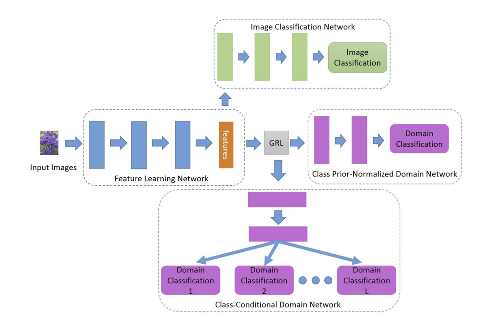
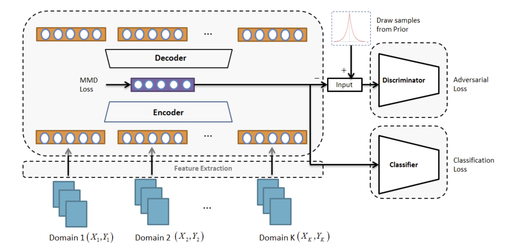
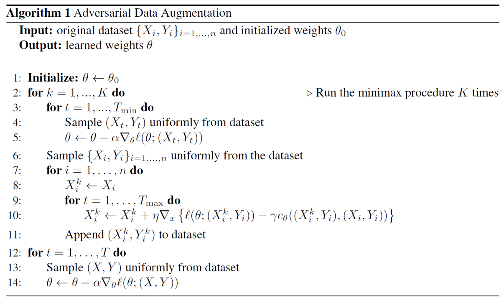
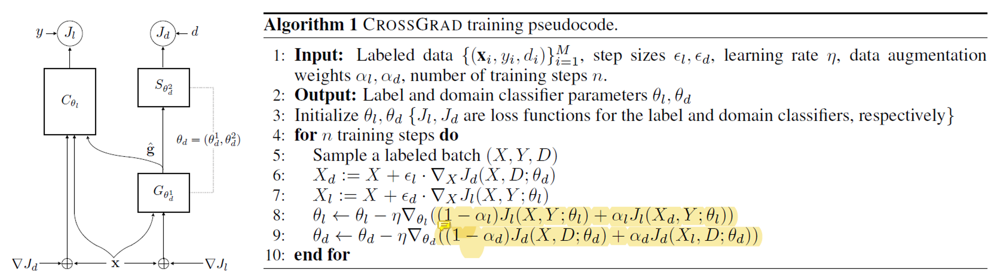
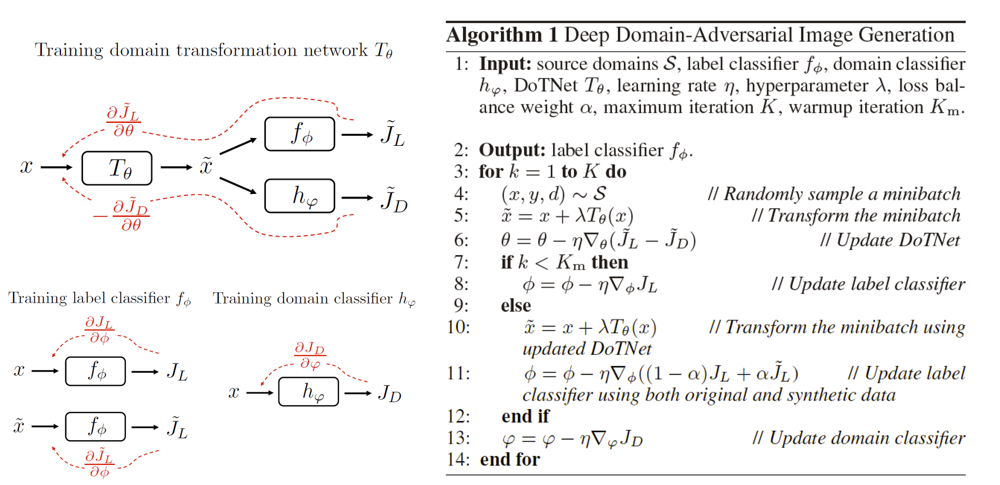
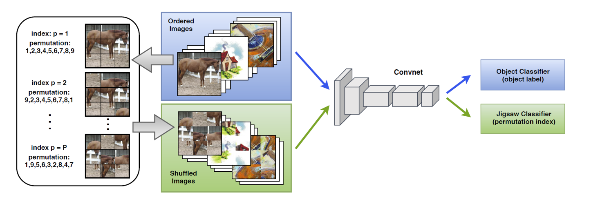
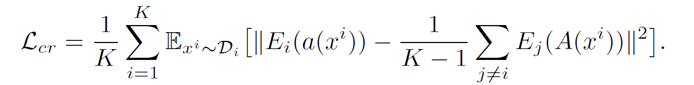

* content
{:toc}

在分布式的深度学习训练场景下，训练数据与测试数据可能来自不同的分布，同时训练数据来自多个数据源，数据源之间也存在分布偏移。由于深度学习模型本身具有[对训练集的过拟合特性](https://openreview.net/forum?id=Sy8gdB9xx)，对于不同分布数据的微调也会[导致深度学习模型的"灾难性遗忘"](https://www.zhihu.com/question/360374828/answer/1225597056)，因此这种域偏移会严重影响模型的泛化能力。

在之前的博客中，我们用两篇长文介绍了解决这一问题的著名技术：域适应(Domain Adaptation)，分别为[域适应的基本原理](https://www.fenghz.xyz/Domain-Adaptation-A-Survey/)，以及[域适应算法中的核函数](https://www.fenghz.xyz/RHKS-DA/)。此外，经过四个月的工作，我们撰写的一篇名为["KD3A: Unsupervised Multi-Source Decentralized Domain Adaptation via Knowledge Distillation"](https://arxiv.org/abs/2011.09757)的文章也已公开并投稿到AAAI2021，在这篇工作中，我们提出了一个新的解决联邦无监督域适应问题的算法，并在当前最大规模的验证集DomainNet上取得了51.1%的准确率。但是，域适应问题要求取得目标域的有标注或无标注数据，这与真实场景具有较大的区别。首先，真实场景中，我们往往希望模型能够适配于多个目标域，并可以进行快速的，小样本的微调。其次，真实场景的训练与测试往往是分离的，训练用于调试模型的数据，往往测试并不可用。域泛化(Domain Generalization)是研究这一问题的有效方法，它假设模型的输入为来自多个源域的数据集，而希望模型能够学到域无关的特征，这种特征可以容易地泛化到新的测试域上。

在本文中，我们对现有的域泛化算法进行综述，并按如下顺序展开：首先，我们介绍域泛化算法的基本理论模型；然后，我们将现有域泛化方法分为四类，基于元学习的域泛化、基于域无关特征的域泛化、基于生成模型的域泛化、以及基于自监督任务的域泛化，并逐一介绍这些方法的优缺点。

## 域泛化问题的基本定义与误差界[1]

我们用如下形式刻画在二分类问题上的域泛化过程。首先，我们将输入空间记作$\mathcal{X}$，将预测的标签空间记作$\mathcal{Y}$，其中$\mathcal{Y}=\{0,1\}$。为了突破“源域未知”这一限制，我们引入在输入空间与标签空间的直积上的概率分布的集合，记作

$$
\mathcal{B}_{\mathcal{X}\times \mathcal{Y}}
$$

$$\mathcal{B}_{\mathcal{X}\times \mathcal{Y}}$$中的每一个元素$$P_{\mathbf{X}\mathbf{Y}}\in \mathcal{B}_{\mathcal{X}\times \mathcal{Y}}$$都代表着输入空间与标签空间的一种可能的联合分布，而不同的联合分布对应着训练过程中的不同域。为方便起见，我们记$$\mathcal{B}_{\mathcal{X}}$$为输入空间$$\mathcal{X}$$上所有可能的概率分布集合，而记$$\mathcal{B}_{\mathcal{Y}\vert \mathcal{X}}$$为给定观测$$\mathbf{X}$$后标签空间的条件后验分布。同样的，我们有$$P_{\mathbf{X}\mathbf{Y}}=P_{\mathbf{X}}\cdot P_{\mathbf{Y\vert X}}$$，其中$$P_{\mathbf{X}}\in \mathcal{B}_{\mathcal{X}}$$，$$P_{\mathbf{Y\vert X}}\in \mathcal{B}_{\mathcal{Y\vert X}}$$。

假设在$$\mathcal{B}_{\mathcal{X}\times \mathcal{Y}}$$上存在一类分布，记作$$\mu$$，而我们观察到的$$N$$个域（也就是$$N$$个概率分布）都是对$$\mu$$的独立同分布采样，即

$$
P_{\mathbf{X}\mathbf{Y}}^{(1)},\ldots,P_{\mathbf{X}\mathbf{Y}}^{(N)}\sim^{\text{i.i.d}}\mu
$$

我们考虑域泛化问题的目标函数如下。考虑在概率分布集合与输入空间上的联合映射

$$
f:\mathcal{B}_{\mathcal{X}}\times \mathcal{X}\rightarrow\mathbb{R}; \hat{\mathbf{Y}}=f(P_{\mathbf{X}},\mathbf{X})
$$

我们希望对于任意测试分布$$P^{T}_{\mathbf{X}\mathbf{Y}}$$，模型预测与真实标签的损失尽量小，即最小化

$$
\epsilon(f) :=\mathbb{E}_{P^{T}_{\mathbf{X}\mathbf{Y}}\sim \mu}\mathbb{E}_{(\mathbf{X}^T,\mathbf{Y}^T)\sim P^{T}_{\mathbf{X}\mathbf{Y}}}\ [l(f(P^T_{\mathbf{X}},\mathbf{X}^T),\mathbf{Y}^T)] \tag{1}
$$

然而，在实际的采样过程中，我们往往只能采样若干个测试域，而每个测试域也一般只能采样若干个样本。在这种情况下，我们在测试域上的泛化误差与公式(1)所述的理想泛化误差之间有一定的偏移。假设我们采样了$$N$$个测试域，记作

$$
P_{\mathbf{XY}}^{(1)},\ldots,P_{\mathbf{XY}}^{(N)}\sim \mu
$$

对于对采样的每一个测试域$$P_{\mathbf{XY}}^{(i)}$$，我们选取尺寸为$$n$$的样本集合$$S_i$$，其中

$$
S_i=(\mathbf{X}_{i,j},\mathbf{Y}_{i,j})_{1\leq j\leq n_i}
$$

我们记通过采样集$$\{S_i\}_{i=1}^{N}$$所得的域泛化损失为

$$
\epsilon(f,\sum_{i=1}^{N}n_i):=\frac{1}{N}\sum_{i=1}^{N}\frac{1}{n_i}\sum_{j=1}^{n_i}\ [l(f(\hat{P}^{(i)}_{\mathbf{X}},\mathbf{X}_{i,j}),\mathbf{Y}_{i,j})]\tag{2}
$$

易得，当$$N\rightarrow \infty,n\rightarrow \infty$$时，通过$$(2)$$所计算出的泛化损失逼近于真实泛化损失$$(1)$$，因此我们也可以记$$(1)$$为$$\epsilon(f,\infty)$$。那么，一个很自然的问题是，我们通过$$(2)$$所估算的误差是否能收敛到真实误差$$\epsilon(f,\infty)$$，他们之间的距离是否可以用[PAC可学习理论](https://tangshusen.me/2018/12/09/vc-dimension/)进行表示。通过研究Reproducing Kernel Hilbert Space (RKHS)上的目标函数$$f$$，我们可以得到一个漂亮的理论上界。

### 在RKHS空间上进行泛化误差界分析

考虑损失函数$$l:\mathbb{R}\times \mathcal{Y}\rightarrow \mathbb{R}_{+}$$。令$$\bar{k}$$表示空间$$\mathcal{B}_{\mathcal{X}}\times \mathcal{X}$$上的核函数，令$$\mathcal{H}_{\bar{k}}$$表示对应的Reproducing Kernel Hilbert Space (RKHS)。给定采样集$$\{S_i\}_{i=1}^{N}$$，我们令$$\hat{P}_{\mathbf{X}}^{(i)}$$表示通过采样样本对第$$i$$个域的分布$P_{\mathbf{X}}^{(i)}$的经验估计，并通过采样集得对目标函数进行优化如下

$$
\hat{f}_{\lambda}=\arg_{f\in \mathcal{H}_{\bar{k}}}\min\frac{1}{N}\sum_{i=1}^{N}\frac{1}{n_i}\sum_{j=1}^{n_i}\ [l(f(\hat{P}_{\mathbf{X}}^{(i)},\mathbf{X}_{i,j}),\mathbf{Y}_{i,j})]+\lambda\Vert f\Vert.\tag{3}
$$

根据RKHS空间的基本性质，我们可以通过核函数计算的距离给出预测，即

$$
\hat{f}_{\lambda}(\hat{P}_{\mathbf{X}},\mathbf{X})=\sum_{i=1}^{N}\sum_{j=1}^{n_i}\alpha_{i,j}\mathbf{Y}_{i,j}\bar{k}((\hat{P}_{\mathbf{X}},\mathbf{X}),(\hat{P}_{\mathbf{X}}^{(i)},\mathbf{X}_{i,j}))
$$

而其中$$\alpha_{i,j}$$是优化器根据$$(3)$$所计算而来的参数。那么，对于这种特殊的输入$$(\hat{P}_{\mathbf{X}},\mathbf{X})$$，如何构造核函数，使得它们之间的距离能够被正确度量呢？我们已经在之前的博客中系统性介绍了[核函数的基本性质](http://www.fenghz.xyz/RHKS-DA/#reproducing-hilbert-kernel-space)，基于两个核函数的乘积也是核函数这一原理，一个很自然的想法是对$$\bar{k}$$进行如下所示的分解

$$
\bar{k}((P_{\mathbf{X}}^{(1)},\mathbf{X}_1),(P_{\mathbf{X}}^{(2)},\mathbf{X}_2))=k_{P}(P_{\mathbf{X}}^{(1)},P_{\mathbf{X}}^{(2)})k_{\mathbf{X}}(\mathbf{X}_1,\mathbf{X}_2)
$$

对于$$k_{\mathbf{X}}(\mathbf{X}_1,\mathbf{X}_2)$$，先前工作已经提出了很多有用的核函数，如线性核，二次核，高斯核等，因此我们这里重点讨论对分布构造核函数。在[Kernel Mean Embedding of Distributions: A Review and Beyond](https://arxiv.org/abs/1605.09522)这篇论文的第三章中，给出了一个通过**Kernel Mean Embedding**来计算分布之间距离的方法，即构造从所有可能的概率分布的集合$$\mathcal{B}_{\mathcal{X}}$$到通过任意一个在输入空间上的核函数$$k'_{\mathbf{X}}$$所对应的RKHS空间的映射$$\Phi:\mathcal{B}_{\mathcal{X}}\rightarrow \mathcal{H}_{k’_{\mathbf{X}}}$$如下：

$$
P_{\mathbf{X}}\rightarrow \Phi(P_{\mathbf{X}}):=\int_{\mathcal{X}}k’_{\mathbf{X}}(\mathbf{X},\cdot)dP_{\mathbf{X}}
$$

此时，再利用$$\mathcal{H}_{k_{\mathbf{X}}}$$空间的基本性质，即

$$
k'_{\mathbf{X}}(\mathbf{X}_1,\mathbf{X}_2)=\langle  k'_{\mathbf{X}}(\mathbf{X}_1,\cdot),k'_{\mathbf{X}}(\cdot,\mathbf{X}_2)\rangle_{\mathcal{H}}
$$

我们就可以考虑对于分布的如下kernel：

$$
k_{P}(P_{\mathbf{X}}^{(1)},P_{\mathbf{X}}^{(2)})=\langle\Phi(P_{\mathbf{X}}^{(1)}),\Phi(P_{\mathbf{X}}^{(2)})\rangle=\int_{\mathcal{X_1}}\int_{\mathcal{X_2}}k'_{\mathbf{X}}(\mathbf{X}_1,\mathbf{X}_2)dP_{\mathbf{X}}^{(1)}dP_{\mathbf{X}}^{(2)}\tag{4}
$$

考虑通过采样估计的经验分布$$(\hat{P}_{\mathbf{X}}^{(1)},\hat{P}_{\mathbf{X}}^{(2)})$$，代入$$(4)$$之后有如下等式：

$$
k_{P}(\hat{P}_{\mathbf{X}}^{(1)},\hat{P}_{\mathbf{X}}^{(2)}):=\frac{1}{n_1 * n_2}\sum_{i=1}^{n_1}\sum_{j=1}^{n_2}k'_{\mathbf{X}}(\mathbf{X}_{1,i},\mathbf{X}_{2,j})\tag{5}
$$

式$(5)$定义了最基本的分布距离计算的内积形式。如果我们扩展到二阶矩核函数，即

$$
k_{P}^2(P_{\mathbf{X}}^{(1)},P_{\mathbf{X}}^{(2)})=\Vert\Phi(P_{\mathbf{X}}^{(1)})-\Phi(P_{\mathbf{X}}^{(2)})\Vert_2^2\\
=\langle\Phi(P_{\mathbf{X}}^{(1)}),\Phi(P_{\mathbf{X}}^{(1)})\rangle+\langle\Phi(P_{\mathbf{X}}^{(2)}),\Phi(P_{\mathbf{X}}^{(2)})\rangle
-2\langle\Phi(P_{\mathbf{X}}^{(1)}),\Phi(P_{\mathbf{X}}^{(2)})\rangle
$$

此时，我们就导出了著名的MMD距离。我们用一类函数$$\mathcal{T}$$来表示所有通过二阶矩函数的扩张所得到的核函数，记作

$$
\mathcal{T}(P_{\mathbf{X}}^{(1)},P_{\mathbf{X}}^{(2)})=F(\Vert\Phi(P_{\mathbf{X}}^{(1)})-\Phi(P_{\mathbf{X}}^{(2)})\Vert)
$$

显然，高斯核

$$
\mathcal{T}(P_{\mathbf{X}}^{(1)},P_{\mathbf{X}}^{(2)})=\exp(-\frac{\Vert\Phi(P_{\mathbf{X}}^{(1)})-\Phi(P_{\mathbf{X}}^{(2)})\Vert_2^2}{2\sigma^2})\tag{6}
$$

是$$F$$的一种特例。引入了核函数以后，我们就可以通过核函数的有界性以及**Lipschitz**连续性来搞事了。我们的泛化误差分析基于以下两条基本假设：

**损失函数假设：**损失函数$$l(\cdot,y)$$关于第一个变量满足**$$L_{l}$$-Lipschitz**连续，且具有上界$$B_{l}$$。

**核函数假设:**  核函数$$k_{\mathbf{X}},k'_{\mathbf{X}},\mathcal{T}$$ 都是有界函数，且上界分别为$$B^2_{k},B^2_{k'}\geq 1$$,以及$$B_{\mathcal{T}}^2$$。此外，注意到

$$
\Phi:\mathcal{B}_{\mathcal{X}}\rightarrow \mathcal{H}_{k’_{\mathbf{X}}}
$$

是一个将分布映射到核函数对应的**RKHS：**$$\mathcal{H}_{k’_{\mathbf{X}}}$$的映射，而在$$\mathcal{T}$$的作用下，我们在$$\Phi$$的基础上又得到了一个新的核，这个核也可以构建对应的**RKHS：**$$\mathcal{H}_{\mathcal{T}}$$，因此我们可以构造一个典范映射$$\psi_{\mathcal{T}}:\mathcal{H}_{k’_{\mathbf{X}}}\rightarrow\mathcal{H}_{\mathcal{T}}$$，我们对这个映射也施加一个约束如下：

$$
\forall v,w\in\mathcal{H}_{k’_{\mathbf{X}}},\exists \alpha\in(0,1],L_{\mathcal{T}}>0,\\
s.t.\Vert\psi_{\mathcal{T}}(v)-\psi_{\mathcal{T}}(w)\Vert\leq L_{\mathcal{T}}\Vert v-w\Vert^{\alpha} \tag{7}
$$

一个常用的结论是，对于如$$(6)$$式所述的高斯核函数，$$(7)$$式在$$\alpha=1$$的条件下是成立的。

利用这两个假设，我们可以得到如下定理。

**一致泛化误差定理：**基于损失函数假设与核函数假设，通过对采样集$$\{S_i\}_{i=1}^{N}$$进行训练所得的目标函数$$f$$遵循一致泛化误差定理。对任意$$R>0,s.t. \Vert f\Vert_2^2\leq R$$，以下不等式至少以$$1-\delta$$的概率成立：

$$
\sup_{\Vert f\Vert_2^2\leq R,f\in \mathcal{H}_{\bar{k}}}\vert \epsilon(f,\sum_{i=1}^{N}n_i)-\epsilon(f,\infty)\vert\leq \\
c(RB_{k}L_{l}(B_{k'}L_{\mathcal{T}}(\frac{\log N+\log\delta^{-1}}{n})^{\frac{\alpha}{2}}+B_{\mathcal{T}}\frac{1}{\sqrt{N}})+B_{l}\sqrt\frac{\log\delta^{-1}}{N}) \tag{8}
$$

### 对域泛化的采样方案与因果分析

公式$$(1)$$给出了域泛化问题测试误差界的计算，那么如何对测试集进行采样呢？我们可以通过如下条件分解进行因果探索：

$$
\epsilon(f,\infty) :=\mathbb{E}_{P_{\mathbf{X}\mathbf{Y}}\sim \mu}\mathbb{E}_{(\mathbf{X},\mathbf{Y})\sim P_{\mathbf{X}\mathbf{Y}}}\ [l(f(P_{\mathbf{X}},\mathbf{X}),\mathbf{Y})]\\
=\mathbb{E}_{P_{\mathbf{X}}\sim \mu_{\mathbf{X}}}\mathbb{E}_{P_{\mathbf{Y\vert X}}\sim \mu_{\mathbf{Y\vert X}}}\mathbb{E}_{\mathbf{X}\sim P_{\mathbf{X}}}\mathbb{E}_{\mathbf{Y\vert X}\sim P_{\mathbf{Y\vert X}}}\ [l(f(P_{\mathbf{X}},\mathbf{X}),\mathbf{Y})]\\
=\mathbb{E}_{P_{\mathbf{X}}\sim \mu_{\mathbf{X}}}\mathbb{E}_{\mathbf{X}\sim P_{\mathbf{X}}}\mathbb{E}_{P_{\mathbf{Y\vert X}}\sim \mu_{\mathbf{Y\vert X}}}\mathbb{E}_{\mathbf{Y\vert X}\sim P_{\mathbf{Y\vert X}}}\ [l(f(P_{\mathbf{X}},\mathbf{X}),\mathbf{Y})]
$$

因此，我们可以不必同时生成输入$$\mathbf{X}$$以及对应的标注$$\mathbf{Y}$$，我们可以先从$$\mu_{\mathbf{X}}$$中采样对应的输入域$$P_{\mathbf{X}}$$，然后从$$P_{\mathbf{X}}$$中采样$$\mathbf{X}$$，最后再根据$$\mathbf{X}$$得到对应的条件标注$$\mathbf{Y}$$。

## 基于元学习的域泛化

[元学习](https://drive.google.com/file/d/1DuHyotdwEAEhmuHQWwRosdiVBVGm8uYx/view)是一个**"learning to learn"**的机器学习领域，它的目的是期望我们所学到的特征能够容易地泛化到新的任务，新的数据集上去。基于域泛化问题中目标域的不可见，元学习可以应用于域泛化任务中。现有基于元学习的域泛化工作主要有三类：基于参数元学习的域泛化[3]，基于正则化元学习的域泛化[4]，以及基于**episode-training**的域泛化[5]。

**基于参数元学习的域泛化。**如何让模型学到**具有泛化能力**的特征呢？一个很自然的想法是在训练的过程中"模拟"泛化这一步骤，即对训练集进行重采样，将其分为若干训练-测试输入对，然后我们先模拟训练过程，用每一个输入对的训练部分更新模型参数，然后再用更新后的参数在测试部分进行模拟测试。最后，为了让模型参数学到"泛化"的能力，我们将测试的损失对原参数进行求导，再对原参数进行更新。其基本过程如下所示：

首先，我们通过`Line 5-7`计算在构建的输入对的训练部分的损失，对原参数$$\Theta$$进行求导并更新。注意，这一步更新并不会终止计算图，即更新后的参数$$\Theta'$$可以认为是原参数的函数$$f(\Theta)$$，然后我们代入更新后的参数，计算在测试部分的损失$$\mathcal{G}(f(\Theta))$$，再用这一部分损失去对$$\Theta$$求梯度，然后进行更新即可。这种方法有一个缺点，即在计算模拟测试损失$$\mathcal{G}$$时，计算图会被扩大一倍，因此基于参数元学习的域泛化方法限于模型本身的大小而无法进行有效的推广。

**基于正则化元学习的域泛化。**正如上文所述，直接采用元学习方法会使得计算图扩大，从而令方法受限于深度神经网络本身的参数量。一种解决思路是用模型正则化损失来代替测试部分的损失，减少参数量。此外，为了减少在元学习中所需要学习的参数，我们还可以把神经网络分为两个部分，即**Backbone**与**Classifier**，参数分别为$$\psi,\theta$$。此时模型可以表示为：

$$
M_{\Theta}(\mathbf{X})=(T_{\theta}\circ F_{\psi})(\mathbf{X})
$$

对参数量较少的$$\theta$$引入一个自适应的正则化损失如下，其参数为$$\phi$$：

$$
R_{\phi}(\theta)=\sum_{i}\phi_{i}\vert \theta_{i} \vert
$$

我们采样$$p$$个训练域与$$q$$个测试域，我们希望在训练域中得到的模型能够不经调整地泛化到测试域上。根据上文所述，训练算法可以描述为以下三部分：

首先，我们对每一个训练域固定**Backbone**参数，而对后面的分类器参数进行区分，即参数空间为$$[\psi,\theta_1,\ldots,\theta_{p}]$$。在每一个训练的epoch中，我们都用$$p$$个训练域的数据以及对应的标签对整个参数空间进行训练，得到参数空间的良好初始化，如该算法中`Line 2-7`。然后，我们开始对训练域进行随机划分，模拟元学习的过程，如算法中的`Line 8-9`。接着，我们引入自适应的正则化工具，并采用联合损失，即

$$
L(\mathbf{X},\mathbf{y},\theta,\phi)=CE(\mathbf{X},\mathbf{y},\theta)+R_{\phi}(\theta)
$$

在训练集上更新后，得到更新参数$$\beta_l = f(\theta,\phi)$$，如`Line 9-14`。最后，我们在模拟的测试集上进行参数更新，此时我们并不直接更新$$\theta$$，而是更新正则化参数$$\phi$$，如`Line 15-16`。也就是说，整个元学习的过程由正则化部分完成。注意到对每一个训练域，我们都分配了一个独特的分类器参数$$\theta_{i}$$，因此，在最后测试的过程中，我们用每一个分类器参数进行预测，而对预测结果进行**ensemble**。

**基于episode-training的域泛化。**相对于更广泛的元学习问题，域泛化有其特殊性，即源域与目标域的特征接近，且预测任务基本一致。基于这一特性，文献[5]提出了**episode-training**，它的基本思路分为两块，首先，对每一个训练域，模型构造独立的分类参数$$[\theta_i,\psi_i]$$。然后，分别采用每个训练域的数据对分类参数进行训练，得到*domain-specific*的$$[\theta_i,\psi_i]$$。最后，用这些*domain-specific*的$$[\theta_i,\psi_i]$$训练一个*domain-agnostic*的全局模型$$[\theta,\psi]$$。训练的方法分为三阶段：

* Step 1. 全局训练

  $$
  \arg_{\theta,\psi}\min \text{CE}(\psi (\theta (\mathbf{X}),\mathbf{y})
  $$

* Step 2. Episodic training for $\theta$

  $$
  \arg_{\theta}\min \mathbb{E}_{i,j\sim[1,n],i\neq j}[\mathbb{E}_{(\mathbf{X}_i,\mathbf{y}_i)\sim S_i}[\text{CE}(\psi_j (\theta (\mathbf{X}_i),\mathbf{y}_i)]]
  $$

* Step 3. Episodic training for $\psi$

  $$
  \arg_{\psi}\min \mathbb{E}_{i,j\sim[1,n],i\neq j}[\mathbb{E}_{(\mathbf{X}_i,\mathbf{y}_i)\sim S_i}[\text{CE}(\psi (\theta_{j} (\mathbf{X}_i),\mathbf{y}_i)]]
  $$

其算法如下所述：

此外，本文还探索了一种对异构域泛化问题的训练方案，即泛化任务与训练任务也不一致，基本思路是引入随机分类器来训练特征提取器：

$$
\arg_{\theta}\min \mathbb{E}_{i\sim[1,n]}[\mathbb{E}_{(\mathbf{X}_i,\mathbf{y}_i)\sim S_i}[\text{CE}(\psi_{\text{Random}} (\theta (\mathbf{X}_i),\mathbf{y}_i)]]
$$

## 基于域无关特征的域泛化

根据公式$$(8)$$所述的一致泛化误差定理，如果对于所有可能的域，它们在核空间上的分布距离都尽量接近，那么就意味着分布距离的上界$$B_{k'},B_{\mathcal{T}}$$以及$$L_{\mathcal{T}}$$都变得尽量小，同时泛化误差也会变小。将神经网络视作一个可以自主学习的核函数，一个从域迁移的工作中自然衍生到域泛化的思路为令不同训练域的输入在神经网络的输出特征层面不可分辨。那么，采用什么样的损失函数才能让所学的特征达到**不可分辨**的效果呢？我们首先回顾一下统计学中常用的方差分析(ANOVA)。

模型所学的特征**不可分辨**，等价于检验模型对于不同域的数据所预测特征的分布一致。假如存在$$p$$个训练域，在每个训练域上，对$$\mathbf{X}_{i,j}$$所预测特征为$$\mu_{i,j}$$，域$$S_i$$特征的均值为$$\mu_i$$，所有域的平均特征为$$\mu$$。那么要令模型特征不可分辨，即验证以下假设成立：

$$
H_0:\mu_1=\mu_2=\cdots=\mu_p
$$

基于正态性假设，我们可以用平方和来计算$$H_0$$成立所需的统计量：

$$
\text{SS}_{T}=\sum_{i=1}^{N}\sum_{j=1}^{n_i}\Vert\mu_{i,j}-\mu\Vert_2^2\\
\text{SS}_{E}=\sum_{i=1}^{N}\sum_{j=1}^{n_i}\Vert \mu_{i,j}-\mu_i\Vert_2^2\\
\text{SS}_{A}=\sum_{i=1}^{N}\sum_{j=1}^{n_i}\Vert \mu_{i}-\mu\Vert_2^2
$$

根据方差分析表，当统计量$$F=\frac{\text{SS}_{A}}{\text{SS}_{E}}$$比较小时，模型在不同域上特征的均值统计量基本一致。基于域无关特征的域泛化方案可以根据这种思路进行设计，现有方法基本分为3类：基于核方法的域无关特征学习[6,7]；基于深度神经网络的域无关特征学习[9,10]；以及基于对抗训练的域无关特征学习[8,11]。

**基于核方法学习域无关特征。**对于一个分类任务$$f:\mathbf{X}\rightarrow \mathbf{Y}$$，我们先用核函数$$\phi$$将样本$$\mathbf{X}_{i,j}$$映射到核空间，记为$$\mu_{i,j}=\phi(\mathbf{X})$$。在核空间内，我们期望来自不同域的特征$$\mu_{i,j}$$与标签$$\mathbf{Y}$$的联合分布基本一致，从而令模型能学习域无关的特征，即我们希望学习的特征满足

$$
p(\phi(\mathbf{X}),\mathbf{Y})=p(\phi(\mathbf{X}))\cdot p(\mathbf{Y}\vert\phi(\mathbf{X}))
$$

因此，如果对于不同的域$$S_{i}$$，如果满足

$$
p^{(i)}(\phi(\mathbf{X}))=p^{(j)}(\phi(\mathbf{X})) \tag{9}
$$

且

$$
p^{(i)}(\mathbf{Y}\vert\phi(\mathbf{X}))=p^{(j)}(\mathbf{Y}\vert\phi(\mathbf{X}))\tag{10}
$$

那么我们可以说模型可以学习域无关的特征。之前经典的域泛化工作基本都是令特征空间最小化不同的域之间特征分布的差异，如最小化$$(6)$$。这些工作都是假设标注$$\mathbf{Y}$$的条件分布不随域的改变而改变，即$$(10)$$式自然成立。然而，在实际场景下，由于不同域之间目标的相似度会发生变化（如在油画和简笔画中，橙子可能在油画更好分辨，而在简笔画中可能和猕猴桃混肴)，因此这个假设往往是很难满足的。但是，对于数据量足够大的相似domain，我们一般可以认为标注空间的边缘分布，即$$p(\mathbf{Y})$$差异不大。此时，我们可以采用如下条件分布公式来对$$p(\mathbf{Y}\vert\phi(\mathbf{X}))$$进行如下限制：

$$
p(\mathbf{Y}\vert\phi(\mathbf{X}))=\frac{p(\phi(\mathbf{X})\vert\mathbf{Y})\cdot p(\mathbf{Y})}{p(\phi(\mathbf{X}))}
$$

因此，为了满足$$(10)$$的限制，我们可以令来自不同域的类别条件分布彼此相等，即

$$
p^{(i)}(\phi(\mathbf{X})\vert\mathbf{Y})=p^{(j)}(\phi(\mathbf{X})\vert\mathbf{Y})
$$

为了达成这一目的，我们应该通过类别进行分组，要求相同类别不同域的特征尽量相似，并且要求不同类别的特征尽量有差异。根据这一直觉，可以将我们的$$m$$个训练域采样集$$\{S_i\}_{i=1}^{m}$$按$$C$$个类别进行子集划分，即$$S_i=\cup_{c=1}^{C}S_{i}^{(c)}$$。依据这种划分，文献[6,7]提出了以下四个指标：

1. Average domain discrepancy. 该指标要求在每一个类别内部，不同域特征的**MMD**距离尽量小，即
   
   $$
   \min \Psi^{add}(\{S_i\}_{i=1}^{m}):=\frac{1}{\tbinom{m}{2}}\sum_{c=1}^{C}\sum_{1\leq i< i'\leq m}\hat{\text{MMD}}(S_{i}^{(c)},S_{i'}^{(c)})
   $$

2. Multi-domain within-class scatter. 该指标要求在所有域上，属于相同类别个体的类内特征差异尽量小，即
   
   $$
   \min \Psi^{mws}(\{S_i\}_{i=1}^{m}):=\frac{1}{N}\sum_{c=1}^{C}\sum_{i=1}^{m}\sum_{j=1}^{n_j^s}I[\mathbf{X}_{i,j}\in S_{i}^{(c)}]*\text{dist}(\phi(\mathbf{X}_{i,j}),\mu_c)
   $$
   其中，$$\mu_c$$为所有域上属于第$$c$$类的输入所对应的特征的期望，可以通过均值计算。

3. Average class discrepancy. 该指标要求以类别对$$\{S_i\}_{i=1}^{m}$$进行划分，即
   
   $$
   T_{c}=\cup_{i=1}^{m}S_i^{(c)}
   $$

   要求不同类别的特征差异尽量大，即

   $$
   \max \Psi^{acd}(\{S_i\}_{i=1}^{m}):\frac{1}{\tbinom{C}{2}}\sum_{1\leq c<c'\leq C}\hat{\text{MMD}}(T_c,T_{c'})
   $$

4. Multi-domain between-class scatter. 该指标要求在所有域上，属于不同类别个体的类间特征差异尽量大，即
   
   $$
   \max \Psi^{mbs}(\{S_i\}_{i=1}^{m}):=\frac{1}{N}\sum_{c=1}^{C}\vert T_{c}\vert *\Vert\mu_{c}-\bar{\mu}\Vert_2^2
   $$

综合以上四个指标，我们的模型目标函数为

$$
\arg\max\frac{\Psi^{acd}+\Psi^{mbs}}{\Psi^{add}+\Psi^{mws}}
$$

**基于神经网络的域无关特征学习**用神经网络作为一个良好的非线性核函数，其目标函数与核方法的函数类似。我们记一个深度神经网络由两部分组成，特征提取器和特征分类器，记作$$f=h\circ g$$，那么对于相同类别的个体，我们要求不同域的特征尽量接近，即

$$
\min_{g} \frac{1}{N}\sum_{c=1}^{C}\sum_{1\leq i < i'\leq m}\sum_{j=1}^{n_j^s}I[\mathbf{X}_{i,j}\in S_{i}^{(c)}]*I[\mathbf{X}_{i',j}\in S_{i'}^{(c)}]*\text{dist}(g(\mathbf{X}_{i,j}),g(\mathbf{X}_{i',j}))
$$

此外，我们还要求对于不同分类的数据，它们的距离尽量疏远

$$
\max_{g} \frac{1}{N}\sum_{1\leq c <c' \leq C} \sum _{\mathbf{X}_{i,j}\in T_c\\\mathbf{X}_{i',j'}\in T_{c'}}\text{dist}(g(\mathbf{X}_{i,j}),g(\mathbf{X}_{i',j'}))
$$

一般而言，我们可以用指数距离，或者$$\Vert\cdot\Vert_2^2$$来计算特征距离。文献[10]提出了一种度量学习的方案，通过一个度量学习网络(记作$$\phi$$)来进行距离计算，损失函数为一个*triplet loss*

$$
l_{\text{tri}}^{a,p,n}=\max\{0,d_{\phi}(\mathbf{z}_a,\mathbf{z}_p)^2-d_{\phi}(\mathbf{z}_a,\mathbf{z}_n)^2+\xi\}
$$

其算法用了*meta-learning*的思想，对模型进行模拟的训练-测试集划分，先在训练集上用标注对模型进行训练，然后再用更新后的参数在测试集上训练域无关特征，算法如下图所述：

**基于对抗训练的域无关特征学习**用对抗生成模型使得不同域数据在特征空间上的分布"不可分辨"。文献[8]构造了一个全局的域分类器，以及$$C$$个基于不同类别先验的条件域分类器，全局域分类器对输入的样本属于哪一个域进行正确分类，同时特征提取模型$$g$$在训练的过程中混肴全局域分类器。条件域分类器与全局域分类器一致，但是输入的样本是属于同一个类别的不同域的样本数据。在对抗方式上，该模型采用逆梯度的方法(reverse gradient)进行对抗训练。

文献[11]混合了MMD距离与GAN，它在通过最小化域之间的MMD距离，从而使得模型学到合适的全局特征的同时，将来自不同域的特征求均值，并认为在最优条件下，这个均值向量应当服从正态分布。基于该直觉，模型采用一个GAN网络，令均值向量逼近正态分布生成的向量，如下图所述：

## 基于生成模型的域泛化

除了在低维空间上令特征分布无法分辨以外，一个更直观的方法是基于当前这些源域直接生成与当前源域风格差异巨大，但是语义差异（分类特征）类似的图像，常用方法有基于Robust Adversarial Training的生成模型[12,13]，基于全卷积神经网络的生成模型[14]，以及基于Cycle-GAN的生成模型[15]。

**基于Robust Adversarial Training的生成模型**目的是通过梯度对抗训练，得到一个新的样本，该样本与当前目标域差距较大，但是又能保留基本的语义特征。文献[12]提出了对抗数据增广方法，通过得到一个与当前数据差异足够大的新样本训练神经网络，使之能够学到更多数据特征，算法如下所述：

在`Line7-10`，模型通过对抗的方法得到与原数据空间差异尽量大的新样本。文献[13]扩展了该思路，它指出我们生成的新样本也要保留语义特征，并设计了两个独立的分类器，一个为类别分类器，另一个为域分类器。在每次生成中，模型对于一个输入$$\mathbf{X}$$分别生成两个新样本，一个新样本能够混肴域分类器，记为$$\mathbf{X}_d$$。另一个新样本混肴类别分类器，记为$$\mathbf{X}_l$$。在训练过程中，类别分类器的训练采用$$\mathbf{X}_d$$作为增广数据，而域分类器则采用$$\mathbf{X}_l$$进行数据增广，过程如下所述：

**基于全卷积神经网络的生成模型**[14]将$$X$$输入到一个全卷积模型中，让模型学习一个变换$$T_{\theta}(\mathbf{X})$$，并构造新的样本为$$\tilde{\mathbf{X}}=\mathbf{X}+T_{\theta}(\mathbf{X})$$，要求该变换满足两个条件：能够尽量混肴域分类器，同时能够强调类别分类器的语义特征（即让类别分类损失尽量变小），其过程如下所述：

**基于Cycle-GAN的生成模型**[15]构造一个*Cycle-GAN*，要求对输入$$\mathbf{X}$$所对应的生成样本$$\tilde{\mathbf{X}}$$具有如下特性：首先，生成样本$$\tilde{\mathbf{X}}$$在*GAN*的*Wasserstein*距离上与$$\mathbf{X}$$距离尽量远；其次，生成样本能够被正确的分类到与输入相同的类别。最后，经过循环生成$$G(G(\mathbf{X}))$$后得到的样本与输入尽量接近。训练好生成器后，我们就可以用生成器得到的样本扩充原来的数据空间。

## 基于自监督任务的域泛化

在上文中，我们介绍了基于元学习，基于域无关特征，以及基于生成模型的域泛化方法，这些方法都旨在令模型能够学到域无关的特征。此外，还有一类基于自监督任务的域泛化方法，它们通过构造经验式(empirical)的或是启发式(heuristic)的辅助自监督任务，让模型学到能泛化的特征。我们介绍该领域常用的三个方法——秩约束法[14]，*Jigsaw Puzzle*法[15]，以及Ensemble Learning[16]。

秩约束法[14]提出对模型的参数进行限制，使得卷积神经网络模型的参数秩尽量小。此外，该文章也是第一个构造了常用的域泛化数据集**PACS**的文章。

*Jigsaw Puzzle*法[15]构造了一个自监督的拼图任务让模型学习，并认为这个**域无关**的拼图任务可以弥合域之间的分布差异，其模型结构如下图所示：

模型提前确定$$P$$个常用的拼图模型，对于每一个输入图像，我们构造一个**解拼图分类器**，使得它能够正确预测打乱的顺序，并通过该任务令特征提取网络学到共同的特征，这种方法在PACS上达到了80.51%的分类精度。

Ensemble Learning[16]方法先独立让每一个源域训练分类器，作为每个域的专家。然后令专家之间进行学习，基本思路为令某专家的预测指标接近于其他专家预测的均值：

其中，$$a(\cdot)$$与$$A(\cdot)$$分别表示两种数据增广方法，前者表示弱增广，后者表示强增广。

## 可用代码与模型验证

现阶段比较广泛的可用代码为`Kaiyang Zhou`博士的[Dassl库](https://github.com/KaiyangZhou/Dassl.pytorch)。

## 参考文献

[1] Blanchard G, Lee G, Scott C. Generalizing from several related classification tasks to a new unlabeled sample[C]//Advances in neural information processing systems. 2011: 2178-2186.

[2] Muandet K, Fukumizu K, Sriperumbudur B, et al. Kernel mean embedding of distributions: A review and beyond[J]. arXiv preprint arXiv:1605.09522, 2016.

[3] Li D, Yang Y, Song Y Z, et al. Learning to generalize: Meta-learning for domain generalization[J]. arXiv preprint arXiv:1710.03463, 2017.

[4] Balaji Y, Sankaranarayanan S, Chellappa R. Metareg: Towards domain generalization using meta-regularization[C]//Advances in Neural Information Processing Systems. 2018: 998-1008.

[5] Li D, Zhang J, Yang Y, et al. Episodic training for domain generalization[C]//Proceedings of the IEEE International Conference on Computer Vision. 2019: 1446-1455.

[6] Hu S, Zhang K, Chen Z, et al. Domain generalization via multidomain discriminant analysis[C]//Uncertainty in Artificial Intelligence. PMLR, 2020: 292-302.

[7] Li Y, Gong M, Tian X, et al. Domain generalization via conditional invariant representation[J]. arXiv preprint arXiv:1807.08479, 2018.

[8] Li Y, Tian X, Gong M, et al. Deep domain generalization via conditional invariant adversarial networks[C]//Proceedings of the European Conference on Computer Vision (ECCV). 2018: 624-639.

[9] Dou Q, Coelho de Castro D, Kamnitsas K, et al. Domain generalization via model-agnostic learning of semantic features[J]. Advances in Neural Information Processing Systems, 2019, 32: 6450-6461.

[10] Motiian S , Piccirilli M , Adjeroh D A , et al. Unified Deep Supervised Domain Adaptation and Generalization[C]// International Conference on Computer Vision Iccv. 2017.

[11] Li H , Pan S J , Wang S , et al. Domain Generalization with Adversarial Feature Learning[C]// CVPR 2018. 2018.

[12]  Volpi R, Namkoong H, Sener O, et al. Generalizing to unseen domains via adversarial data augmentation[C]//Advances in neural information processing systems. 2018: 5334-5344. 

[13]  Shankar S, Piratla V, Chakrabarti S, et al. Generalizing across domains via cross-gradient training[J]. arXiv preprint arXiv:1804.10745, 2018. 

[14]  Li D, Yang Y, Song Y Z, et al. Deeper, broader and artier domain generalization[C]//Proceedings of the IEEE international conference on computer vision. 2017: 5542-5550.

[15]  Carlucci F M, D'Innocente A, Bucci S, et al. Domain generalization by solving jigsaw puzzles[C]//Proceedings of the IEEE Conference on Computer Vision and Pattern Recognition. 2019: 2229-2238.

[16]  Zhou K, Yang Y, Qiao Y, et al. Domain Adaptive Ensemble Learning[J]. arXiv preprint arXiv:2003.07325, 2020.

