人类具有从经验中不断复用拓展知识的能力，即我们不仅可以将先前学到的知识和技能应用到新的环境中，还可以将它们作为以后学习的基础。这种**持续学习，泛化知识**的能力是强人工智能的重要特征，而以深度学习为代表的人工智能则难以具备。人工智能的重要研究目标是构建具备**持续学习**能力的智能体，该智能体可以根据自身经验构建对世界的复杂理解，从而利用更复杂的知识进行**自主的渐进式的**训练与改进。实验证明，已训练好的 AI 模型在新数据上训练或在新环境部署时会受到很大影响（如灾难性遗忘），即使新数据与它们的训练环境十分相似。此外，深度学习模型的学习过程通常是局部或孤立任务中的固定数据集，这令模型难以产生更复杂和自主的智能行为。持续学习（Continual Learning），也称终身学习（Life-long learning）是解决此类问题的研究方向，它的目标是扩展模型适应能力，令模型能够在不同时刻学习不同任务的知识，同时不会遗忘先前任务的特征。在ICML2021上，加拿大蒙特利尔大学的**Irina Rish**研究员对深度学习中的持续学习（Continual Learning）做了一个Tutorial，我们对此进行解读。

解读分为三部分：第一部分先介绍持续学习的动机和简史，然后将持续学习按目标应用场景进行分类，最后在方法、基准数据集和实验结果方面对最新成果进行总结；第二部分讨论如何在低监督信号/数据下进行持续学习，并将持续学习与其他机器学习场景（如无监督、半监督和强化学习）相结合。最后，总结持续学习的社会影响，并对进一步的研究问题和有趣的研究方向进行了探索。该解读的素材文本由浙江大学CAD&CG实验室硕士一年级的同学*YvHui*提供，由本人进行编辑校正。

## 持续学习的简介与应用场景

### 动机与历史

基于深度学习的人工智能模型取得了很好的泛化性能，在个别任务上甚至超过了人类。但是深度模型大多是在静态同分布数据集上进行训练，无法随着时间而适应或扩展其行为，因此这种**智能**仍非常局限。作为人类，我们能轻易学会多种任务，并将多种知识交叉应用于多个环境。人是如何做到这一点的呢？答案是**持续学习（Continue Learning）**，也称为**终身学习（Lifelong Learning）**。[Ring (1997)](https://link.springer.com/chapter/10.1007/978-1-4615-5529-2_11) 将持续学习定义为：**持续学习是基于复杂环境与行为进行不断发展，并在已经学习的技能之上建立更复杂技能的过程。**

持续学习有许多现实场景中的需求与挑战：机器人在不同的环境中需要自主地去习得新的技能，适应新的情况，完成新的任务；自动驾驶程序需要去适应不同环境，如从乡村公路到高速公路到城市马路；智能对话系统需要去适应不同的用户和情景；智能医疗应用则需要适应新的病例、新的医院以及不一致的医疗条件。一个持续学习的系统模型如下图所示：基于知识的人工智能系统利用各个渠道的信息进行学习，诸如文本信息，超文本数据（html），以及基于人机交互设备所得到的数据，不断在新概念间建立联系（右图），令所学的系统越来越强大。

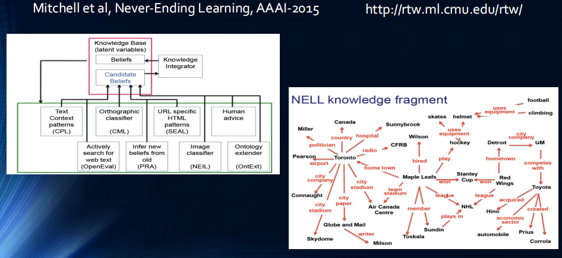

在深度神经网络上进行持续学习有两个目标：一是应对神经网络由于其自身的设计天然存在的**灾难性遗忘问题** (McCloskey and Cohen, 1989)，二则是使训练模型更为通用，即令模型同时具备**可塑性（学习新知识的能力）和稳定性（对于旧知识的记忆能力）**。

- **灾难性遗忘**

  灾难性遗忘是神经网络训练过程中，在新数据集上学习新特征时突然**完全抹去**网络已经学到的特征的现象。神经网络所学到的知识与特征存储在模型参数中（如卷积核参数，Attention参数），当神经网络在新数据集上学习一个新任务时，网络中的参数会被更新，而旧任务的知识则会被覆盖，导致更新后的模型在旧任务上的表现出现了"灾难性的下降"。

- **可塑性与稳定性**

  - 可塑性：适应新的任务的能力
  - 稳定性：保留在旧任务上学习到的技能的能力

综上所述，可以持续学习的深度学习系统的难点在于设计一个对新输入敏感但不会受到颠覆性干扰的系统。

## 1.2 持续学习与其他学习场景的异同

持续学习的目的是令所训练的机器学习模型能够具备在不同时间段分别解决多个任务的能力，这与很多机器学习场景具有一定的相似性：多任务学习要求一个模型能够完成多个任务；迁移学习要求模型所学特征能够迁移到不同分布上。我们将持续学习与机器学习中的多个场景，即**监督学习、多任务学习、迁移学习、域适应以及元学习**进行对比。记机器学习模型所需要进行推断的时刻为$$T_1,T_2,\cdots,T_m$$，需要泛化的数据集分布为$$D_1,\cdots,D_k$$，用$$(\mathbf{X},\mathbf{y})\sim D_k$$表示对数据集分布上的数据采样。那么监督学习、多任务学习、迁移学习、域适应，元学习以及持续学习的学习过程可以由下图所对比描述：

- **有监督学习**：在标准监督学习中，训练数据和测试数据都是来自于同一时刻上分布为$$(\mathbf{X},\mathbf{y})\sim D_1$$的独立同分布数据，模型在训练集上进行拟合，目标是泛化到未见过的测试数据
- **多任务学习**：多任务学习 (Multi Task Learning) 的训练与测试数据来自**同一个时刻**的多个不同的分布$$D_1,\cdots,D_k$$，模型采用相同Backbone**同时对所有任务进行离线训练**，并且在模型部署后不再进行调整，目的是学习不同任务的共同特征，利用多种数据增强泛化性并减少过拟合。
- **迁移学习**：迁移学习的训练数据来自$$T_s,T_T$$这两个时刻的两个分布$$D_S,D_T$$，称作源分布与目标分布，而测试集则仅为目标分布$$D_T$$中的数据。在训练过程中，模型先在源分布$$D_S$$上进行训练，再在目标分布$$D_T$$上微调适应。迁移学习旨在利用从源分布中获得的知识来**帮助学习目标分布**$$D_T$$。迁移学习主要关注从源分布到目标分布的单向迁移需求，在迁移期间不考虑模型在源分布上的性能，即不考虑在$$D_S$$上的灾难性遗忘。 此外，在迁移后模型部署不再调整，因此不再考虑模型的进一步适应问题。
- **域适应**：域适应是迁移学习的一个子领域，与迁移学习略有不同，其训练数据来自相同时刻$$T_1$$的两个分布$$D_S,D_T$$，而目标分布上仅能获得未标记的原始数据$$\mathbf{X}\sim D_T$$。域适应通过**同时利用**有标注的源分布数据$$D_S$$与无标注的目标分布$$D_T$$，令模型在目标分布上表现良好。域适应也是从源分布到目标分布的单向迁移，迁移后模型不再调整，但是源分布与目标分布的训练共用一套参数与一个Backbone，因此会一定程度地减轻$$D_S$$上的灾难性遗忘。
- **在线学习**：在线学习的训练与测试数据来自相同分布$$D_1$$，但是数据从多个时刻采样。因此模型在部署期间仍然要保持学习能力，因此可以利用新采样的数据增强泛化性能。
- **元学习**：元学习（Meta Learning）也称 Learning to Learn，其训练数据是来自相同时刻$$T$$的多个分布$$D_1,\cdots,D_k$$，而测试数据则是另外一个分布$$D_n$$，在测试过程中，训练好的模型利用测试分布$$D_n$$中的少量样本（一到五个样本）进行微调，并期望能够泛化到整个测试分布中。元学习的目标是令模型能够学习一个可以**容易地泛化到不同任务上的元特征**，这种元特征可以类比为身体中的**干细胞**，它保留了快速适应新分布，快速泛化的能力。元学习模型仍然通过**离线训练**，同时不考虑泛化到新任务的特征在训练分布上的表现，因此没有考虑$$D_1,\cdots,D_k$$上的灾难性遗忘。
- **持续学习**：持续学习融合了多任务学习，在线学习与域适应，是一个在多分布，多时刻上共用一套参数与一个Backbone的学习任务。它的训练集与测试集来自$$T_1,T_2,\cdots,T_m$$时刻所对应的单个分布$$D_1,\cdots,D_k$$，而测试集则包含所有的分布$$D_1,\cdots,D_k$$。因此，持续学习需要在不同的时刻在线获取新分布的数据，并在线更新模型参数，而模型则需要同时适应所有的分布。持续学习从多个时间段的数据流中学习，因为训练数据不会村粗，因此要求在新知识的学习过程中不会忘记旧有的特征，从而令神经网络可以在不同任务中不断积累知识，减轻灾难性遗忘。

最后，我们从四个维度对以上的学习场景进行简要对比：（1）Multiple Domains of Employment，即模型是否要适应多个分布不一致的场景；（2）Multiple Required Skills，即模型是否需要适应多个不同的任务；（3）Universal Master Policy，即模型是否将相同的backbone应用于不同的任务（如迁移学习需要对不同的分布进行参数微调，从而修改了Backbone，而域适应则要求模型能够学到域无关（Domain Invariant）的特征，在相同的Backbone上进行预测）；（4）Non-stationary Evolution，即模型在不同时刻所需要泛化的数据是否服从相同的分布，如果服从则称模型的训练是平稳演化（Stationary Evolution），不服从则是非平稳（Non-stationary）。可见监督学习，多任务学习，域适应都是平稳演化，而迁移学习与持续学习在不同时刻的应用场景则会变化，它们属于Non-stationary Evolution。[依据四种特性整理的表格如下](https://homes.esat.kuleuven.be/~konijn/publications/2019/1909.08383.pdf)：

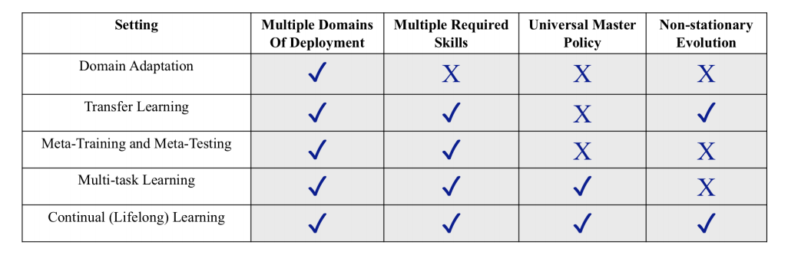

## 1.3 持续学习的分类

在上文中，我们比较了持续学习与其他学习场景的异同，即持续学习面对的是多个时刻上分布不一致数据的学习任务，要求模型能够在一套参数下在不同时刻学习不同的特定任务，同时又不会遗忘之前的知识。但是，在现实场景中，依据数据的收集方式，学习过程又可分为多类，如有监督学习，无监督学习，类增量学习等。结合不同的学习过程，我们可以将持续学习细分为如下四类：（1）任务增量型持续学习（Task-Incremental CL），（2）类增量型持续学习（Class-Incremental CL）（3）域增量型CL（Domain-Incremental CL）（4）任务不可知型持续学习（Task-Agnostic CL），这是最具挑战的持续学习场景。为方便阐述，记持续学习系统的符号表示及相关概念如下：

- $$\mathbf{X}\in \mathcal{X}$$：数据集中的数据点
- $$\mathbf{Y}\in \mathcal{Y}$$：分类集中的类别标签
- $$T$$：任务，不同任务下的输入数据与分类标签都不一样，记为$$P(\mathbf{X,Y}\vert T)$$
- $$P(\mathbf{X})$$：输入数据的分布
- $$P(\mathbf{Y})$$：标签的分布

根据在模型训练过程中是否知道任务的信息，我们可将持续学习进行如下分类：若训练时无法完整获取泛化任务信息，即模型在测试过程中可能会应对任意未知的任务，这一类场景被称为**任务不可知式持续学习（Task-agnostic CL）**，因此要求模型学到的特征能够容易地泛化到任意新场景上；若训练时能够完整获取泛化任务信息，即模型测试过程中的任务一定在训练中出现过，那么可以依据在测试场景中是否知道任务信息，分为已知任务信息的**任务增量式持续学习（Task-Incremental CL）**以及**未知任务信息的类增量式/域增量式持续学习（Class-Incremental CL or domain-incremental CL）**。 

#### (1) Task-Incremental CL（任务增量持续学习，类似于多任务学习）

任务增量学习是最简单的持续学习场景，在该场景下，不同时刻收集的数据分属于不同的任务，而同一任务的数据能够在一个时刻全部到达。在该场景下，我们可以获得**当前任务的全量数据**，从而可以**在独立同分布的假设下训练模型**，如下图所示，它的基本假设是$$\left\{\mathcal{Y}^{(t)}\right\} \neq\left\{\mathcal{Y}^{(t+1)}\right\}$$，即不同时刻的任务标签来自于不相交的空间，与不同的任务对应。

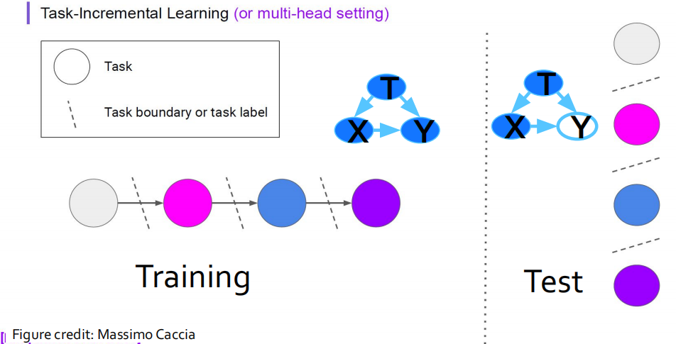

此外，在推断过程中，模型可以得到当前任务的具体信息（如分类的类别），因此可以为不同的任务设计特定的模型。利用不同任务的输出互相独立这一特点，一个典型的Task-Incremental CL模型可以通过多头网络的方式实现，即由一个在任务之间共享的Backbone提取特征，再构建多个分类器解决对应的任务。

#### (2) Class-Incremental CL（类增量持续学习）

区别于任务增量学习，在类增量学习的训练过程中，在不同时间段所收集的数据均属于同一分类任务的不同类别，且类别没有交叉（如手写数字分类任务中，第一次获得数字"0，1"，第二次"2，3"，直到获得所有数字）。在推断过程中，虽然模型可以获得完整获取泛化任务信息（如要求分类数字"0-9"），但是无法得到当前任务的具体信息（如分类的类别），因此不仅需要对输入数据作出合理推断，还要对模型面临的任务进行推断（如需要推断当前收集的数据是来自哪两类，然后对具体的图片进行分类）。因此，类增量学习**要求模型在学习过程中能够自适应地增加新分类的类别**。用数学语言表达它的基本假设是：（1）$$P(\left\{\mathcal{X}^{(t)}\right\}) \neq P(\left\{\mathcal{X}^{(t+1)}\right\})$$；（2）$$\left\{\mathcal{Y}^{(t)}\right\} =\left\{\mathcal{Y}^{(t+1)}\right\}$$；（3）$$P(\left\{\mathcal{Y}^{(t)}\right\}) \neq P(\left\{\mathcal{Y}^{(t+1)}\right\})$$。

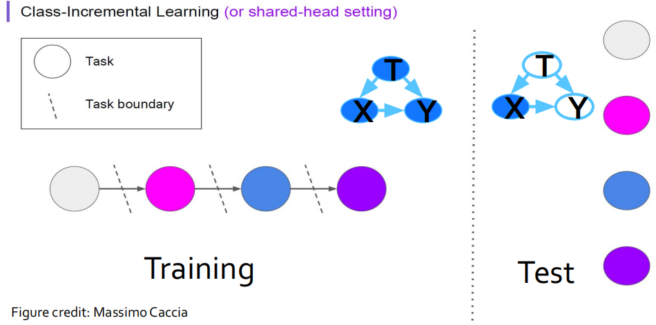

#### (3)Domain-Incremental CL（域增量持续学习，类似于域适应）

域增量学习是指，不同时刻到达的数据属于同一任务的相同类别，但是数据分批次到达，且输入数据的分布发生了变化，**不同时间片上的数据属于不同的域，不再符合静态同分布假设**。因此，它的基本假设是（1）$$P(\left\{\mathcal{X}^{(t)}\right\}) \neq P(\left\{\mathcal{X}^{(t+1)}\right\})$$；（2）$$\left\{\mathcal{Y}^{(t)}\right\} =\left\{\mathcal{Y}^{(t+1)}\right\}$$；（3）$$P(\left\{\mathcal{Y}^{(t)}\right\}) = P(\left\{\mathcal{Y}^{(t+1)}\right\})$$。域增量学习与域适应有一定的不同之处，域适应旨在将知识从旧任务迁移到新任务上，并且只考虑新任务上的泛化能力，而域增量学习需要应对灾难性遗忘，并同时保持旧任务以及新任务上的性能。

#### (4) Task-Agnostic CL（任务不可知持续学习，类似于meta-learning）

任务不可知持续学习是泛化能力最强，也是最有挑战性的持续学习场景。在该场景下，不同时刻收集的训练数据 $$(\mathcal{X}^{(t)},\mathcal{Y}^{(t)})$$的数据和标签分布不一致，即存在：（1）$$P(\left\{\mathcal{X}^{(t)}\right\}) \neq P(\left\{\mathcal{X}^{(t+1)}\right\})$$；（2）$$\left\{\mathcal{Y}^{(t)}\right\} \neq \left\{\mathcal{Y}^{(t+1)}\right\}$$。此外，在测试过程中，存在测试数据以及对应的分类标签完全不同于任意一个时刻的训练数据的场景，即

$$
P(\left\{\mathcal{X}^{(\text{test})}\right\}) \neq P(\left\{\mathcal{X}^{(\text{train})}\right\}), \left\{\mathcal{Y}^{(\text{test})}\right\} \neq \left\{\mathcal{Y}^{(\text{train})}\right\}
$$

这种信息不对称带来了三大挑战：首先，训练时无法完整获取泛化任务信息，即模型在测试过程中可能会应对任意未知的任务。其次，由于持续学习中**过了这村就没这店**的特性，我们无法回溯以往的任务数据，最后，灾难性遗忘问题在这一类场景中更容易出现。**任务不可知式持续学习（Task-agnostic CL）**要求模型学到的特征能够容易地泛化到任意新场景上，并且不会降低在先前任务上的训练表现。

保留模型特征泛化能力的学习过程是**meta-learning**的主要研究对象，因此任务不可知式持续学习的主要解决思路是集合持续学习与**meta-learning**，代表论文为continual-meta learning [1]以及continual-meta representation learning [2].

[1] He et al. Task agnostic continual learning via meta learning. 2019
[2] K. Javed and M. White. Meta-learning representations for continual learning. 2019.

#### 小结

根据输入数据分布，标签分布，以及训练/测试集分布，总结以上三种持续学习类型的性质如下（注: **S**：单输出模型；**M**：多输出模型；**I**：已知任务信息）：

| 学习场景  | $$P(\left\{\mathcal{X}^{(t)}\right\}) \neq P(\left\{\mathcal{X}^{(t+1)}\right\})$$ | $$P(\left\{\mathcal{Y}^{(t)}\right\}) \neq P(\left\{\mathcal{Y}^{(t+1)}\right\})$$ | $$\left\{\mathcal{Y}^{(t)}\right\} \neq \left\{\mathcal{Y}^{(t+1)}\right\}$$ | $$P(\left\{\mathcal{X}^{(\text{test})}\right\}) \neq P(\left\{\mathcal{X}^{(\text{train})}\right\}), \left\{\mathcal{Y}^{(\text{test})}\right\} \neq \left\{\mathcal{Y}^{(\text{train})}\right\}$$ | Remark |
| ------------------ | :----------------------------------------------------------: | :----------------------------------------------------------: | :----------------------------------------------------------: | :----------------------------------------------------------: | :----: |
| Non-Incremental    |                              ×                               |                              ×                               |                              ×                               |                              ×                               |   S    |
| Task-Incremental   |                              ×                               |                                                              |                              √                               |                              ×                               |   S    |
| Class-Incremental  |                              √                               |                              √                               |                              ×                               |                              ×                               |   S    |
| Domain-Incremental |                              √                               |                              ×                               |                              ×                               |                              ×                               |  M&I   |
| Task-Agnostic      |                              √                               |                              √                               |                              √                               |                              √                               |   M    |

## 1.4 持续学习中的主要挑战：灾难性遗忘以及稳定性-可塑性权衡

### 1.4.1 灾难性遗忘

灾难性遗忘是指模型在多个时间片分别学习不同任务时，在后来时间片中对新任务的泛化的同时，在先前时间片的老任务上表现断崖式下降。在多任务持续学习的过程中，如何应对灾难性遗忘是持续学习的核心问题。在处理该问题前，我们先对多任务优化问题中的梯度进行分析。

采用随机梯度下降法对多任务进行分析中，动态梯度有一个拔河拉锯（Tug-of-War）现象 [3]，如下图所示：左侧两图展现了在单个任务上优化损失函数的轨迹，右侧展现了同时优化两个损失时的轨迹。在这个轨迹中，两侧梯度以**拔河**的方式得到新梯度，而模型顺着新梯度的方向前进，从而保证在两个任务上都有较好的结果。

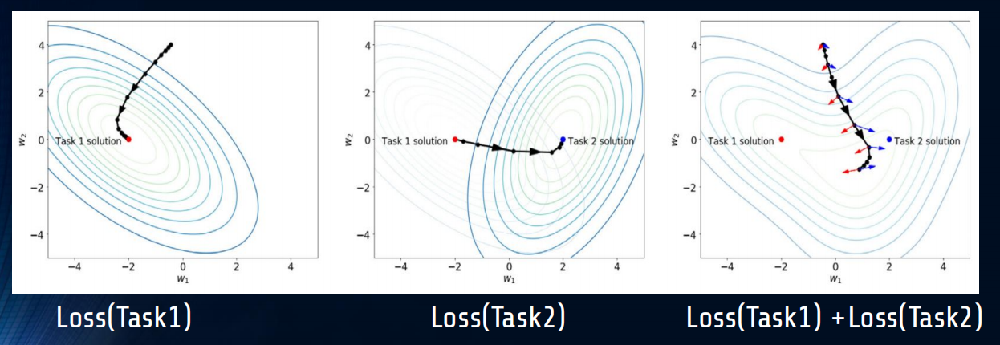

但是，在持续学习的环境中，任务是在不同的时间段分别出现的，并且当前时间段无法获得上一个时间段的训练集信息，因此就会出现上图左一到左二的情况。此时，模型先在*Task1*上达到了最优点，然后基于*Task1*的最优点进行继续训练，达到*Task2*上的最优损失。但是*Task2*上最优解决方案却在Task1上损失巨大；这就是连续学习中的灾难性遗忘问题，即按顺序对一组任务依次进行训练可能会导致在先前训练的任务上表现不佳。类比于迁移学习，灾难性遗忘往往也会和**负迁移**有关系。在迁移过程中，正向的迁移要求在*Task1*上的优化能够同时降低*Task2*的损失，但是负迁移则相反。因此，负迁移可能是灾难性遗忘的导火索 [4]。

为了解决灾难性遗忘，通常可以通过一些方法**保留过去的知识**，限制模型权重的改变。譬如可以用一个存储器保留过去训练中的一些数据，或者是一些梯度记录，从而在每次更新时对当前更新加以限制。但是，这样的方法也带来了一个新的问题：**模型的稳定性和可塑性的平衡。**

[3] Hadsell R, Rao D, Rusu A A, et al. Embracing change: Continual learning in deep neural networks[J]. Trends in cognitive sciences, 2020.

[4] Riemer et al (2019) Learning to Learn without Forgetting By Maximizing Transfer and Minimizing Interference.

### 1.4.2 稳定性-可塑性平衡

**模型的稳定性**定义为模型适应新场景的时候在旧场景上的表现；而**模型的可塑性**则指在旧场景中训练的模型是否能通过优化在新场景中表现优异。考虑持续学习可能出现的几种情景：（A）是模型缺乏稳定性，即出现了灾难性遗忘的情景，此时模型接触的新场景越多，在旧场景上表现越差；（B）是模型缺乏可塑性的场景，即模型困于旧场景的参数结构，很难泛化到新场景，学到新特征；（C）是避免了灾难性遗忘的一般持续学习的情况，也就是同时具备稳定性和可塑性，；（D）代表持续学习中不仅避免了灾难性遗忘，还具有**良好的前向迁移能力**的情况，即之前任务所学到的特征能够用于之后的任务学习中，为之后的任务学习带来了更好的参数初始化以及模型特征。（E）代表最完美的同时**具备前向和后向知识迁移能力**的持续学习情况，之前任务所学到的特征能够用于之后的任务学习中，而之后的学习任务所学到的特征还能改善之前任务。

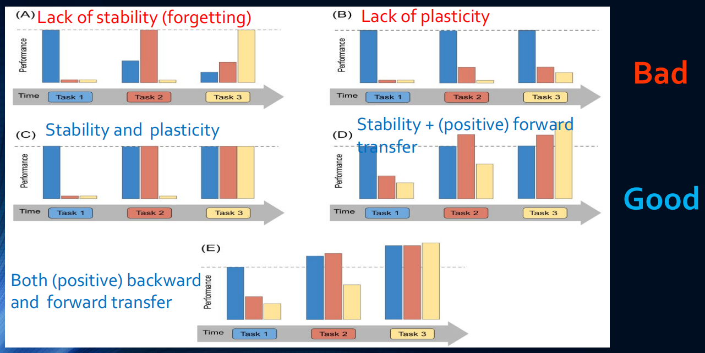

### 1.5 持续学习的主要方法

在上文对于持续学习的两大挑战的分析中，持续学习要求模型的优化方案既能考虑之前任务的影响，也能在当下的任务上表现良好。而在训练的过程中，负迁移是导致灾难性遗忘的可能问题：有一些数据学到的特征适用于所有的任务，而有些数据学到的特征则会对其他任务有负面影响。基于这些结论，我们可以在直觉上得到一些解决方案，比如可以通过构建一个存储器保留之前的梯度信息，从而重现”拔河拉锯“；我们也可以对数据进行过滤，给予那些正迁移的数据较高的权重，过滤那些会导致负迁移的数据。

基于这些直觉，可以将持续学习的方法划分为以下三类：基于Replay（回放）的方法，基于正则化（Regularization）的方法以及基于模型结构（Architecture-based）的方法。其中基于正则化和回放的范式受到的关注更多，也更接近持续学习的真实目标，而模型结构则需要引入较多的参数和计算量，因此通常只能用于较简单的任务，如下图所示：

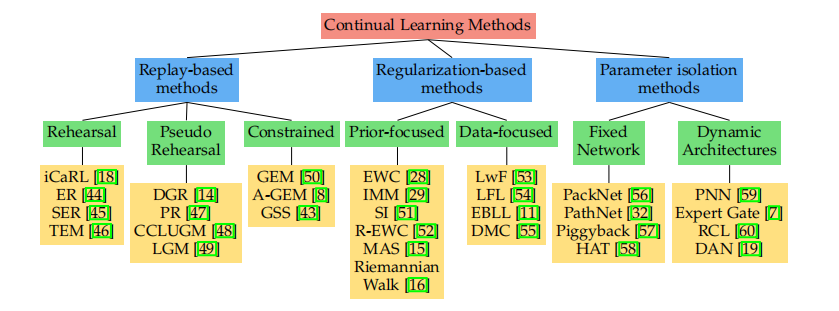

- **基于回放的方法（Replay-based methods）**

  基于回放的方法基本思路为对之前的关键数据，或是模型梯度进行存储或压缩存储。在学习新任务时，为减轻遗忘，可以在训练过程中**重放先前任务中存储的样本**，这些样本/伪样本既可用于联合训练，也可用于约束新任务损失的优化，以避免干扰先前任务。

- **基于正则化的方法（Regularization-based methods）**

  由于隐私政策等原因，往往无法存储之前的任务信息。在该场景下，可以设计巧妙的正则化损失以在学习新数据时限制旧知识的遗忘（譬如限制模型参数的变化范围）。这些方法可以进一步分为基于数据的方法和基于先验信息的方法。在基于数据的方法中，可以对输入数据进行加权，选取具有迁移能力的数据。

- **基于参数隔离的方法（Parameter isolation-based/Architecture-based methods）**

  为了防止遗忘之前的任务，一个直觉是构建足够大的模型，而对每个任务构建大模型的子集。这种方法可以通过固定Backbone，并为新任务增加新的分支来实现。

####  (1) 基于回放的方法(Replay-based methods)

基于回放的方法又细分为

- **Rehearsal methods**：联合存储的旧训练集子集以及新任务，重新训练当前的模型
- **Constrained optimization**：通过限制新任务带来的参数更新范围，减少对旧任务的干扰
- **Pseudo rehearsal methods**：将随机输入提供给以前的模型，将输出用作伪样本进行联合训练，从而保留模型的旧有知识。其中可以用生成模型生成高质量的伪数据。

##### 例1: Replay + Constraints (GEM)

一个常用的基于回放的方法是[梯度情景记忆（Gradient Episodic Memory, GEM) [5]](https://zhuanlan.zhihu.com/p/71521790)，它的基本思路为存储一部分先前的数据，同时令模型在学习新任务时，参数更新的方向与之前所有任务的更新方向比较相似（即夹角为锐角）：

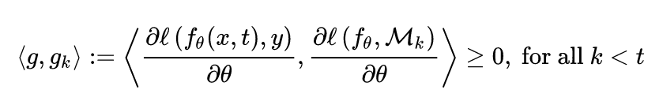

这种方法的好处是避免了联合训练带来的数据量不匹配，利用类似于方向正则化的方式进行训练。

**实验验证**: 为了对持续学习的效果进行评估，构建由*T*个任务组成的测试集，训练方法为对这*T*个任务按持续学习的方法进行依次训练。设计精度矩阵$$R\in \mathbb{R}^{T\times T}$$，其中$$R_{i,j}$$表示模型完成对任务 $$t_i$$ 的学习后对任务$$t_j$$ 的测试分类准确率，定义以下三个指标：
$$
\text{Average Accuracy}=\frac{1}{T}\sum_{i=1}^{T} R_{T,i}\\
\text{Backward Transfer (BWT)}=\frac{1}{T-1}\sum_{i=1}^{T-1}(R_{T,i}-R_{i,i})\\
\text{Foreward Transfer (FWT)}=\frac{1}{T-1}\sum_{i=2}^{T}(R_{i-1,i}-\bar{b}_i)
$$
其中$$\bar{b}_i$$表示第*i*个任务上进行独立训练的平均精度。*Accuracy*代表在*T*个任务训练完成后对所有任务预测的平均精度，*BWT*表示在*T*个任务训练完成后对**过去**每一个任务预测带来的平均表现增长，*FWT*则表示模型在第*i-1*个任务上训练后对于**未来**的第*i*个任务所带来的增益。这些指标越大，则说明持续学习的效果越好。 如果两个模型具有相似的*Accuracy*，则具有较大 *BWT* 和 *FWT* 的模型更优。在三个数据集（MNIST Permutation，MNIST Rotation， Cifar-100）上进行了不同的模型方法的评估实验，左侧一列的柱状图显示的数据集和方法对应的 ACC、BWT 和 FWT。 右侧一列的图显示的是随着学习更多的任务，第一个任务的测试准确性的演变。总体而言，在三个数据集任务上的结果显示，GEM的表现明显优于其他CL方法，如EWC，但是GEM的瓶颈是必须在每次学习迭代中计算以前的任务梯度，但是这些学习场景还是过于Naive了。

[5] Lopez-Paz and Ranzato (2017). Gradient episodic memory for Continual Learning.

##### 例2: Replay + Meta-Learning(MER) 

Meta-learning也是持续学习的常用方法，目的是可以学习具有泛化能力的元特征。[**Meta-Experience Replay (MER)**[6]](https://www.ibm.com/blogs/research/2019/05/meta-experience-replay/) 是一种比较成功的方法。考虑*i,j*两个任务，正如上文所总结的原理，当$$\frac{\partial L\left(x_{i}, y_{i}\right)}{\partial \theta} \cdot \frac{\partial L\left(x_{j}, y_{j}\right)}{\partial \theta}>0$$时候，两个任务能够学到具有迁移能力并令彼此受益的特征；当$$\frac{\partial L\left(x_{i}, y_{i}\right)}{\partial \theta} \cdot \frac{\partial L\left(x_{j}, y_{j}\right)}{\partial \theta}<0$$时候，两个任务发生负迁移，产生灾难性遗忘。因此，一个想法是令两个任务的梯度方向为正，即增加损失函数项：

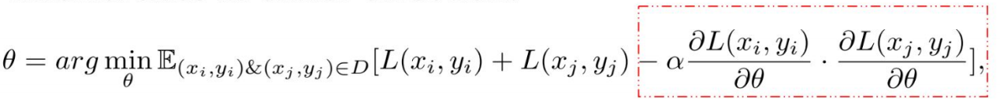

此外，结合元学习，要求对于从*i,j*两个任务中采样的数据Batch$$B_i,B_j$$，在经过$$B_j$$数据的更新后，仍在$$B_i$$上训练仍然保持泛化到$$B_j$$上的能力，这就构建了如下的损失函数：

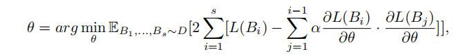

[6] Riemer, Matthew, et al. "Learning to learn without forgetting by maximizing transfer and minimizing interference." *arXiv preprint arXiv:1810.11910* (2018).

#### (2) 基于正则化的方法（Regularization-based methods）

基于正则化的持续学习的方法又分为：

- **Data-focused**：构造一些输入数据，或者从先前的任务中进行一些采样，构成一个记忆存储。然后将这些数据输入先前的模型，利用先前的模型进行推断，得到推断后的知识，然后利用这个输入数据与先前模型的推断知识在新训练的模型上进行知识蒸馏，从而进行知识保留 [7]。
- **Prior-focused**：从新数据中学习时，使用模型参数的估计分布作为先验；当更改那些对于之前的任务非常重要的参数时施加损失惩罚。

##### 例1: Elastic Weight Consolidation(EWC)[8]

人脑可以通过减少一些对之前任务重要的突触的可塑性，从而进行突触固化来抵抗遗忘，达到持续学习的目的。EWC方法借鉴人脑的突触固化机制，设计了一种类似的参数固定算法来保留知识。具体做法为：在学习新任务时，在对非常影响之前任务表现的重要的参数上施加损失惩罚，即可达到继续学习的效果。

如下图所示，选取在A任务上更新较大的参数$$\theta_A$$，在学习B任务时，为了不让模型遗忘A任务，需要限制$$θ$$，使其对$$θ_A$$的改变较小。这个过程就像是捏橡皮泥，对A来说，$$θ_A$$很难被改动，因此能更好保留A任务的记忆。对于B来说，通过欺负软柿子，能够在B上达到良好的泛化效果，从而保留下两个任务的记忆。

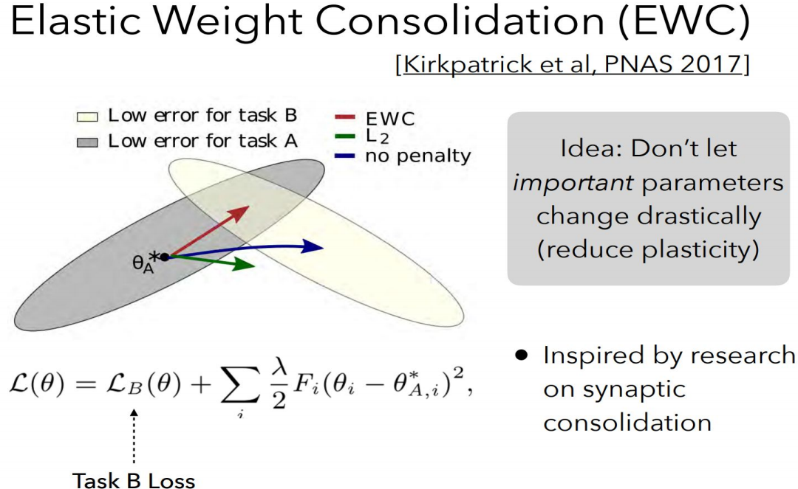

以下为在permuted MNIST任务上的结果。使用EWC（红色）、L2正则化（绿色）和普通随机梯度下降SGD（蓝色）在三个任务A、B和C的训练曲线。可以观察到：

- 运用普通SGD在任务序列上的训练会导致**灾难性的遗忘**，如图蓝色曲线显示了在两个不同任务的测试集上的性能。在训练任务从A切换到B时，普通SGD对应模型在原先任务A的性能迅速下降，而在任务B上其性能则急剧上升；任务的遗忘随着增加后续任务进一步加剧；
- 如L2正则化所示，灾难性遗忘不能通过对每个权重使用固定的二次约束对网络进行正则化来解决，任务 A 的性能下降得不那么严重，但任务 B 无法正确学习，因为约束同等地保护了所有权重，在 B 上几乎没有剩余能力去学习。
- 然而如红色曲线所示，当使用EWC时，网络可以很好地学习任务B，而不遗忘任务A，一定程度上对抗了灾难性遗忘。

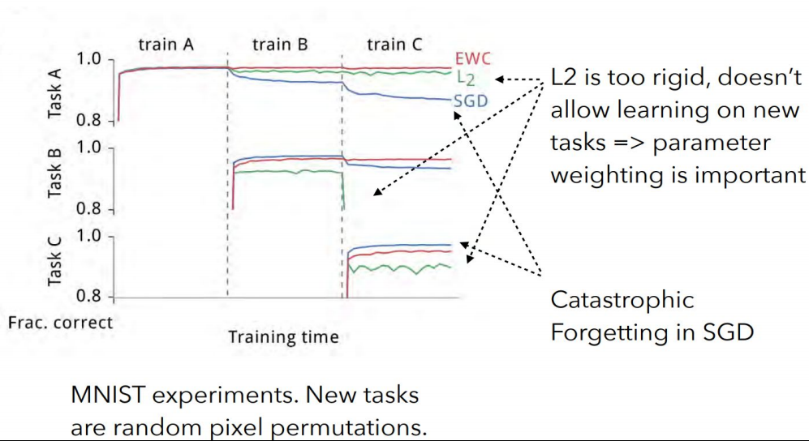

[7] van de Ven et al (2020). Brain-inspired replay for continual learning with artificial neural networks

[8] Mitchell T, Cohen W, Hruschka E, et al. Never-ending learning[J]. Communications of the ACM, 2018, 61(5): 103-115.

#### (3) 基于参数隔离的方法（Parameter isolation-based methods）

基于参数隔离的方法的基本思想是通过对每个任务使用不同的参数，来避免遗忘，主要可分为：

- **Fixed Network Methods**：在学习新任务时，用于先前任务的网络部分会被屏蔽掉，主要在神经元级别 (HAT) 或参数级别（PackNet、PathNet）进行屏蔽。
- **Dynamic Architecture Methods**：当模型大小不受限制时：为新任务增加新的分支，同时固定以前的任务参数（RCL），或将模型进行复制，令独立的模型专门用于每个任务（Expert Gate）等。

## 1.5 论文推荐与总结

在上文中，我们讨论了持续学习的场景和挑战。在持续学习的场景中，用于数据处理的服务器内存是有限的，但是所需要处理的数据以**流数据**的形式出现，无法进行存储。此外，持续学习模型以**在线学习**的方式进行训练，对于**未来所要适应的任务**并没有明确的信息。

一个完美的持续学习系统具有以下几个特性：首先，能够**具有前向迁移的能力**，即当前训练所得到的特征**具有通用性和可塑性**，能够容易地泛化到未来的任务；其次，**具备后向迁移的能力**，即在新任务上学到的特征**具有稳定性**，能够保留先前任务的知识；最后，模型具有**扩展性**，能够在未知任务，未知分类上进行扩展。

### 关于持续学习的survey整理

- **Hadsell et al. (2020) Embracing Change: Continual Learning in Deep Neural Networks.**
- **Khetarpal et al. (2020). Towards Continual Reinforcement Learning: A Review and Perspectives.** 
- **Mundt et al. (2020) A wholistic view of continual learning with deep neural networks:** 
  **Forgotten lessons and the bridge to active and open world learning.** 
- **De Lange et al. (2019) Continual learning: A comparative study on how to defy forgetting in classification tasks.**
- **Parisi et al. (2019) Continual lifelong learning with neural networks: A review.**
- **Chen & Liu (2018). Lifelong Machine Learning.**
  **Soltoggio et al. (2017) Born to learn: the inspiration, progress, and future of evolved** 
  **plastic artificial neural networks**

# Part 2:  持续学习的未来方向和开放挑战

无监督学习是人工智能最热门的话题，是应对海量数据的主要手段。LeCun提出：

> 如果把“智能”（intelligence）比作一个蛋糕，那么无监督学习就是蛋糕本体，监督学习是蛋糕上的糖霜，而强化学习是蛋糕上的樱桃。我们知道如何得到糖霜和樱桃，但不知道怎样做蛋糕。

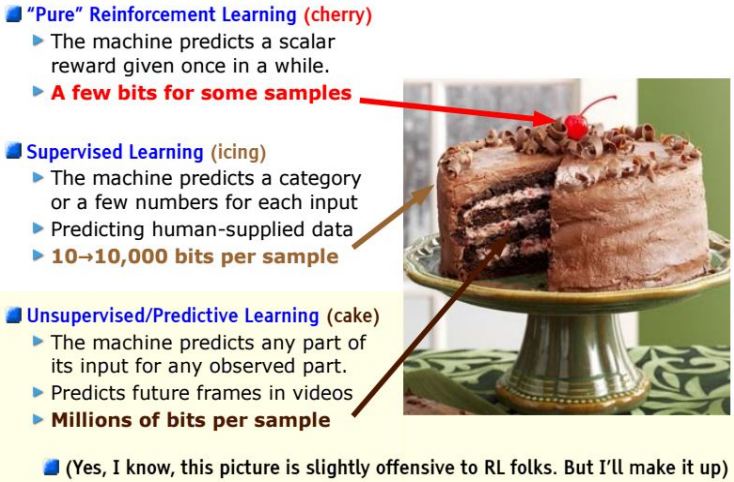

在现实世界中，大量数据是以**流数据**的形态出现的，往往无法及时获得这些数据的标签。因此，持续学习+无监督学习是未来最热门的方向。

## 2.1 持续无监督学习

有监督的持续学习往往集中在一系列任务上，可以获得任务标签和需要泛化的任务边界信息，并且给出了每个数据点的标签。 这一设定无法满足现实世界中的需求：任务标签未知和任务边界定义不明确，以及大量的类标记数据不可用，这就引出了无监督持续学习。

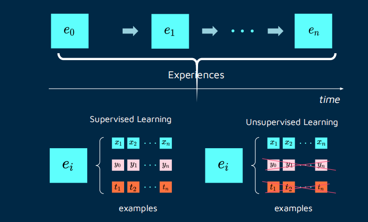

人可以在不同环境中学习许多不同的概念并执行不同的任务，同时不会遗忘之前任务的概念，而学习过程往往是弱监督或无监督的。 例如，婴儿可以在没有明确任务规范（任务不可知）的情况下，通过与时间相关的非同分布的视觉输入数据，按照一定顺序学习与环境中的物体交互，并且使用最少的外部监督，而这些交互模式往往可以组合成更复杂的Pipeline，完成一定的任务。

我们先介绍无监督持续学习的两个方案，NELL和Lifelong Topic Modeling，然后介绍持续无监督表示学习，最后讨论无监督持续学习中的可能探索方向及相关工作。

#### NELL: Never-Ending Language Learning（永不停止的语言学习）

为应对不断增长的知识，NELL [9] 构建了一个不断增长的知识库（红框）充当共享黑板，而各种阅读和推理模块（绿框）通过该黑板进行交互。在每次获取新数据时，知识库首先利用各种阅读和推理模块生成伪标签，然后用这些伪标签进行监督训练。这种范式模拟了人类学习的渐进特性，可以进行持续学习。但是，NELL 对其生成的伪标签往往信心不足，因此学习效率较低，且需要依靠人类专家定期清除错误或无意义的知识。

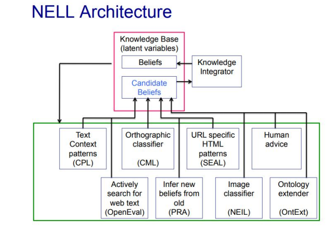

[9] Mitchell, Tom, et al. "Never-ending learning." *Communications of the ACM* 61.5 (2018): 103-115.

####  Lifelong Topic Modeling（终身主题模型）

终身主题模型中的“主题”由相似词的集群构成。在持续学习的过程中，可以从多个数据域中生成各自的主题词，而这些主题之间的共享词集则可以作为终身学习的积累 [10,11]。

[10] Z. Chen et al. Topic modeling using topics from many domains, lifelong learning and big data. ICML, 2014.

[11] P. Gupta et al. Neural topic modeling with continual lifelong learning. ICML, 2020.

#### 持续无监督表示学习

在很多场景中，输入数据很复杂，因此提取可用的低维表征，并在持续学习的过程中改进表征是很重要的方向。无监督表征学习（Continual Unsupervised Representation Learning, CURL）目的是在具体任务未知的情况下学习表征，使得该表征可以应对任务之间的突然变化，并泛化到新的任务上。CURL采用图模型进行特征学习，采用变分自编码器结构学习潜变量分布$$\mathbf{z}$$，并利用图结构，令任务标签$$\mathbf{y}$$连续改进潜变量分布$$\mathbf{z}$$。但是这种方法仅仅在MNIST和Omniglot上进行测试，在更复杂的环境上也许没用（笔者认为应该没用，VAE就不适用于复杂环境）[12]。

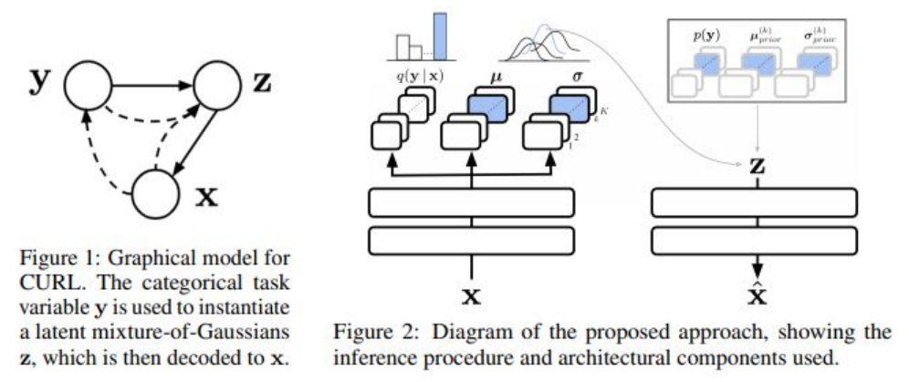

[12] Rao D, Visin F, Rusu A A, et al. Continual unsupervised representation learning[J]. arXiv preprint arXiv:1910.14481, 2019.

## 2.1.2 论文列表

以下是无监督持续学习的最新论文列表：

<u>**自监督学习，Self-Supervised Learning**</u>

S. Zhang et Al. Self-Supervised Learning Aided Class-Incremental Lifelong Learning. CLVision Workshop Findings at CVPR, 2021.
J. Gallardo et Al. Self-Supervised Training Enhances Online Continual Learning. arXiv, 2021.

**<u>序列学习，Sequence Learning</u>**

Y. Cui et al. Continuous online sequence learning with an unsupervised neural network model. Neural Computation, 2016.
A. Cossu et Al. Continual Learning for Recurrent Neural Networks: an Empirical Evaluation. Elsevier Neural Networks, 2021.
B. Ehret et Al. Continual learning in Recurrent Neural Networks. ICLR 2021.

<u>**对比学习，Contrastive Learning**</u>

M. Zheda et al. Supervised Contrastive Replay: Revisiting the Nearest Class Mean Classifier in Online Class-Incremental Continual Learning. CLVision Workshop at CVPR 2021.
C. Hyuntak et al. CO2L: Contrastive Continual Learning. arXiv, 2021.

<u>**类赫布学习，Hebbian-like Learning**</u>

G. Parisi et al. Lifelong learning of spatiotemporal representations with dual-memory recurrent self-organization. Frontiers in neurorobotics, 2018.
P. Bashivan et al. Continual learning with self-organizing maps. CL Workshop at NeurIPS 2018

**<u>主动学习，Active Learning</u>**

L. Pellegrini et al. Continual Learning at the Edge: Real-Time Training on Smartphone Devices. ESANN, 2021.
R. Camoriano et al. Incremental robot learning of new objects with fixed update time. ICRA, 2017.

<u>**弱/半监督学习，Weakly/Semi-Supervised Learning**</u>

Lomonaco V. and Maltoni D. Semi-Supervised Tuning from Temporal Coherence. ICPR 2016.
L. Wang et al. Ordisco: Effective and efficient usage of incremental unlabeled data for semi-supervised continual learning. CVPR 2021

**<u>随机网络，Randomized Networks</u>**

A. Cossu et al. Continual Learning with Echo State Networks. ESANN 2021. 
M. Wortsman et al. Supermasks in superposition. NeurIPS 2020.

**<u>持续表征学习</u>**

A. Bertugli et al. Few-Shot Unsupervised Continual Learning through Meta-Examples. Workshop on Meta-Learning at NeurIPS 2020.

I. Muñoz-Martín et al. Unsupervised learning to overcome catastrophic forgetting in neural networks. IEEE Journal on Exploratory Solid-State Computational Devices and Circuits, 2019.

L. Caccia et al. SPeCiaL: Self-Supervised Pretraining for Continual Learning, arXiv 2021.
W. Sun et al. ILCOC: An Incremental Learning Framework Based on Contrastive One-Class Classifiers. CLVision Workshop at CVPR 2021.

J. He et al. Unsupervised Continual Learning Via Pseudo Labels. arXiv 2020.

S. Khar et al. Unsupervised Class-Incremental Learning through Confusion. arXiv 2021

## 2.2 持续学习应用

**持续学习用于流数据的处理，可以用于边缘计算，云计算场景：**

- **Edge**
  - 嵌入式系统和机器人：+隐私、+效率、+快速适应、+在边缘、-互联网连接（例如自动驾驶汽车、机器人手臂/手）
- **Cloud**
  - 将持续学习用于AutoML 系统：+可扩展性、+效率、+快速适应、-能源消耗（例如推荐系统）
- **Continue Edge-Cloud**
  - 无处不在的人工智能系统：高效通信、流畅和动态计算
  - 神经网络补丁：+安全补丁，+公平性补丁，+快速更新
  - 持续分布式学习：在联邦学习系统中增加持续学习模块

**相关论文有**

L. Pellegrini et al. Latent Replay for Real-Time Continual Learning, IROS 2020.
L. Pellegrini et al. Continual Learning at the Edge: Real-Time Training on Smartphone Devices. ESANN, 2021.
G. Demosthenous et al. Continual Learning on the Edge with TensorFlow Lite. arXiv 2021.
L. Ravaglia et al. Memory-Latency-Accuracy Trade-offs for Continual Learning on a RISC-V Extreme-Edge Node. SiPS 2020.

### 2.2.1 产品中的持续学习架构

下图所示为自适应的AutoML系统中的持续学习架构，其中数据流输入系统，系统生成不同的模型流，用多个模型进行推断。

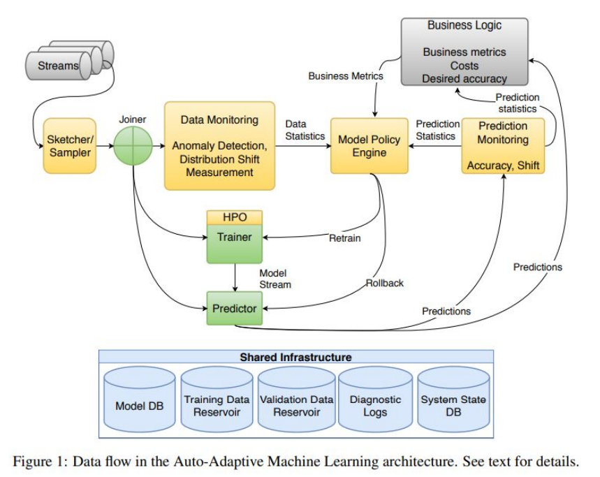

[1] Diethe T ,  Borchert T ,  Thereska E , et al. Continual Learning in Practice[J].  2019.

## 2.3 持续学习的挑战性问题与总结

- 有可能持续地学习一个鲁棒的深度表示吗
- 现在提出的持续学习场景和评估指标是足够的吗
- 在持续学习中，什么程度的监督信息是符合实际的
- 如何知道哪些信息是要遗忘的，哪些是需要记住的
- 持续学习和概念漂移的关系是什么
- 计算和存储哪个更重要
- 序列学习和持续学习的关系是什么
- 整合能力是人类智能中的一个核心的部分：CL系统可在这方面有何种可期待的突破
- 系统的自我评估：当仅有未标签数据时，如何衡量模型精度

### 总结

灾难性遗忘是深度学习所不可忽视的问题，持续学习是深度学习落地的重要解决方案。虽然现有工作对标准benchmark做出了显著的改进，但是它们仍主要在简化场景上进行实验，提出的评估指标倾向于对遗忘的抵抗，而没有过多关注迁移，持续学习还具有巨大的探索空间。

此外，在多任务迁移学习上，持续学习试图打破统计学习中的独立同分布假设，这在现实场景中是有意义的。持续学习不仅在神经科学中受到重要关注，也在推动下一代真正智能、稳健和自主的 AI 系统，使其具备高效、有效、可扩展的特性。

>  “We are not looking for incremental improvements in  state-of-the-art AI and neural networks, but rather  paradigm-changing approaches to machine learning  that will enable systems to continuously improve  based on experience.” — Hava Siegelmann