* content
{:toc}

联邦学习（Federated Learning）是一种**满足隐私保护的分布式机器学习训练方案**，它允许多个客户端（例如多个移动设备，多个数据供应商）能够在某个中央服务器的调度下协作训练模型，并从模型的联合训练中受益，同时保持训练数据的去中心化存储，尊重各方数据隐私。**IBM Research** 在联邦学习方面做出了广泛的努力，包括新颖的方法、模型和范式，并提供了一个可用于非商业的企业级联邦学习平台：IBM联邦学习社区版。此外，在2021年的ICML大会上，**IBM Research**发起了一个名为 ***Enterprise-Strength Federated Learning: New Algorithms, New Paradigms, and a Participant-Interactive Demonstration Session*** 的tutorial，该tutorial通过7场简短演讲概述联邦学习的前沿成果，涵盖以下五个话题：

* 在通信与计算上都更为高效的自适应联邦学习框架

* 联邦学习与异构训练场景：
  * 对异构数据具有高度鲁棒性的本地模型个性化联邦学习策略
  * 对于异构模型进行模型聚合的策略研究

* 联邦学习是否真的能够保护隐私？
  * 联邦学习系统所面临的隐私攻击：模型窃听，成员推理攻击，重建攻击，注毒攻击等
  * 应对隐私攻击的方法：参数加密，差分隐私，K-anonymity方法

* 联邦学习所得全局模型的安全性分析：对联邦学习模型进行对抗攻击
* 对联邦学习系统进行监管：模型的公平性原则与问责机制

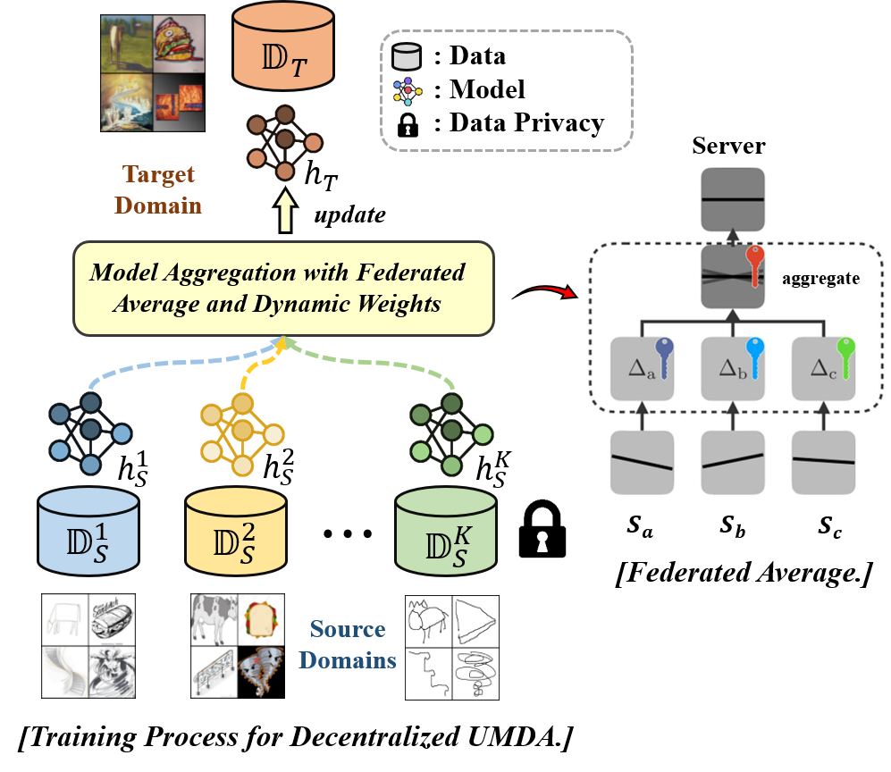

在本篇博客中，我们将对该分享进行详细的介绍，总结与提炼，并对以上话题的前沿研究进行分析。本文由浙江大学CAD国家重点实验室**可视分析与可视智能小组（VAI）**硕士生**YvHui**整理，并由本人进行修订，**未经作者同意禁止转载**。

## 1. Adaptive Federated Learning for Communication and Computation Efficiency

该场次演讲主题为：在通信与计算上都更为高效的自适应联邦学习框架，分为三个部分进行介绍。

首先，介绍联邦学习的基础范式，包含以下四个要点：

- 数据由每个用户收集并存储在客户端，客户端可为用户（移动）设备、边缘服务器或网关等。

- 模型训练由聚合器进行协调，聚合器为在边缘或云上运行的逻辑组件，一般为中央服务器

- **数据保留在本地客户端，不与其他客户端共享**

- 模型参数需上传到聚合器，可以进行共享

- 模型训练由客户端的本地计算与服务器对模型的全局协调、聚合与通信协作完成

  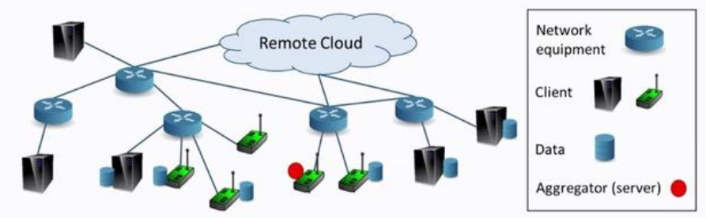

其次，介绍联邦学习在企业落地中所面对的主要问题：在有限的通信带宽和计算能力下，如何设计协作训练方法（如设计合理的模型容量，参数上传方案以及通信轮次），从而最大限度地利用资源？为解决这一问题，作者提出了自适应的联邦学习方法，**目标是在相同的训练时间下最优化模型泛化性能**，包含三个优化目标：（1）本地参数更新的轮次，要求自适应地设计参数更新频率，模型未收敛时更新快一些，稳定时则放缓频率，最大限度利用通信资源；（2）模型参数压缩、参数稀疏化，要求在不影响收敛的情况下，将上传的更新参数稀疏化，从而节约通信时间；（3）模型剪枝，优化模型大小，加快本地训练速度。

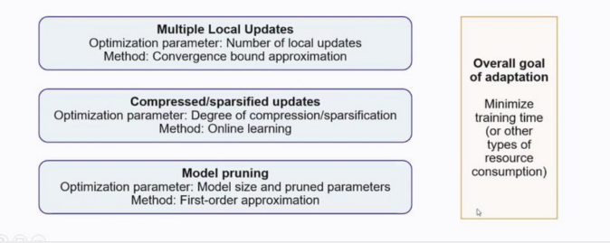

三个优化目标对应着三个研究工作，下面我们将对三项研究工作进行详细分析。

### 1.1 参数更新轮次自适应方案

文献[Adaptive federated learning in resource constrained edge computing systems](https://arxiv.org/abs/1804.05271)提出了自适应设计参数更新频率的方法，综合计算与通信资源，得到最优的联邦学习训练设置。

基础的联邦学习模型聚合算法（Federated Average）如下图所示：首先由中央服务器向本地客户端发送初始参数，然后本地客户端根据各自的本地数据对模型进行$$\tau$$轮的迭代训练，并将参数上传到中央服务器，最后由中央服务器进行参数的加权平均，获得全局模型，并将全局模型发还到各个本地客户，开始新一轮更新。经过总计$$T$$轮的迭代训练后，全局模型收敛。

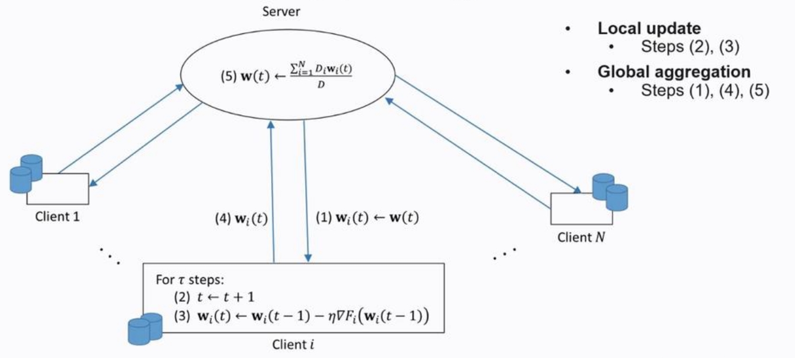

考虑本地迭代训练次数$$\tau$$以及全局训练轮次$$T$$的关系：假设模型收敛所需的总计训练轮次$$T$$是常数，那么整个联邦训练过程所需的通信次数$$K$$是本地迭代训练次数$$\tau$$的倒数，即$$K=\frac{T}{\tau}$$。研究表明，在实际应用中，$$K$$与$$\tau$$存在通信成本与模型精度的**Trade-off**：当$$\tau$$比较大时，较小的通信次数$$K$$带来较低的通信成本，但是也会因更新不及时令各个本地模型出现局部数据上的过拟合，损害全局模型的精度；当$$\tau$$比较小时，联邦学习的全局模型能够达到与中心化训练相同的精度，但是也会带来高通信成本。

文献设计了一个自适应方案，要求在**给定训练时间开销**的前提下，找到**本地更新**$$\tau$$和**全局通信**$$K$$之间的最佳**trade-off**，令全局模型的泛化误差最小，其目标函数如下所示：

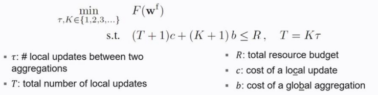

其中，$$c$$记作每轮本地训练的时间开销（计算开销），$$b$$为进行一次模型聚合的时间开销（通信开销），$$R$$为系统所能承担的最大训练时间开销。优化目标为全局模型的泛化误差最小，即$$\min _{\tau, K \in\{1,2,3, \ldots\}}  F\left(\mathbf{w}^{\mathrm{f}}\right)$$，优化限制为训练过程中的总时间开销应当小于等于最大开销$$R$$。注意"$$+1$$"操作代表模型初始化所需的参数更新开销与通信开销。论文的主要贡献是提出了一个可计算的对$$R$$的近似上界，可以对目标函数进行求解：

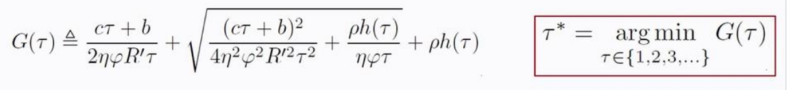)

为了论证论文通过近似上界$$G(\tau)$$所求解的最佳本地更新$$\tau^*$$的有效性，文献采用SVM、Linear Regression、CNN等模型进行了一系列实验，从1到100分别选择$\tau $值，绘制不同$\tau $下模型损失与模型精度的变化曲线，如下图所述。

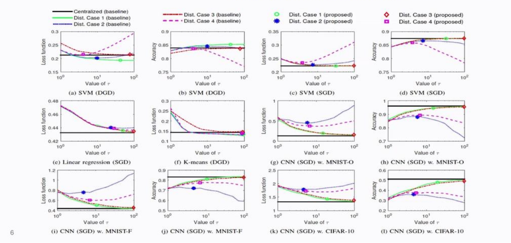

实验采用中心化训练（Centralized）作为基线，采用GD与SGD两种模型优化方案，并考虑了四种可能的去中心化数据分布场景：

- Case 1: 整个数据库被随机且均匀地分配到各个节点，因此每个节点的数据分布相同，但是信息不完整。
- Case 2: 整个数据库被不均匀地分配到各个节点，每个节点仅有某一类数据，节点间数据分布不同。例如，手写数字识别数据被分到10个节点，其中第1个节点只有数字1的数据，第2个节点只有数据2，这是一类经典的分布不均匀下的联邦学习场景。
- Case 3: 每个节点都拥有完整的数据库
- Case 4: 整个数据库的前半部分被均匀分配到各个节点，与Case 1一致。后半部分被不均匀地分配，与Case 2一致。

**实验结果证实了两个结论：**

1. 文献通过近似上界$$G(\tau)$$所求解的最佳本地更新$$\tau^*$$**在所有实验场景下都接近于模型的最佳性能点**。
2. **对不同的数据分布和模型选择，$\tau $的（经验）最优取值不同**，因此对于确定的开销$$R$$也无法给出一个固定的最优$\tau$值。
3. 在某些场景下，分布式方法的性能优于中心化训练。这是因为**在给定的训练时间下**，联合学习能够利用多个节点上的计算资源，令模型更新更快。

###  1.2 对参数更新进行压缩/稀疏化

在每一轮模型聚合中，各个本地客户端需要向中心服务器发送模型参数更新$$\Delta w_i$$，中心服务器采用联邦平均（Federated Average）聚合各个客户端的更新得到全局模型，即$$\Delta w^t=\sum D_i \Delta w_i/D$$。该操作需要得到每一个参数更新，而对于较大的深度学习模型，如Resnet101，参数更新可以达到200MB的大小，带来了极高的通信开销与时间花费。为了减少通信成本，提高联邦学习的整体效率，一种直觉是对梯度进行稀疏化操作，即每次通信仅上传一小部分最重要参数的梯度，从而代替上传所有参数梯度。Top-k稀疏（top-k sparsification）是常用的稀疏化方法，即按梯度的绝对值从小到大排序，每轮只上传前$$k$$个参数。如何选取合适的$$k$$是一个有挑战性的问题：如果$$k$$太大了，通信成本会增加；如果$$k$$太小了，参数过于稀疏，降低模型性能。文献[Adaptive gradient sparsification for efficient federated learning: An online learning approach](https://arxiv.org/pdf/2001.04756.pdf)提出了一种自适应top-k稀疏的方法，采用在线学习的思想，在训练过程中对不同轮次设置不同的稀疏参数$$k$$，在给定训练时间的情况下达到最佳模型性能。它的基本直觉是：在模型训练初期，参数变化剧烈，因此设置较大的$$k$$值，使得模型快速收敛；在模型训练中后期，参数趋于稳定，因此设置较小的$$k$$值，减少通信成本。文献提出”损失区间下的训练时间函数"这一概念，记$$\tilde{t}(k,l)$$为在损失$$l$$下采用top-k稀疏的通信时间，采用给定损失区间$$[L,L']$$下的时间积分作为时间成本的度量：$$\tilde{\tau}(L',L,k):=\int_L^{L'}\tilde{t}(k,l)dl$$。对于第$$m$$轮，模型采用其对$$k$$的微分来判断在当前轮次是否应该增加或减少通信的参数量，即:
$$
\hat{s_m}:=\text{sign}(\frac{\partial \tilde{\tau}(L',L,k)}{\partial k}\vert _{k=k_m})=\text{sign}(\int_L^{L'}\frac{\partial \tilde{t}(k,l)}{\partial k}dl\vert _{k=k_m})
$$
算法的伪代码如下图所示，算法**目标是最大限度地减少达到某一损失值的训练时间**首先选取$$k$$的取值区间范围$$[k_{min},k_{max}]$$，然后采用$$\hat{s_m}$$作为符号自适应地调节$$k_m$$。

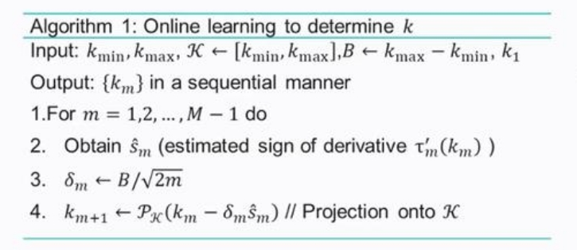

此外，文献方法的贡献还包括优化了$$\hat{s_m}$$的求解过程，给出了的$$\hat{s_m}$$近似计算方案与可证明的regret bound，以及描述了理论算法和静态最优解之间的margin。自适应top-k稀疏方法具有以下优点：

1. 求解过程与具体模型无关（model free）
3. 与基于强化学习的方法相比具有较小的计算开销

###   1.3 模型剪枝

联邦学习中的客户端设备往往是一些边缘计算设备（如手机，智能家电等），它们的计算和通信资源更为有限，难以用庞大模型进行推断。为克服这一问题，文献[Model pruning enables efficient federated learning on edge devices](https://arxiv.org/abs/1909.12326)提出**PruneFL**，它是一种能够对联邦学习模型进行剪枝的方法。在联邦学习的模型训练过程中，PruneFL能够自适应地调整模型大小以减少训练时间，同时保持与原始模型相似的精度。

PruneFL包含两个主要阶段：首先使用本地数据对单个客户端进行剪枝，然后让所有客户端参与并在联邦学习的模型聚合期间进行剪枝。在模型剪枝过程中，修剪后的模型$$\mathbf{w}'(k)$$相比于原模型$$\mathbf{w}(k)$$需要满足两个约束条件：

1. 修剪前后模型的泛化性能接近，即
   $$
   F(\mathbf{w}'(k))\approx F(\mathbf{w}(k))
   $$

2. 保留模型在未来学习的能力，即要求采用修剪后的模型$$\mathbf{w}'(k)$$进行进一步优化，仍然能够达到与在原模型的基础上优化所得的$$\mathbf{w}(k+1)$$相似的性能，它通过最小化风险误差得到，如下图所示：

   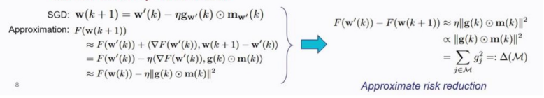

   $$F(\mathbf{w}(k+1))$$可以在$$F(\mathbf{w}(k+1))$$的基础上经过泰勒展开得到（注意$$\nabla F(\mathbf{w}'(k))\approx \mathbf{g}(k)$$），因此可以通过最小化$$\Delta(\mathcal{M})$$来保留模型的学习能力。

## 2. 异构场景下的联邦学习

企业级联邦学习框架往往需要适应多种异构场景，如数据异构（多种客户端数据分布不一致），设备异构（不同客户端设备计算能力，通信效率不一致），以及模型异构（不同本地客户端模型学到的特征不一致）。该场次主要介绍两个联邦异构场景下的工作：对异构数据具有高度鲁棒性的本地模型个性化联邦学习策略，以及对于异构模型进行模型聚合的策略研究。

### 2.1 在联邦学习中学习鲁棒的表达
在传统的联邦学习范式中，各个客户端协作训练一个通用的全局模型。然而，在联邦学习的落地场景中，数据异构性，即多个客户端的本地数据分布完全不一致，是常见的异构场景。在这种场景中，学习单一的能够同时泛化到不同分布的全局模型是非常困难的。此外，对于在不同分布上训练的模型直接进行联邦平均（federated average）往往会导致全局模型上的训练失败。一个典型实验结果如下图所示，在该实验中，多方数据分布完全不同（non-IID)：

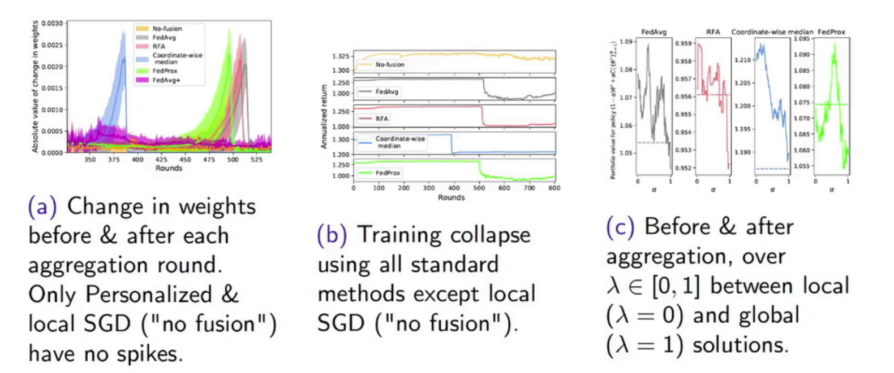

图（a）展示了在每一轮联邦平均前后模型参数的变化。可以明显观察到，传统的联邦平均策略（蓝色，绿色，橙色，灰色）都会出现一个参数的突变，这是因为本地模型之间差异太大，导致联邦平均前后的变化过大。此外，图（b）还展示了这种突变会导致模型训练性能的断崖式下降。图（c）展示了在模型聚合前后的性能分析，$$\lambda$$表示聚合的程度：$$\lambda=0$$表示仅用本地模型，$$\lambda=1$$表示全局模型。实验表明，模型的最佳性能发生在中间位置，即$$\lambda \in [0.4,0.6]$$。该结果表明，仅用局部模型或是仅用全局模型都无法达到最优性能，而得到全局模型后再在各个客户端上进行微调会带来更好的模型性能。因此，一个在异构数据上进行联邦学习的方法是对本地模型与全局模型进行混合利用。基于这种直觉提出了个性化联邦学习（**Personalized Federated Learning**），它通过在每一个客户端上对全局模型进行调整，构建个性化模型来解决数据异构问题，如下图所示：

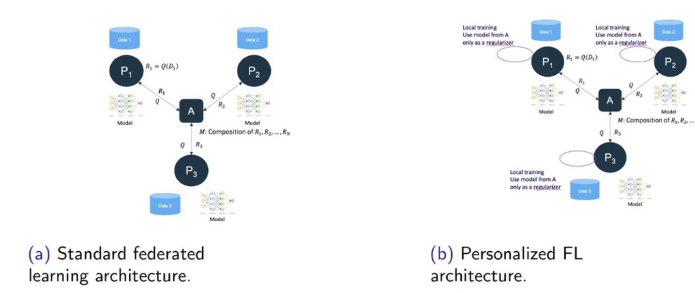

在个性化联邦学习的框架中，全局模型并不直接作为局部模型训练的起点，而是充当一个正则化工具，其具体公式如下所示：

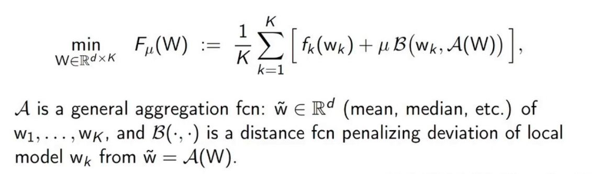

其中，$$\mathbf{w}_k$$代表本地模型参数，$$\mathbf{\tilde{w}} =\mathcal{A}(\mathbf{W})$$是全局模型参数，$$\mathcal{A}$$是一种聚合方法，如均值聚合，中值聚合等，而$$\mathcal{B} \left ( \cdot ,\cdot  \right )$$度量了本地模型参数$$\mathbf{w}_k$$与全局参数$$\mathbf{\tilde{w}} =\mathcal{A}(\mathbf{W})$$之间偏差。损失函数主要通过两部分起作用：首先，每一个本地模型在本地数据集上最优化损失函数，即$$f_k(\mathbf{w}_k)$$，然后，利用距离函数$$\mathcal{B} \left ( \cdot ,\cdot  \right )$$对模型进行惩罚，通过控制全局参数和局部参数的距离，使得本地模型不会过分偏离全局模型，如此全局模型就起到了正则化作用。该方法称作**Robust personalize FL formulation**，它利用全局模型作为正则化项优化本地模型，要求其聚合模型能够收敛，并且具有鲁棒性，即不会存在之前的实验图中出现的参数突变与性能崩溃现象。

那么，如何选择合适的参数聚合方法$$\mathcal{A}$$呢？均值聚合，即联邦平均方法被证明在异构模型上存在不鲁棒，因此Talk介绍了一个平滑连续的聚合方法，如下图所示

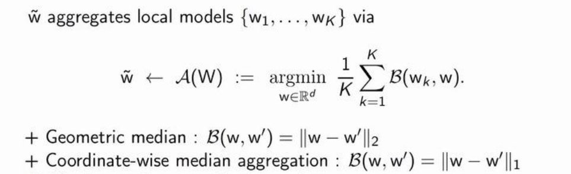

距离函数$$\mathcal{B}$$可被定义为L2范数或是L1范数。

##### 实验分析与应用场景
（**实验分析**）上文提到，在多方数据分布完全不同场景下，联邦平均（federated average）会导致全局模型上的训练失败。同时，**Robust personalize FL formulation**具有该场景下的鲁棒性。此外，性能实验也证明了**Robust personalize FL formulation**的有效性：

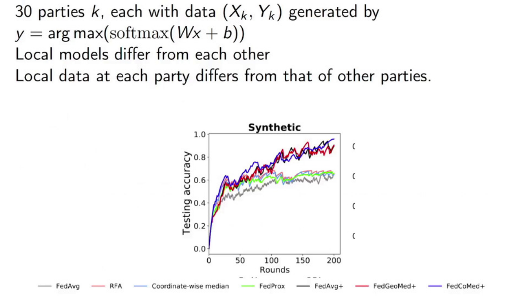

图中，GedMed代表$$\mathcal{B}$$取L2范数，CoMed代表$$\mathcal{B}$$取L1范数。

（**应用场景**）将**满足鲁棒性的个性化联邦学习**应用于金融投资组合管理。金融投资组合管理目的是将财富重新分配到资产周期 (例如日) 来获得长期收益，而自动交易方式的策略可以使用强化学习 (RL) 来计算。在该场景下，投资组合经理不希望共享自己的隐私数据，但希望通过聚合其他经理的模型来为自己训练更好的模型。此外，不同的经理面对的投资行业也不一致，因此个性化的联邦学习非常契合这一场景。

考虑以下设定：有50个投资组合经理，每个人都使用基于LSTM的强化学习模型对标普500指数中的股票构建选股策略，采用联邦学习的方式训练聚合模型及其本地模型，结果如下图所示：与传统的联邦学习相比，用**Robust personalize FL**训练的模型回报率明显上涨。 

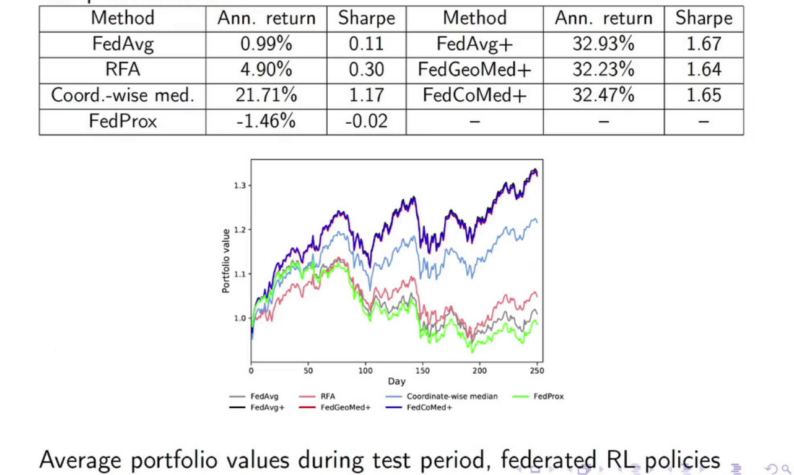

### 2.2 异构模型融合

在每轮训练后，联邦学习需要将局部模型的参数更新进行聚合（fusion）得到性能更优的全局模型。在一个通信轮次中，设计合适的聚合方法可以大大提高全局模型的表现。

联邦平均是最基础的模型聚合方式。当不同客户端的模型高度同构时，联邦平均能够令全局模型收敛到中心化训练的最优模型。但是，当各个客户端的模型出现异构时，联邦平均可能不会有效。模型参数排列不一致就是最典型的异构问题。对于在不同分布数据集上训练的模型，其学到的参数所对应的特征在顺序上可能不一致。例如对新生儿预测线性模型的参数进行排列，A模型的排列可能是GDP-医院数目，而B模型的排列则可能是医院数目-GDP。

对参数进行重排并不会改变模型结果，但是如果按照参数顺序进行平均，很可能会merge意义不同的特征，破坏模型结构。将多个参数排列不一致的模型进行联邦平均会破坏模型结构，影响全局模型的性能。这种异构现象常常出现在无监督模型，高斯过程模型以及神经网络模型中。以卷积分类网络为例，两个本地训练的卷积神经网络的卷积核所学特征是高度重合的，但是对应位置的卷积核所学特征可能并不一致。此外，对卷积核进行随机排列，模型的推断特征不会改变。但是如果将两个模型按卷积核的位置直接进行模型聚合，其结果会很不理想。

模型的异构性往往源于训练数据的异构性，如下例子所述：一个本地数据集有锤子和锯子，另一个数据集有锯子和螺丝刀

​	

因此，模型会学到锯子的共同特征，以及锤子，螺丝刀的差异特征

​	

为解决这一问题，基本思想是寻找本地模型参数之间的一致性，并将一致的参数进行聚合，从而获得全局模型。一般令全局模型容量稍微大于本地模型，从而令全局模型可保存本地模型的所有必要特征——锤子、锯子以及螺丝刀。以主题模型（topic model）为例，主题模型是一种统计模型，用于对文档描述的主题进行抽象，如根据书籍内容分类其主题为科学，小说或是文学。如下图所示，两个本地主题模型分别从各自的数据集上学到三个主题，模型聚合要求全局模型能够区分本地模型独有的话题（如音乐书，诗歌），并对共同主题进行聚合，最终全局模型应当具备四个主题。

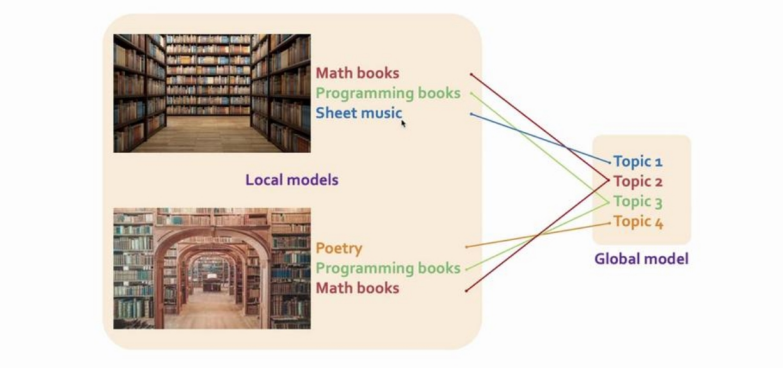

为达成上述要求的模型聚合，Talk将模型聚合转变为线性分配问题，基于不同本地模型特征间的欧式距离构造代价函数矩阵，从而发现模型之间的一致性。Talk也提出了一种基于匈牙利算法的解决方案。

##### 实验分析

Talk在MNIST数据集上进行实验，构建多个异构本地数据集，并进行异构模型聚合，如下图所示。

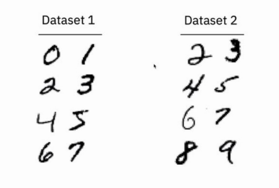

划分MNIST为两个本地数据集并训练本地模型，第一个模型能够正确分类数字0到7，第二个模型能够正确分类数字2到9，对这两个模型进行模型聚合，得到全局模型。对两个卷积网络模型的卷积核进行可视化，发现相同位置的卷积核所学特征并不一致，而不同位置卷积核的特征往往有相似性。如下图所示，发现模型一中第12个卷积核与模型二的第8个卷积核相似，可以进行聚合。类似情形还有$$(49,7)$$的配对，而模型一中的第21个卷积核学到了0的特征，这是模型二学不到的。此外，模型二的第36个卷积核学到了8的特征，这在模型一中也无法学习。

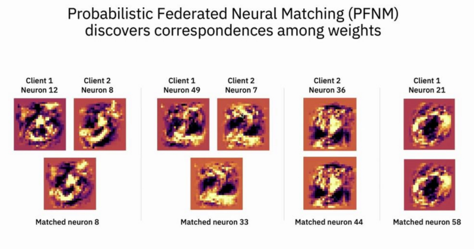

基于这种配对关系，全局模型应当对$$(12,8),(49,7)$$的卷积核进行聚合，并保留本地模型的独立特征。

##### 参考文献

异构模型的模型聚合是一个很大的研究课题，Talk按时间顺序给出了前沿的参考文献列表：

- Yurochkin, Mikhail, et al. "Scalable inference of topic evolution via models for latent geometric structures." *arXiv preprint arXiv:1809.08738* (2018).
- Yurochkin, Mikhail, et al. "Bayesian nonparametric federated learning of neural networks." *International Conference on Machine Learning*. PMLR, 2019.
- Yurochkin, Mikhail, et al. "Statistical model aggregation via parameter matching." *Advances in Neural Information Processing Systems* 32 (2019): 10956-10966.
- Wang, Hongyi, et al. "Federated learning with matched averaging." *ICLR 2020*.
- Claici, Sebastian, et al. "Model Fusion with Kullback-Leibler Divergence." *International Conference on Machine Learning*. PMLR, 2020.

## 3. 联邦学习是否真的能够保护隐私？

隐私保护是当前社会的热门话题。从欧盟一般隐私保护法案到滴滴上市的国家隐私泄露问题，隐私保护被各个公司广泛讨论，也被各个国家、政府立法约束。但是，隐私保护话题就像是房间里的大象，有很多显而易见的，可是却一直被忽略的问题。譬如，欧盟一般隐私保护法案（GDPR）并没有对数据的存储做出规定，并且并没有涉及差分隐私概念。也就是说，就算采用联邦学习的方法进行训练，并且模型满足差分隐私的要求，得到的模型也不一定能满足各个国家隐私保护法案的规定，譬如修正权，遗忘权等。也就是说，现在的隐私保护技术手段与隐私保护法案目标仍然存在一个较大的偏差，而这种偏差很少为人所讨论。

在本节中，Talk围绕**联邦学习是否真的能够保护隐私**这一话题，讨论联邦学习系统容易受到的攻击，以及可能存在的隐私泄露风险。

### 3.1 Efficient, Legally Compliant Privacy-Preserving Federated Learning

联邦学习（Federated Learning）令多个客户端（例如多个移动设备，多个数据供应商）能够在某个中央服务器的调度下协作训练模型。由于联邦学习的训练过程中，同时保持训练数据的去中心化存储，因此做到了尊重各方数据隐私。但是，联邦学习需要频繁上传与更新本地模型，因此非常容易受到针对模型参数的隐私攻击，攻击类型主要有以下几种：

- **窃听攻击**：通过对中央服务器或客户端进行窃听，获取模型参数。
- **成员推理攻击（Membership inference attack）**：识别给定数据样本是否在机器学习模型的训练集内。 由于机器学习模型对训练集的预测效果往往高于测试集，因此可以通过某种置信度检验**判断该数据是否为训练集的成员**。
- **重建攻击（Reconstruction Attack）**：通过模型参数更新，对训练数据进行重建。
- **注毒攻击（Poisoning Attack）**：通过污染数据或者污染标签，令模型推断错误。数据注毒被视为完整性攻击，因为篡改训练数据会影响模型输出正确预测的能力。

针对这些攻击，现有研究提供了如下的策略，旨在防止隐私攻击的同时，减少计算/通信的复杂度，提高模型性能：

- **加密（安全多方计算）**：旨在防止窃听攻击，保护模型聚合的安全性，防止不受信任的服务器参与聚合，但带来了额外的训练成本。
- **$$(\varepsilon,\delta)-$$差分隐私**：
  - 向模型参数/模型更新添加噪声，使它们能够应对差分攻击（在差分数据库上的输出结果难以区分）
  - 参数$$\varepsilon $$用于调节隐私保护水平(较低的$$\varepsilon$$意味着较高的差分隐私安全)

然而，差分隐私这个概念暂时还未被主流的隐私法律框架所接受（比如GDPR，HIPPAA等），这再一次强调了模型满足差分隐私要求也无法说明其满足隐私保护法规。此外，差分隐私在模型更新或模型参数上添加噪声，这会严重降低模型性能。一般来说，差分隐私要求模型在差分数据库上的推断结果被$$e^\epsilon$$所限定。但是，在不影响模型性能的前提下，往往只能达到$$\epsilon>5$$，而$$e^5\geq100$$，这种差分隐私界在实际中没有任何意义。

针对这些问题，论文[Anonymizing data for privacy-preserving federated learning](https://arxiv.org/abs/2002.09096)采用**句法方法**（syntactic approach）进行隐私保护的联邦学习。具体而言，利用**K-匿名**(K-Anonymity)技术构造匿名数据库，并在这种数据库上进行隐私保护的联邦学习的方法。

> **K-匿名**(K-Anonymity)技术是Samarati和Sweeney在1998年提出的技术，用以构造高匿名的数据库。传统的匿名方法通过去掉人名，身份证号，电话号码构建匿名数据库。但是，数据库中的其他标签仍然会泄露隐私。例如，通过比对邮箱编号，性别，受教育程度，身高体重这些条目，**很多数据库中的不同条目可以链接在一起**，从而增加个人隐私的暴露。**K-匿名**针对这种情况提出了更高的匿名要求，它保证了数据库中的每一个敏感属性都至少有$$K$$条记录，这样对于每一条个体记录，检索人都无法与其他$$K-1$$个个体相区分（比如至少保证医院数据库中有$$K$$个人患某一疾病，教育数据库中某大学的毕业生至少有$$K$$个人，这样就可以令观察者无法精准地将两个数据库中的条目进行一一对应，保证了高匿名要求。

这种隐私保护的联邦学习方法具有以下**主要优势**：

 - **法律合规**：K-匿名技术已被广泛用于对数据集进行匿名化，并符合不同隐私框架的要求，包括 HIPAA/GDPR
   
- **比差分隐私更高的模型性能**：K-匿名技术选择性匿名化敏感数据集特征，而差分隐私是向整个数据或模型更新增加噪声，因此前者会带来更好的模型性能。

句法联邦学习（Syntactic  Federated Learning）的基本框架如下图所示：

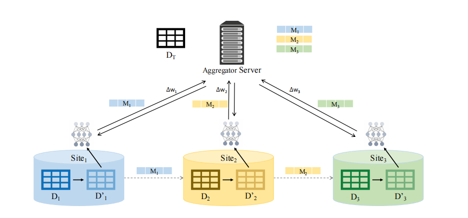

在训练阶段，在本地数据集$$(D_1,D_2,D_3)$$上通过K-匿名技术获得$$(D_1',D_2',D_3')$$，而其对应的匿名数据映射$$(M_1、M_2、M_3)$$则发送到中心服务器，以供将来使用。在联邦训练过程中，在匿名化的本地数据集$$(D_1',D_2',D_3')$$上训练模型，然后向中央服务器发送参数更新。**全局模型的推断过程**分为两步，首先用匿名数据映射$$(M_1、M_2、M_3)$$将目标数据集（$$D_T$$）匿名化，然后用全局模型对测试样本进行推断。

##### 实验分析

如下图所示，将**句法联邦学习**与差分隐私方法以及一般联邦学习方法进行实验比较，**句法联邦学习**在各个场景下都取得了大大优于差分隐私的模型性能。

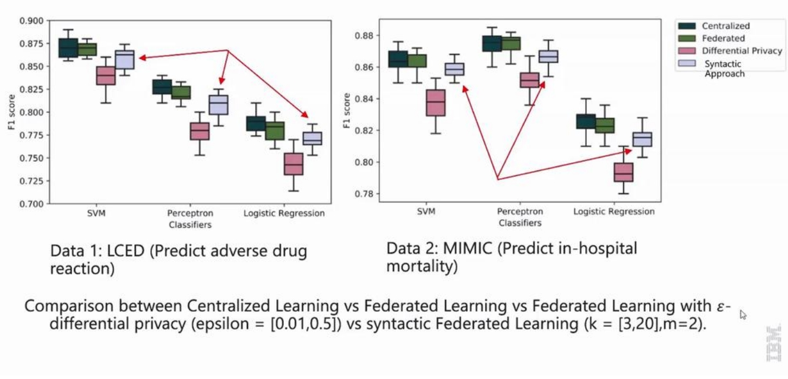

### 3.2 Defending Gradient Leakage Attack

在联邦学习的训练过程中，本地模型需要将参数更新发送到中央服务器。梯度泄露攻击（Gradient Leakage Attack）是一种重建攻击，它以参数更新作为输入，目标是重构训练数据，分两步进行攻击：首先，随机生成输入$$\mathbf{x,y}$$，然后迭代更新$$\mathbf{x,y}$$，使得模型以它们为输入的参数更新逼近真实参数更新，其基本算法如下图所示：

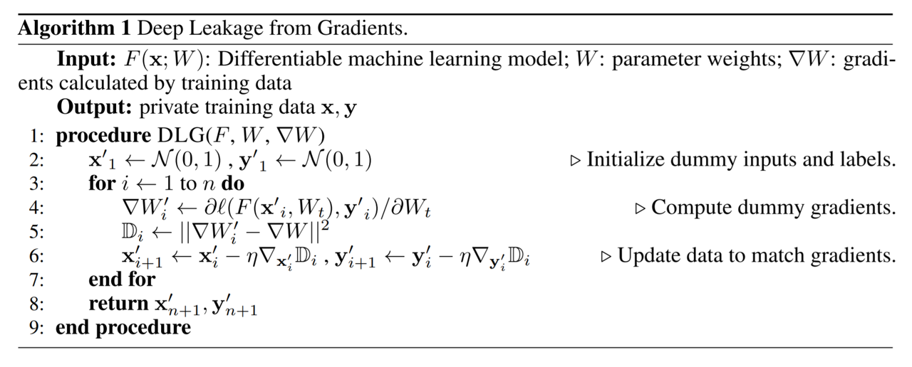

下图为MIT的一个核心实验室进行的通过梯度泄露攻击对CIFAR10数据集进行重建攻击的结果

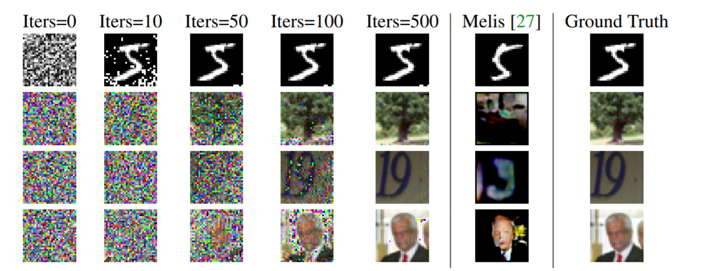

文献**[Separation of Powers in Federated Learning](https://arxiv.org/abs/2105.09400)**提出了一种能够对抗梯度重建攻击的方法，TRUDA（**TRU**stworthy and **D**ecentralized **A**ggregation），它通过模型聚合的策略设计对抗重建攻击，如下图所示。假设有三个本地客户端参与聚合，Truda的聚合策略分为三步构成：首先，参数更新被转换成Flatten Tensor，然后通过一个可信赖的服务器生成随机种子，利用随机种子对参数更新的Tensor进行随机打乱(Shuffle)与划分（Partition），最后将不同的划分部分传输到多个中央服务器进行聚合，再发送到值得信赖的服务器生成全局模型。论文证明，这个方法能够防止任何现存的数据重建攻击（但是我还是觉得这就是一个基于加密的方法，没什么新意，纯粹灌水。实际上你通信次数少一点，重建攻击就没用了）。

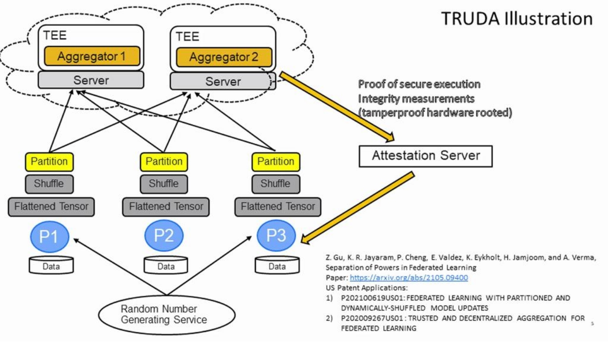

##### 实验分析

论文的实验结果如下图所示，实验证明，划分并在两个以上的中心服务器上进行聚合（Aggregation）（第2，第3行）以及参数乱序（Shuffling，第4行）这两个方法都可以独立对抗重建攻击，而同时利用两个方法则可以更加安全（第5，6行）。此外，右侧的实验结果展示了TRUDA的训练延迟，TRUDA中添加的安全特性为训练模型产生了额外的延迟，但时间花费并不高。

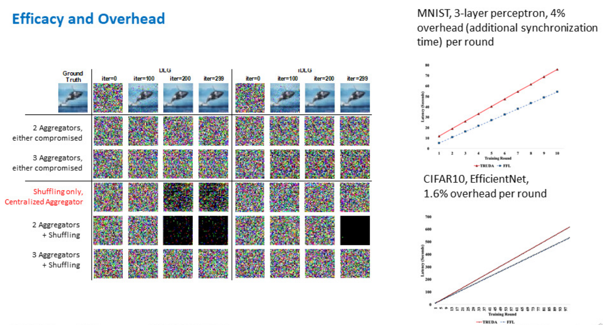

## 4. 联邦学习中的对抗训练方法

对抗攻击是对深度学习系统最具威胁性的攻击手段之一。通过对原始数据增加噪声，构造肉眼无法分辨的对抗样本，令模型分类错误。联邦学习能够进行分布式模型训练，在训练过程中无需获得本地数据。一个自然的问题是，在联邦学习的设定下，模型是否会受到对抗样本的影响，以及如何对联邦学习系统设计对抗训练方法（Adversarial Training）消除影响。

文献**[ Adversarial training in communication constrained federated learning](https://arxiv.org/abs/2103.01319)**提出具有高通信效率的联邦学习对抗训练，在假设通信成本有限，并且各个本地数据分布不一致（数据异构性）的前提下进行对抗训练策略研究。

首先，文献指出，在non-iid的数据分布场景下，直接进行传统的对抗训练策略，即**在每一个本地模型上进行对抗训练，然后再将所有本地模型聚合在一起的方法**，会导致模型的泛化精度显著下降，而对于对抗样本的鲁棒性却没有提升。这是因为在分布不一的本地数据集上进行对抗训练时，由于在多个训练epoch后才进行一次模型聚合，本地模型会出现明显的偏移，影响到全局模型的精度。对此，文献进行了多次实验，实验结果如下图所示，结果表明证明传统对抗训练策略的性能瓶颈存在两个方面：在non-iid的数据集上模型精度的大幅降低（图左），以及对抗训练收敛速度更慢，带来极高的通讯的开销（图右）。

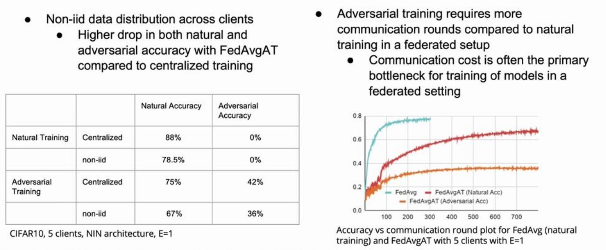

如何降低通信开销，减少在non-iid的数据集上的模型偏移是提高联邦对抗训练表现的关键。文献还对每两次通信间隔里本地模型的训练轮数$$E$$进行了分析，结果如下图所示：

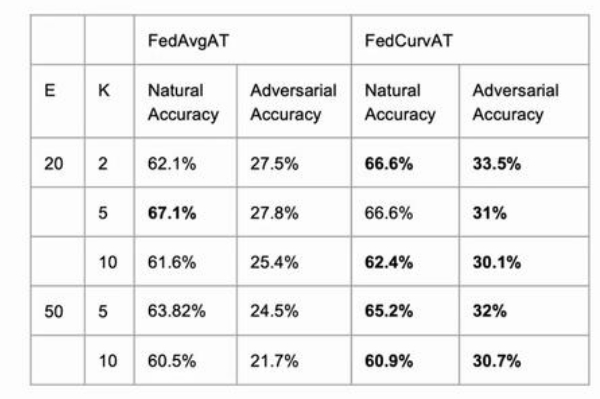

其中，E代表每两次通信间隔里本地模型的训练轮数，而K代表本地客户端数目。实验表明，E的数值越高模型收敛的越快，但是模型偏移问题更加严重，从而降低全局模型对于对抗样本的鲁棒性；而较低的E值带来了较高的模型性能，但是通讯开销也会增加。因此，通过自适应调整E可以在通信成本有限的情况下，增强对抗训练性能。基于这种直觉，文献提出了一种联邦动态对抗训练的方法（FedDynAT）来提高non-iid的数据分布场景下对抗训练性能，并在多个数据集和模型上对其进行实验验证。FedDynAT算法流程如下所示，其主要思想是在通信轮次上增加了衰减系数：在训练前期，增大本地训练的轮次E，加快模型收敛，减少通信成本；在训练后期，减少E从而解决模型偏移问题。

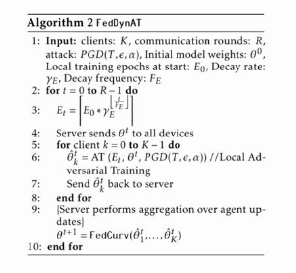

实验证明，FedDynAT在大部分场景下优于其他两种方法，同时FedDynAT达到模型收敛的通信轮次明显低于FedAvgAT。

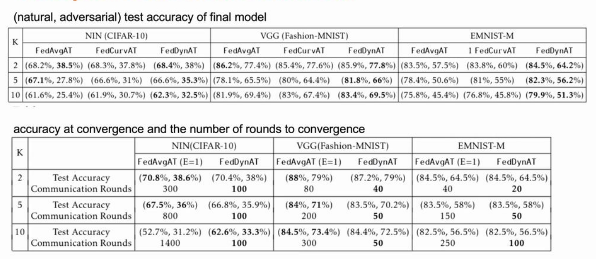

## 5. 对联邦学习系统进行监管：公平性原则与问责机制

最后一场演讲话题是对联邦学习系统进行管理，以维护人工智能模型的公平性原则，并对训练过程可能出现的问题（隐私泄露等）进行问责。在受监管行业和公共部门机构中应用机器学习模型需要遵守规章并接受审查。这意味着联邦学习系统应该做到透明，负责，可再现：通过透明性，提供人工智能方面的公平性；通过责任性，使得审查人员能够通过所提供的责任细节来核实这整个过程；通过可再现性，能够对系统进行诊断。此外，公平性原则对于人工智能的伦理道德也至关重要：控制训练过程使用的数据特征，使得生成的模型对于少数群体足够公平（**如模型不得使用人种，肤色这些歧视性特征进行推断**）。然而，目前保障联邦学习系统透明、责任、公平的技术都需要在中心化的训练环境中进行，因此数据隐私要求对于公平性原则与问责机制提出了技术上的挑战。

本场Talk主要对能够应用于联邦学习系统的透明，负责，可再现技术进行介绍。

#### 5.1 具有责任性的联邦学习

负责任的联邦学习（Accountable Federated Learning）是一种可以发现联邦学习过程是否被恶意操纵的技术。Talk介绍了IBM在公共管理背景下提出的一种解决方案——Factsheet，它可以在AI应用中提供透明度和建立信任。Factsheet记录了用于训练模型的数据、使用的算法和参数，重要的模型属性，如性能、公平性、健壮性、可解释性和继承扩展关系。

#### 5.2 具有公平性的联邦学习

过去的5到10年期间，机器学习社区与媒体都致力于令机器学习算法在种族、性别、宗教以及年龄等特征上消除偏见，遵循伦理。Talk中提到了导致联邦学习模型存在偏见的几个可能原因：

- 本地训练：联邦下也许中的本地训练与中心化训练过程相同，因此，在传统训练过程中导致的不公正，如偏见、低估和负面遗留，在本地训练中已经确定，这也是联邦学习中偏差（bias）存在的根本原因。 由于联邦学习涉及多个训练集，各方会将自己的偏差引入全局模型。

- 客户选择：现有联邦学习的方法会对不同的参与方进行选择，比如参与方选择（party selection）等。某一方是否可以参加全局模型聚合可能会因其敏感属性受到限制。比如：一家公司使用手机数据来训练联邦学习模型，网络速度等因素会影响是否收集用户数据，这与社会经济地位有关。 此外，许多联邦学习算法通过检查手机是否充电或插入插座来选择可以参与聚合的客户，而这些信息可能与白班和夜班工作时间表等因素相关 ，从而引入了经济地位导致的偏差。

- 数据异构：即使所有客户方都参与模型训练，各方的潜在数据分布可能存在不同。比如银行，女子学院附近的分支机构得到的数据主要是女性，这可能与银行客户数据集的总体组成有很大的不同，这也会引入偏差。
- 聚合算法：中心服务器结合各方模型，采用模型聚合算法更新全局模型。聚合算法往往涉及加权，这会导致导致偏差。比如，联邦学习算法可能会对具有更多数据的人群的贡献赋予更高的权重，即特定产品的重度用户，从而放大数据集中特定群体的影响。

针对上述联邦学习系统的公平性问题，Talk提出了两种不同的隐私设计，从而减轻偏差：避免敏感信息的传输以及增加差分隐私。具体方法基于两种已有的偏见缓解技术，重新赋权和偏见消除，技术细节在下列参考文献中：

- Accountable Federated Machine Leaming in Govemment：Engineering and Management Insights.
- Abay A, Zhou Y, Baracaldo N, et al. Mitigating bias in federated learning.
