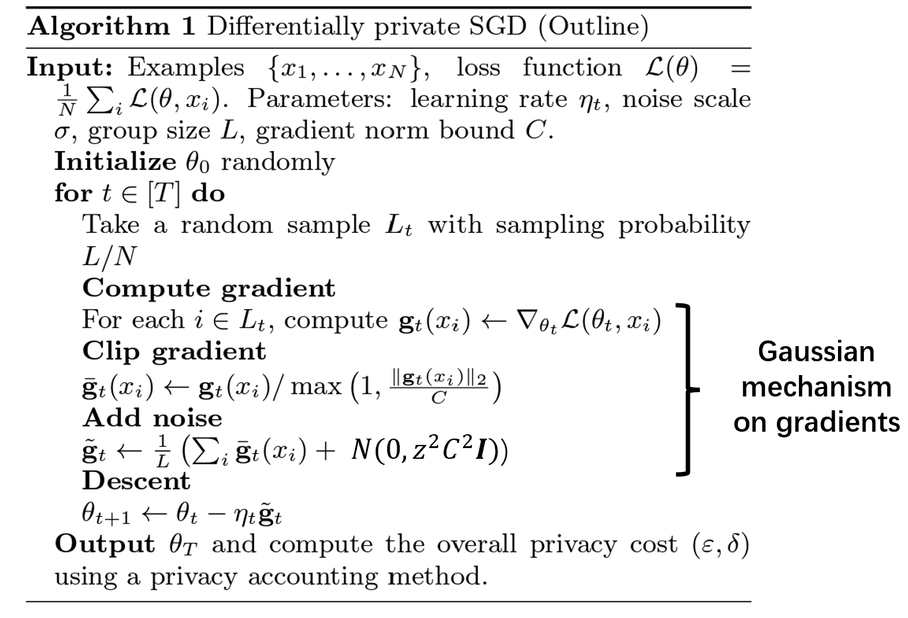
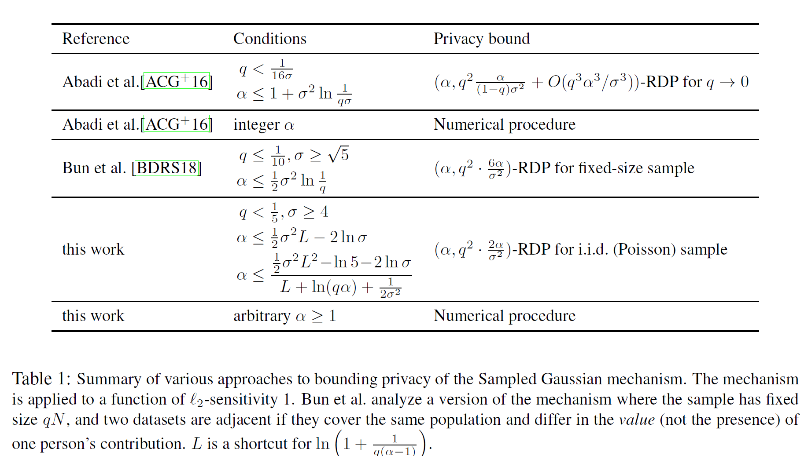
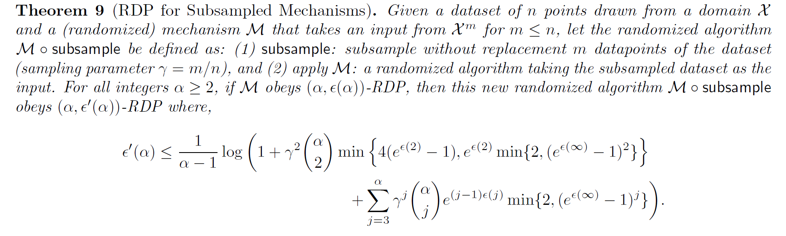
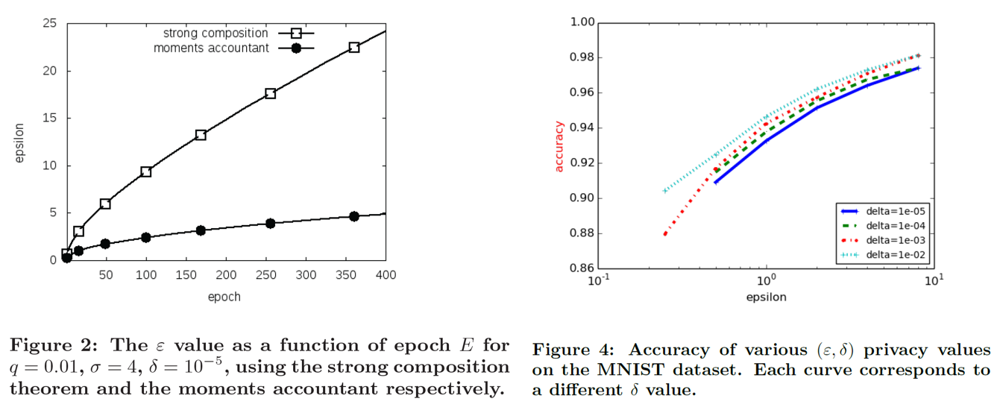
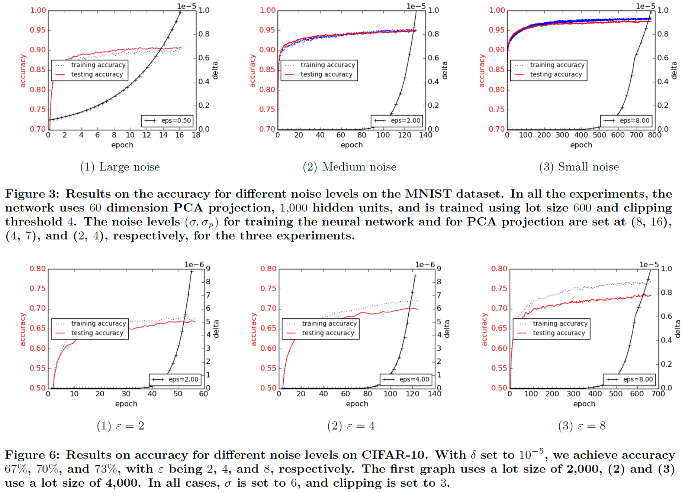
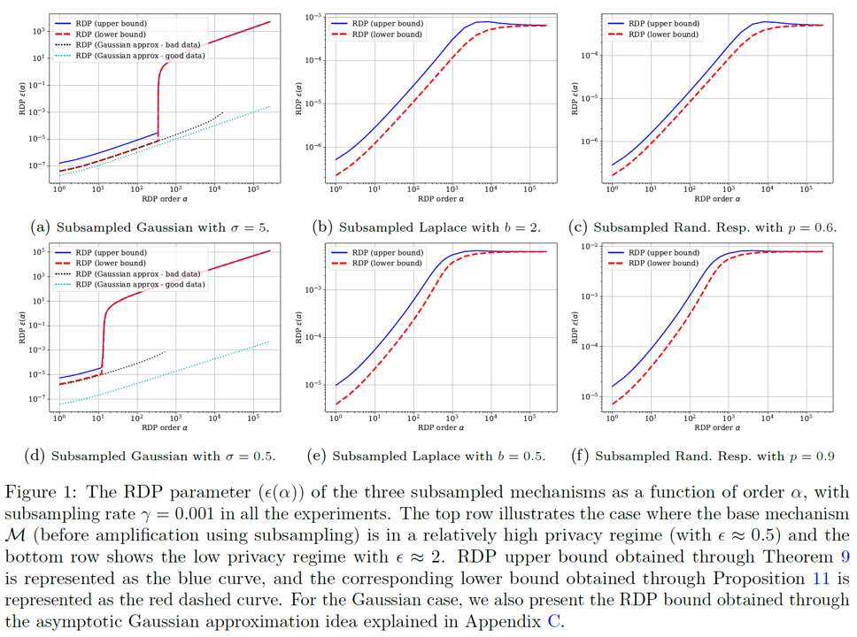

在之前[关于差分隐私的Tutorial](https://www.fenghz.xyz/Differential-Privacy/)中，我们简单介绍了欧盟隐私保护条例，即个人对数据具有知情权，拒绝权，修正与遗忘权，以及对于自动决策过程的选择权。差分隐私对于数据分析过程提出了严格的隐私保护定义，即对于数据库数据的任何分析，以及根据分析结果与其他信息进行的进一步的合并加工，都不会泄露个人隐私。通俗而言，就是对于任何数据分析员，要求分析员在对数据库进行分析后，对数据库中每一个个体的了解不会超过其在分析开始之前的了解。差分隐私的基本原理是**控制单个数据对于整个分析结果的影响**，对于简单的数据处理过程（如计算平均工资，统计性别比例），通过在数据分析结果中增加高斯噪声，可以令数据分析的机制满足差分隐私的约束。但是，对于需要多轮训练的复杂深度学习系统，构建差分隐私保护则更为困难。本文主要介绍基于高斯机制的差分隐私深度学习系统：通过在训练过程中施加高斯噪声，构建满足**差分隐私要求**的深度学习训练系统，并对所得深度模型**计算隐私开销**。此外，我们也将以[**Opacus**](https://github.com/pytorch/opacus)这一基于pytorch的差分隐私训练库为例进行代码讲解。


本文主要参考的文献为

1. [A Tutorial to Differentially Private Machine Learning, Neurips17](https://www.ece.rutgers.edu/~asarwate/nips2017/NIPS17_DPML_Tutorial.pdf)
2. [Deep learning with differential privacy](https://dl.acm.org/doi/abs/10.1145/2976749.2978318)
3. [Rényi differential privacy](https://ieeexplore.ieee.org/abstract/document/8049725/)
4. [Subsampled Rényi Differential Privacy and Analytical Moments Accountant](https://arxiv.org/abs/1808.00087)
5. [Rényi Differential Privacy of the Sampled Gaussian Mechanism](https://arxiv.org/abs/1908.10530)
6. [The Composition Theorem for Differential Privacy](http://proceedings.mlr.press/v37/kairouz15.html)
7. [Introducing Opacus: A high-speed library for training PyTorch models with differential privacy](https://ai.facebook.com/blog/introducing-opacus-a-high-speed-library-for-training-pytorch-models-with-differential-privacy/)
8. [A general approach to adding differential privacy to iterative training procedures](https://arxiv.org/abs/1812.06210)

## 差分隐私深度学习系统的基本框架

深度学习的训练与推断流程通常由四步组成：构建深度模型并初始化模型参数；输入训练数据并计算梯度；用梯度下降法更新模型直到收敛；将收敛的模型用于数据预测。最直接的隐私保护方法是对模型预测直接添加噪声，由于深度学习的模型参数非常容易获取，因此仅仅在预测阶段添加噪声往往无法达到隐私保护的目的。利用差分隐私的传递性特征，即对于满足$$(\epsilon,\delta)-DP$$的随机算法$$\mathcal{M}$$，对其结果进行任何形式的处理所构成的新算法$$f\circ \mathcal{M}$$同样满足$$(\epsilon,\delta)-DP$$，可得对深度学习系统添加差分隐私的环节应当尽量靠前。然而，在数据集上直接增加噪声往往会使得数据集本身变得脏而不可用（想象一下需要令两张照片的统计信息不可分辨所需要的噪声尺度）。另一个想法是在训练好的模型参数上直接添加噪声，即$$\tilde{\theta}=\theta+\text{Noise}$$，利用高斯机制，添加噪声后的参数也具备差分隐私的特性，该特性可以传递到所有的后续推断过程。但是，深度神经网络是一个对参数非常敏感的黑箱，直接对训练好的参数添加高斯噪声会使得整个算法完全失效，因此差分隐私机制需要在训练过程中加入。通过在训练过程中对梯度进行裁剪并添加高斯噪声，可以保证训练过程的差分隐私性质。

首先，我们定义深度学习系统中的差分隐私如下：

**(Definition 1. Differential Privacy in Deep Training System)** 记数据集为$$D$$，深度学习的模型参数为$$\theta$$，由所有$$D$$的子集组成的训练数据库记为$$\mathcal{D}$$，参数空间为$$\mathcal{T}$$。一个具有随机性质的深度学习训练机制将训练数据集作为输入，采用梯度下降法进行训练，输出训练后的参数，记作$$\mathcal{M}:\mathcal{D}\rightarrow\mathcal{T}$$。我们称这一训练机制满足$$(\epsilon,\delta)$$-DP，如果对于任意两个毗邻的训练集$$d,d'\in \mathcal{D}$$, 以及任何参数范围$$\mathcal{S}\subset \mathcal{T}$$，其输出的参数分布满足：

$$
Pr[\mathcal{M}(d)\in S]\leq e^{\epsilon}Pr[\mathcal{M}(d')\in S]+\delta
$$

在该定义下，数据集中的单个数据对于模型的影响被控制在一定的范围内，实现了在模型层面对于差分攻击的“不可分辨性”。此外，为了叙述方便，我们提前引入差分隐私的一个变种——**Rényi Differential Privacy (RDP)**。我们将在计算隐私开销时体会到**RDP**的威力。

**(Definition 2. Rényi Differential Privacy in DL-system)** 对于**Definition 1**中所述的训练机制$$\mathcal{M}$$，用$$\mathcal{M}(d)(\theta)$$表示在训练集$$d$$上训练所得结果为$$\theta$$的概率密度，即$$\mathcal{M}(d)(\theta)=\Pr[\mathcal{M}(d)=\theta]$$。我们称训练机制$$\mathcal{M}$$对于所有的$$\alpha\in (1,\infty)$$满足$$(\alpha,\epsilon)-$$RDP，如果对于所有可能的相邻训练集$$d,d'\in\mathcal{D}$$满足

$$
D_{\alpha}(\mathcal{M}(d)\Vert \mathcal{M}(d'))=\frac{1}{\alpha-1}\log\mathbb{E}_{\theta\sim \mathcal{M}(d')}[\frac{\mathcal{M}(d)(\theta)}{\mathcal{M}(d')(\theta)}]^{\alpha}\leq \epsilon
$$

**(Proposition 1. From RDP to DP)** RDP和DP可以进行直接转换，如果训练机制$$\mathcal{M}$$服从$$(\alpha,\epsilon)-$$RDP，那么对于所有的$$\delta,0<\delta<1$$，$$\mathcal{M}$$服从$$(\epsilon+\log(1/\delta)/\alpha-1,\delta)-$$DP。


在深度学习的训练中，模型参数采用梯度下降法进行更新，即

$$
\theta_{t}\leftarrow \theta_{t-1}-\frac{\eta_t}{N}\sum_{i=1}^{N}\nabla_{\theta_t}\text{loss}(x_i,\theta_{t-1})
$$

其中$$\theta_0$$是随机初始化参数。梯度是利用输入数据直接进行计算的结果，也是模型参数进行更新的主要运算，因此在梯度上施加差分噪声是自然的事情。为了控制个体数据的影响，文献[1]利用高斯机制对梯度施加差分隐私。高斯机制的定义如下：

**(Definition 3. Gaussian Mechanism)** 假设存在一个确定函数$$f:\mathcal{D}\rightarrow\mathcal{T}$$，敏感度为$$\Delta_2(f)=\max_{d,d'\in \mathcal{D}}\Vert f(d)-f(d')\Vert_2$$，那么对于任意的$$\delta\in(0,1)$$，给定随机噪声服从正态分布$$\mathcal{N}(0,\sigma^2)$$，那么随机算法$$\mathcal{M}(d)=f(d)+\mathcal{N}(0,\sigma^2)$$服从$$(\epsilon,\delta)-$$DP，其中

$$
\epsilon\geq\frac{\sqrt{2 \ln (1.25 / \delta)}}{\frac{\sigma}{\Delta_2 f}}
$$

利用高斯机制，我们对梯度分三个步骤增加差分噪声：首先，对每一个样本对应的梯度裁剪到一个固定范围$$[-C,C]$$，以控制个体数据的影响，此时梯度的敏感度$$\Delta_2(f)=\max_{x_i\in D}\Vert \nabla_{\theta}\text{loss}(x_i,\theta)\Vert_2\leq C$$。然后，对裁剪后的梯度增加高斯噪声$$\mathcal{N}(0,\sigma^2)$$，以得到满足差分隐私的梯度数据。最后，用这些梯度更新模型，并计算模型的隐私损失。记噪声乘子(*noise multiplier*)为$$z=\frac{\sigma}{C}$$，那么该训练系统服从$$(\epsilon,\delta)-$$DP的条件为

$$
z=\frac{\sqrt{2 \ln (1.25 / \delta)}}{\epsilon} \tag{1}
$$

完整算法如下图所述：



模型一共进行了$$T$$轮训练，在每轮训练中，对训练集的每一个样本计算梯度，进行裁剪加噪，最后用满足差分隐私的梯度$$\tilde{\mathbf{g}}_t$$进行参数更新。当$$z$$满足$$(1)$$中所述的条件时，对于第$$t$$轮所选择的训练集，所得的参数$$\theta_{t+1}$$满足$$(\epsilon,\delta)-$$DP。注意到该算法引入了一个新的过程，子采样(subsample)，即在每一轮的训练集是整个训练集的一个子集，通过概率为$$q=L/N$$的不放回采样进行选取。一个普遍的结论是，随着采样率的增加，训练时长变为$$1/q$$倍，但是隐私界与$$q^2$$成正比，因此subsample操作可以用采样率对差分隐私进行amplify，从而降低隐私损失。此外，由于模型要进行$$T$$轮训练，如何计算$$T$$轮训练的总和隐私损失也是一个关键问题。我们就Subsample与Composition两个问题进行描述。

### Subsample：用采样率对隐私进行Amplify，降低差分隐私损失
在深度学习的训练过程中，由于数据量比较大，我们往往采用基于随机采样的梯度下降法，即每次选取一个Batch，在该Batch上计算平均梯度，采用它们的平均梯度进行梯度下降。那么，这种基于采样的方法对隐私损失会有什么样的影响呢？我们先不加证明地给出一个结论，即采样会增强隐私保护的力度，降低隐私损失。首先对Subsample给出如下的定义：

**(Definition 4. Subsample)** 给定一个含有$$N$$个样本的数据集$$X=\{x_1,\cdots,x_N\}$$，**Subsample**操作对于$$X$$的所有大小为$$L$$的子集以等概率进行一次无放回采样，记$$q = \frac{L}{N}$$为采样率。

考虑先对数据集$$X$$进行Subsample，然后在子集上用具有差分隐私性质的训练机制$$\mathcal{M}$$进行训练，文献[4]指出了如下结论：如果训练机制$$\mathcal{M}$$在训练集上满足$$(\epsilon,\delta)-$$DP，那么$$\mathcal{M'}=\mathcal{M}\circ\text{Subsample}$$对于整个数据集$$X$$满足$$(\epsilon',\delta')-$$DP，其中$$\epsilon'=\log(1+q(e^{\epsilon}-1)),\delta'=q\delta$$。

当$$\epsilon$$很小的时候，我们有$$\epsilon'=\mathcal{O}(q\epsilon)$$，是$$q\epsilon$$的小阶，此时虽然模型需要的训练轮次变多了，但是从整体而言，模型的隐私损失变小了。

对于**Rényi Differential Privacy**，文献[3,4,5]都对高斯机制的Subsample进行了研究，提出了更紧的基于Subsample的隐私损失，如下所述：





在这些Bound中，某些情况下$$\epsilon'$$会成为$$q^2\epsilon$$的小阶，这大大减少了隐私损失。

### Composition Theorem：计算整个训练系统的差分隐私损失

深度学习系统在经过一轮由Subsample，梯度计算，梯度裁剪，高斯加噪组成的训练后，得到了一组满足$$(\epsilon,\delta)-$$DP的参数$$\theta_t$$，然后将$$\theta_t$$作为新的初始参数进行下一轮训练。经过$$T$$轮训练后，模型收敛。假设整个训练过程是公开的，即从第一到第$$T$$轮的所有模型参数都是可以获取的，那么如何去判断整个训练机制的隐私损失呢？这就是Composition Theorem所解决的问题，它用于计算整个训练系统的差分隐私损失。一个直觉是，一个由$$T$$个满足$$(\epsilon,\delta)-$$DP的机制$$\mathcal{M}_t$$所组成的队列系统$$M$$的隐私损失至多是$$(T\epsilon,T\delta)$$。这个损失界是否可以进一步减少呢？Strong Composition Theorem提出，T个机制进行Composition后，隐私损失变为$$(\tilde{\epsilon},\tilde{\delta})$$，其中

$$
\tilde{\epsilon}=\epsilon\sqrt{2T\ln(1/\delta')}+T\epsilon\frac{e^{\epsilon}-1}{e^{\epsilon}+1};\tilde{\delta}=T\delta+\delta'
$$

一般而言我们取$$\delta'=\delta$$。结合Subsample定理，当$$\epsilon\rightarrow 0$$时，Strong Composition给出了$$(\mathcal{O}(q\epsilon\sqrt{T\ln(1/\delta)},q(T+1)\delta)$$的隐私损失。但是这个隐私损失与$$\delta$$相关，当$$\delta$$很小时，该损失变得非常大。因此，文献[2]提出了一个在深度学习的训练过程中计算总隐私损失的有效方法，即矩会计方法（Moments Accountant），它将Composition的隐私损失界降低到了$$(q\epsilon\sqrt{T},\delta)$$，是广泛采用的隐私损失界。该隐私损失界的基本思想是将每一轮训练的隐私损失看成随机变量，而将总隐私损失看成是各轮随机变量的加和分布，通过计算随机变量的矩生成函数（moment generating function），得到更精准的隐私界。该方法最终可以归结为RDP的计算，并且在高斯机制下具有解析解，我们对其进行详细的介绍。

对于$$t$$时刻的训练机制$$\mathcal{M}_t$$，差分隐私的目标是令其在相邻数据库上得到的参数$$\theta_t$$的分布尽量相似，即对于所有的相邻训练集$$d,d'\in\mathcal{D}$$，要求

$$
\sup_{\theta\in\mathcal{T},d,d'}\vert\log\frac{\mathcal{M}_t(d)(\theta)}{\mathcal{M}_t(d')(\theta)}\vert \leq \epsilon
$$

因此，我们对$$\log\frac{\mathcal{M}_t(d)(\theta)}{\mathcal{M}_t(d')(\theta)}$$的性质展开研究。依据文献[2]的思路，$$t$$时刻的训练机制接收$$t-1$$时刻的参数$$\theta_{t-1}$$，采用随机梯度下降法在训练集上进行训练，因此我们如下定义随机变量$$c(\theta,\mathcal{M}_t,d,\theta_{t-1},d')$$为

$$
c(\theta,\mathcal{M}_t,\theta_{t-1},d,d')=\log\frac{\mathcal{M}_t(\theta_{t-1},d)(\theta)}{\mathcal{M}_t(\theta_{t-1},d')(\theta)},\theta\sim \mathcal{M}_t(\theta_{t-1},d)
$$

简写为$$c(\theta,\mathcal{M}_t)$$此时，对于由$$\mathcal{M}_1,\cdots,\mathcal{M}_{K}$$这K个训练机制所组成的训练系统$$\mathcal{M}_{1:K}$$。注意到训练机制在不同时刻间的输出参数分布独立：

$$
\Pr[\mathcal{M}_{t}(\theta_{t-1},d)=\theta_t\vert \mathcal{M}_{t-1}(\theta_{t-2},d)=\theta_{t-1}]=\Pr[\mathcal{M}_{t}(\theta_{t-1},d)=\theta_t]
$$

因此，训练系统$$\mathcal{M}_{1:K}$$的隐私随机变量可以由多个时刻的隐私随机变量的加和Composition来进行表示：

$$
c(\theta_{1:K},\mathcal{M}_{1:K},\theta_{0}:\theta_{K-1},d,d')=\log\Pi_{t=1}^{K}\frac{\mathcal{M}_t(\theta_{t-1},d)(\theta_t)}{\mathcal{M}_t(\theta_{t-1},d')(\theta_t)}=\sum_{t=1}^{K}c(\theta,\mathcal{M}_t)\tag{2}
$$

那么，如何利用隐私随机变量$$c(\theta,\mathcal{M}_t,\theta_{t-1},d,d')$$来刻画隐私损失呢？如何将其联系到差分隐私呢？如果在$$d,d'$$相邻数据集上训练机制的输出参数分布完全一致，那么对于任意的相邻数据集，$$c(\theta,\mathcal{M}_t,\theta_{t-1},d,d')$$的估计都应当趋向于0，也就是说随机变量$$c$$的一阶矩（$$\mathbb{E}_{\theta\sim \mathcal{M}_t(\theta_{t-1},d)}c(\theta,\mathcal{M}_t)$$），二阶矩（$$\mathbb{E}_{\theta\sim \mathcal{M}_t(\theta_{t-1},d)}c^2(\theta,\mathcal{M}_t)$$）以至n阶矩都应当在0附近，因此我们可以用随机变量$$c$$的矩的大小来衡量隐私损失。考虑$$c(\theta,\mathcal{M}_t)$$的对数矩生成函数（Moment Generating Functions，基本介绍见附录）:

$$
K_{\mathcal{M}_t}^{d,d'}(\alpha):=\log\mathbb{E}_{\theta\sim \mathcal{M}_t(\theta_{t-1},d)}[\exp(\alpha c(\theta,\mathcal{M}_t,\theta_{t-1},d,d'))]\\
=\log\mathbb{E}_{\theta\sim \mathcal{M}_t(\theta_{t-1},d)}[\frac{\mathcal{M}_t(\theta_{t-1},d)(\theta)}{\mathcal{M}_t(\theta_{t-1},d')(\theta)}]^\alpha\\
=\log \mathbb{E}_{\theta\sim \mathcal{M}_t(\theta_{t-1},d')}[\frac{\mathcal{M}_t(\theta_{t-1},d)(\theta)}{\mathcal{M}_t(\theta_{t-1},d')(\theta)}]^{\alpha+1}
$$

此外，利用$$(2)$$式的独立性，当对由$$K$$个训练轮次构成的训练系统$$\mathcal{M}$$而言，它的对数矩生成函数也具有求和性质，即

$$
K_{\mathcal{M}}^{d,d'}(\alpha)=\sum_{t=0}^{K}K_{\mathcal{M}_t}^{d,d'}(\alpha)
$$

因为差分隐私界需要遍历所有的相邻数据集$$d,d'\in \mathcal{D}$$，因此我们记

$$
K_{\mathcal{M}_t}(\alpha)=\sup_{d,d'\in \mathcal{D}}K_{\mathcal{M}_t}^{d,d'}(\alpha)
$$

利用最大值的性质，我们有$$K_{\mathcal{M}}(\alpha)\leq \sum_{t=0}^{K}K_{\mathcal{M}_t}(\alpha)$$。此外，注意到

$$
K_{\mathcal{M}_t}^{d,d'}(\alpha)=\alpha D_{\alpha+1}(\mathcal{M}_t(\theta_{t-1},d)\Vert \mathcal{M}_t(\theta_{t-1},d'))
$$

因此，$$K_{\mathcal{M}_t}(\alpha)$$可以与RDP进行直接联系，进而可以扩展到$$(\epsilon,\delta)-$$DP，我们有：

**(Proposition 2 Moments Accountant and RDP)** 对于任意的$$\alpha\geq 0$$，在$$t$$时刻具有随机性的训练机制$$\mathcal{M}_t$$满足$$(\alpha+1,K_{\mathcal{M}_t}(\alpha)/\alpha)-$$RDP，而整个训练系统$$\mathcal{M}$$则至少具有$$(\alpha,\sum_{t=1}^K K_{\mathcal{M}_t}(\alpha)/\alpha)$$-RDP。

**(Proposition 3 From Moments Accountant to $$(\epsilon,\delta)$$-DP)**
利用**Proposition 1**中从RDP到DP的转换，以及**Proposition 2**中从Moments Accountant到 RDP的转换，我们有如下结论：
1. 在$$t$$时刻具有随机性的训练机制$$\mathcal{M}_t$$满足$$(\frac{K_{\mathcal{M}_t}(\alpha)+\log(\frac{1}{\delta})}{\alpha},\delta)-$$DP
2. 给定$$\delta$$，则最佳的$$\epsilon$$取值为： 
    $$
    \epsilon(\delta)=\min_{\alpha}\frac{K_{\mathcal{M}_t}(\alpha)+\log(\frac{1}{\delta})}{\alpha}
    $$
3. 给定$$\epsilon$$，则最佳的$$\delta$$取值为
   $$
   \delta = \min_{\alpha}\exp(K_{\mathcal{M}_t}(\alpha)-\alpha\epsilon)
   $$

利用**Proposition 3**，我们可以从概率角度对差分隐私进行新的理解：给定相邻数据集$$d,d'$$，记$$c(\theta,\mathcal{M}_t)$$为关联隐私损失的随机变量，则整个训练过程的差分损失随机变量为$$c(\theta,\mathcal{M})=\sum_{t=1}^{K}c(\theta,\mathcal{M}_t)$$，此时对于满足**Proposition 3**要求的$$(\epsilon,\delta)$$，则对于任意相邻数据库$$d,d'\in \mathcal{D}$$，以及任意$$\alpha$$，我们都有

$$
\Pr[c(\theta,\mathcal{M})>\epsilon]=\Pr[\exp(\alpha c(\theta,\mathcal{M}))>\exp(\alpha\epsilon)]\\
\leq(\text{Markov不等式})\frac{\mathbb{E}[\exp(\alpha c(\theta,\mathcal{M}))]}{\exp(\alpha\epsilon)}\\
=\frac{\Pi_{t=0}^{K}\mathbb{E}[\exp(\alpha c(\theta,\mathcal{M}_t))]}{\exp(\alpha\epsilon)}=\frac{\exp{\sum_{t=0}^{K}\ln(\mathbb{E}[\exp(\alpha c(\theta,\mathcal{M}_t))])}}{\exp(\alpha\epsilon)}\\
=\exp(\sum_{t=0}^{K}K_{\mathcal{M}_t}^{d,d'}(\alpha)-\alpha\epsilon)=\delta
$$

也就是说，此时$$(\epsilon,\delta)-$$DP可以理解为，整个训练过程的差分损失随机变量为$$c(\theta,\mathcal{M})$$大于$$\epsilon$$的概率小于$$\delta$$。

在上文中，我们讨论了整个训练系统的差分隐私损失计算，并介绍了Moments Accountant这一具备很多良好性质的武器。但是，$$K_{\mathcal{M}_t}(\alpha)$$的计算需要遍历整个数据集，这种计算成本是不可接受的。此外，采样率在隐私计算中起到了隐私增幅，减小隐私损失的作用，这也需要在Moments Accountant的计算中得到广泛考虑。对于高斯噪声，文献[2]提出了一种广泛使用的计算Moments Accountant的方法，如下所述：

**(Proposition 4. Calculations of Moments Accountant with Gaussian Mechanism)** 考虑具有随机Subsample的高斯机制，其中高斯机制的噪声乘子(*noise multiplier*)为方差$$\sigma$$与梯度范围$$C$$的比值$$z=\frac{\sigma}{C}$$。记采样率为$$q$$，令$$\mu_0$$为分布$$\mathcal{N}(0,z^2)$$的概率密度函数，$$\mu_1$$为分布$$\mathcal{N}(1,z^2)$$的概率密度函数，令$$\mu=(1-q)\mu_0+q\mu_1$$，那么结合文献[2,5]的结论，我们有

$$
K_{\mathcal{M}_t}(\alpha)=\log \mathbb{E}_{z\sim \mu_0}[\mu(z)/\mu_0(z)]^\alpha\tag{3}
$$

注意到此时$$K_{\mathcal{M}_t}(\alpha)$$对于给定的采样率$$q$$以及噪声乘子$$z$$是一个固定的数值，这也就是说，对于任何的神经网络模型与任何数据集，采用基于Subsample的高斯机制的隐私损失的上界都是一样的。对于整数$$\alpha$$，$$(3)$$式可以写成

$$
\mathbb{E}_{z\sim \mu_0}[\mu(z)/\mu_0(z)]^\alpha=\mathbb{E}_{z\sim \mu_0}[(1-q)+q\frac{\mu_1(z)}{\mu_0(z)}]^\alpha\\
=\sum_{k=0}^{\alpha}\tbinom{\alpha}{k}(1-q)^{\alpha-k}q^k[\frac{\mu_1(z)}{\mu_0(z)}]^k
$$

此时，对于任意正整数$$k$$，$$\mathbb{E}_{z\sim \mu_0}[\frac{\mu_1(z)}{\mu_0(z)}]^k$$具有解析解为

$$
\mathbb{E}_{z\sim \mu_0}[\frac{\mu_1(z)}{\mu_0(z)}]^k=\exp(\frac{k^2-k}{2z^2})
$$

将其代入则可得到$$(3)$$的数值解。对于非整数的$$\alpha$$，我们可以直接进行数值积分，或者采用基于插值的估计方法。文献[4]提出了一个利用$$\alpha$$的向下取整$$\lfloor\alpha \rfloor$$与向上取整$$\lceil\alpha \rceil$$构造估计值，即

$$
K_{\mathcal{M}_t}(\alpha)\leq (1-\alpha+\lfloor\alpha \rfloor)K_{\mathcal{M}_t}(\lfloor\alpha \rfloor)+(\alpha-\lfloor\alpha \rfloor)K_{\mathcal{M}_t}(\lceil\alpha \rceil)
$$

此外，文献[2]还给了一个近似上界，即

$$
K_{\mathcal{M}_t}(\alpha)\leq q^2\alpha(\alpha+1)/[(1-q)z^2]+\mathcal{O}(q^3/z^3)
$$

综上所述，对于一个使用高斯机制的深度学习训练系统，计算隐私损失大概可以分为三步（这也是Tensorflow的Moments Accountant官方库中的计算方法）：

1. 确定给定的噪声乘子$$z$$，梯度裁剪系数$$C$$以及采样率$$q$$。
2. 对某个范围的$$\alpha$$计算$$(3)$$式。一般而言，我们对所有的整数$$\alpha\in [2,32]$$，计算$$K_{\mathcal{M}_t}(\alpha)$$，并列表记录。
3. 确定$$\delta$$的数值，一般为0.01，然后使用**Proposition 3**，对表中所有的$$(\alpha,K_{\mathcal{M}_t}(\alpha))$$对计算最佳的$$\epsilon$$，然后得出整个训练系统的隐私损失。

文献[2]在MNIST和Cifar上都进行了实验，比较基于Moments Accountant的方法与Strong Composition定理在隐私界上的扩展，以及各个参数对模型性能的影响，如下所述：




## Opacus库：基于Pytorch框架的隐私保护库
Opacus是一个高性能，高速的用于训练具有差分隐私的PyTorch模型的函数库。Opacus库提供了主要类函数`PrivacyEngine`，作用于**Pytorch**中提供的优化器`optimizer`上，主要代码如下所示：
```
model = Net()
optimizer = torch.optim.SGD(model.parameters(), lr=0.05)
privacy_engine = PrivacyEngine(
   model,
   batch_size=32,
   sample_size=len(train_loader.dataset),
   sample_rate = 0.01,
   alphas=range(2,32),
   noise_multiplier=1.3,
   max_grad_norm=1.0,
)
privacy_engine.attach(optimizer)
```
其中，`PrivacyEngine`以`torch.Module`作为模型输入，`alpha`是RDP中所使用的$$\alpha$$，也是计算Moments Accountant所用的$$\alpha$$范围，如上文中所述，主要取$$\alpha\in [2,32]$$；`noise_multiplier`是高斯机制中的$$z=\frac{\sigma}{C}$$；`max_grad_norm`是梯度裁剪范围$$C$$；`sample_size`确定了数据总量$$N$$；而`batch size`与`sample_rate`用于计算采样率$$q$$以及更新的最小数据量$$L$$。其中，模型每次采样一个`batch_size`大小的数据，在上面计算梯度，最后将多个`batch`汇总成一个`Lots`进行梯度加噪与参数更新，即`L = sample_size*sample_rate`，此时`q=sample_rate`。注意`sample rate`是一个可选参数，如果不给定`sample rate`，那么模型就会令`Lots=batch_size`，此时模型每次计算完一个Batch就进行梯度更新，采样率`q=batch_size/sample_size`。

此外，为了计算隐私开销，Opacus提供了`get_privacy_spent`函数，它在给定$$\delta$$后，利用Moments Accountant遍历$$\alpha$$，计算最佳的$$\epsilon$$，并给出此时$$\alpha$$的取值：
```
epsilon, best_alpha = optimizer.privacy_engine.get_privacy_spent(delta) 
```
训练过程主要采用高斯噪声对梯度进行加噪，噪声方差为$$\text{noise-multiplier}*\text{max-grad-norm}$$，生成函数如下所示：
```
def _generate_noise(
    engine, max_grad_norm: float, grad: torch.Tensor
) -> torch.Tensor:
    if engine.noise_multiplier > 0 and max_grad_norm > 0:
        return torch.normal(
            0,
            engine.noise_multiplier * max_grad_norm,
            grad.shape,
            device=engine.device,
            generator=engine.random_number_generator,
        )
    return torch.zeros(grad.shape, device=engine.device)
```
### 训练过程中的Subsample与MiniBatch

在**DP-SGD**的实现算法中，模型参数更新以`Lots`为单位，即在所有的训练集中按比率$$q$$选取一个`Lots`，然后对于`Lots`中的每个样本计算梯度，然后汇总梯度依次进行`gradient clip`、`noise adding`以及`SGD`。但是，在常见训练过程中，我们往往以`batch`为单位计算梯度并进行模型更新。虽然我们确实可以将`Lots`的大小设置为与`batch size`等同，此时`q`无限趋向于0（当然这其实也没有什么大问题，也是一个常见的设置），但是在某些场景下，`q`并不是越小越好。比如，提前依据下文中公式$$(4)$$的情景，当$$q$$太小时，对每一个`Lots`所增加的噪声方差都会很大，因此我们往往会将`Lots`的大小设置为`batch size`的若干倍。为了在这种场景下进行更新，`Opacus`引进了`virtual_step`函数，它只会对当前`batch`的梯度进行`gradient clip`，并将裁剪后的梯度向量放入一个容器，在汇总k个`batch`后，对于整个`Lots`的数据再调用`step`函数进行更新，它将存储在容器中的梯度依据`k*batch_size`计算平均值并调用`SGD`。基本代码如下所示：
```
Example:
Imagine you want to train a model with batch size of 2048, but you can only
fit batch size of 128 in your GPU. Then, you can do the following:
>>> for i, (X, y) in enumerate(dataloader):
>>>     logits = model(X)
>>>     loss = criterion(logits, y)
>>>     loss.backward()
>>>     if i % 16 == 15:
>>>         # accumulate the gradients of a lot and perform SGD.
>>>         optimizer.step()    
>>>         optimizer.zero_grad()
>>>     else:
>>>         # store the gradients into a gradient accumulator
>>>         optimizer.virtual_step()   # this will call privacy engine's virtual_step()
```
### 对模型参数进行分组裁剪与加噪

差分隐私模块需要对计算后的参数梯度进行裁剪并增加高斯噪声。但是，深度模型的参数所提取的特征与层数有关，不同层对应不同尺度的特征，也对应不同尺度的梯度和方差（如深度卷积网络的浅层提取纹理特征，深层提取语义特征）。因此，对于参数进行分组，对每一个组的梯度单独采用一组$$(C_g,z_g)$$添加噪声，然后进行梯度下降法是一个直观且符合逻辑的想法。那么，如何进行分组加噪，以及分组加噪后的模型满足什么样的差分隐私界呢？文献[8]对这一问题进行了具体的研究，并提出了一个在各个差分隐私框架下广泛使用的加噪方法。

首先，我们将模型参数$$\mathbf{W}$$分为$$M$$组，则在训练过程中对应的参数梯度记为$$\mathbf{G}=(\mathbf{g}_1,\cdots,\mathbf{g}_M)$$。我们表示裁剪范围为$$C$$的裁剪函数为$$\pi_{C}(\mathbf{g})=\mathbf{g}\cdot \min(1,\frac{C}{\Vert\mathbf{g}_t\Vert_2})$$。对于一个`Lots`的L个训练数据，我们记第$$i,1\leq i\leq L$$个数据的训练梯度为$$\mathbf{G^i}=(\mathbf{g^i}_1,\cdots,\mathbf{g^i}_M)$$，考虑对所有梯度$$\mathbf{G}$$采用$$(C,z)$$作为参数的DP-SGD过程：

$$
\tilde{\mathbf{G}}=\frac{1}{L}\sum_{i=1}^{L}[\pi_{C}(\mathbf{G^i})+\mathcal{N}(0;z^2C^2I)]\\
=[\frac{1}{L}\sum_{i=1}^{L}\pi_{C}(\mathbf{G^i})]+\mathcal{N}(0;\frac{z^2C^2}{L}I)\\
=\frac{1}{L}[\sum_{i=1}^{L}\pi_{C}(\mathbf{G^i})+\mathcal{N}(0; L\cdot z^2C^2I)]\tag{4}
$$

我们说该过程满足$$(\epsilon,\delta)-$$DP，计算方法如**Proposition 4**所述。首先，从公式$$(4)$$中我们发现，差分机制不必对每一个梯度加噪，我们只需要对最后汇总的梯度进行加和，然后增加方差为$$\sigma=zC\sqrt{L}$$的正态噪声，最后对得到的梯度进行平均，就可以获得满足差分隐私要求的梯度$$\tilde{G}$$，从而大大减少计算量。

此外，我们可以将$$(4)$$写成分组的形式，即对每一个$$\mathbf{g}_m$$，采用独立的$$(C_m,z_m)$$作为差分隐私的参数，如下所示：

$$
\tilde{\mathbf{g}}_m=\frac{1}{L}\sum_{i=1}^{L}[\pi_{C_m}(\mathbf{g^i}_m)+\mathcal{N}(0;z_m^2C_m^2I)]\\
=[\frac{1}{L}\sum_{i=1}^{L}\pi_{C_m}(\mathbf{g^i}_m)]+\mathcal{N}(0;\frac{z_m^2C_m^2}{L}I)\\
=\frac{1}{L}[\sum_{i=1}^{L}\pi_{C_m}(\mathbf{g^i}_m)+\mathcal{N}(0; L\cdot z_m^2C_m^2I)]\tag{5}
$$

此时要求$$\sum_{m=1}^{M}C_m^2=C^2$$，因此$$\Vert\mathbf{G}\Vert_2\leq C$$，满足差分隐私的梯度裁剪要求。记$$\sigma_m=z_mC_m\sqrt{L}$$，因为此时对不同的层添加了不同的噪声，如何计算这种场景下的隐私界呢？我们对$$(5)$$进行如下形式的变体：

$$
\tilde{\mathbf{g}}_m=\frac{\sigma_m}{L}[\sum_{i=1}^{L}\pi_{C_m}(\mathbf{g^i}_m)/\sigma_m+\mathcal{N}(0; I)]
$$

利用梯度函数的性质

$$
\pi_{C_m}(\mathbf{g}_m)/\sigma_m=\pi_{C_m/\sigma_m}(\mathbf{g}_m/\sigma_m)
$$

我们可以先将输入的向量进行放缩为$$\mathbf{G}^*=(\mathbf{g}_1/\sigma_1,\cdots,\mathbf{g}_M/\sigma_m)$$，此时的差分隐私机制相当于对放缩后的梯度向量$$\mathbf{G}^*$$添加标准高斯噪声，即

$$
\tilde{\mathbf{g}}_m=\sigma_m\cdot \frac{1}{L}[\sum_{i=1}^{L}\pi_{C_m/\sigma_m}(\mathbf{g^i}_m/\sigma_m)+\mathcal{N}(0; I)]\tag{6}
$$

由于后处理不改变差分隐私界，因此$$(6)$$式的差分隐私界与$$\mathbf{G}^*$$的差分隐私界相同，它们分组施加截距参数为$$C_m^*=C_m/\sigma_m,C^*=\sqrt{\sum_{m=1}^{M}(C_m^{*})^2}$$的差分隐私，而总的噪声乘子$$z^*$$的计算公式为

$$
z^*=\frac{1}{C^*\sqrt{L}}=\frac{1}{\sqrt{\frac{1}{z_1^2}+\cdots+\frac{1}{z_M^2}}}
$$

将噪声乘子$$z^*$$代入**Proposition. 4**，就可以得到这种混合差分隐私的隐私损失了。此外，我们可以将$$z^*$$看成是各层隐私噪声乘子$$z_m$$的一个二次调和平均数。

在**Opacus**中，通过对原有的`nn.optimizer.step`函数进行加噪实现差分隐私，对应的代码实现如下：
```
def step(self, is_empty: bool = False):
    """
    Takes a step for the privacy engine.
    Args:
        is_empty: Whether the step is taken on an empty batch
            In this case, we do not call clip_and_accumulate since there are no per sample gradients.
    Notes:
        You should not call this method directly. Rather, by attaching your
        ``PrivacyEngine`` to the optimizer, the ``PrivacyEngine`` would have
        the optimizer call this method for you.
    """
    self.steps += 1
    params = (p for p in self.module.parameters() if p.requires_grad)
    for p, clip_value in zip(params, clip_values):
        if self.rank == 0:
            # 噪声只添加一次，并由第一个线程添加
            noise = self._generate_noise(clip_value, p.grad)
            # 如果用均值损失，那么噪声也要对应除以均值
            if self.loss_reduction == "mean":
                noise /= batch_size
            p.grad += noise
```
此外，在Tensorflow中，通过采用`NestedQuery`类，可以实现分组的加噪与隐私计算。
#### 超参数选择与采样策略
**(超参数选择)** 对于一个差分隐私训练过程，如何选取合适的$$(C,z)$$超参数呢？我们知道，隐私损失仅与$$z$$的设置有关，因此一般我们选取$$z=1$$。对于分组的情况，我们也选取$$(z_1,\cdots,z_m)$$使得$$z^*=1$$。对于梯度裁剪参数$$C$$以及$$C^*$$的选择需要费一番功夫。太大的$$C$$会导致更大的梯度噪声方差，降低模型表现，而太小的$$C$$会影响模型更新的幅度，导致收敛变慢。因此，一般采用三种取值策略：

1. 使用一个先验的全局尺度$$C$$，然后分组选择$$C_m$$，比如采用组平均法令$$C_m=C/\sqrt{M}$$，或者采用维数平均法，令$$C_m=C/\sqrt{d_m/D}$$，其中$$d_m=\text{dim}(\mathbf{g}_m)$$，而$$D=\frac{1}{\frac{1}{d_1}+\cdots+\frac{1}{d_M}}$$为每一个向量维数的调和平均数。

2. 统计数据集中对每一个梯度向量的大小，从小到大选取$$1-k%$$分位数作为$$C_m$$，此时保证只裁剪大概$$k%$$的数据。此时该分位数的统计也应当加入高斯噪声保证差分隐私，并汇报该参数带来的隐私损失。

3. 采用超参数选择法，微调$$C_m$$使得相同隐私损失下的模型效果最好。如果该方法用到了隐私数据，也应当计算隐私损失。

**(采样策略)** 在初始的DP-SGD算法中，要求``Lots``的选取是i.i.d的，在这种分布下，训练过程可以通过`Moments Accountant`计算隐私损失。这种采样策略可以通过无放回采样从训练集中采样一个固定大小的子集完成。但是，在实际使用的过程中，``Lots``往往由若干个``Batch``组成，而各个``Batch``大小相同，彼此没有交集，本质上是一种随机划分。在这种场景下，我们往往也沿用`Moments Accountant`的隐私计算，但是`Moments Accountant`并不是该采样策略的确界，而关于确界的研究仍然未知。

## PySyft + Opacus：结合差分隐私与联邦学习
``PySyft``是国际隐私保护开源社区[OpenMined](https://www.openmined.org/)所构建的基于联邦学习的多方加密计算方法。联邦学习是一种隐私保护的分布式机器学习流程，它允许多个本地客户端在一个中央服务器的调度下，在多个分布式存储的数据库上训练全局模型，同时保持数据的本地化。联邦学习一般由两个步骤组成，本地模型的训练与中央服务器的聚合。本地模型经过若干个`Epoch`的训练，上传模型的更新参数，然后中央服务器对来自各个客户端的参数更新采用多方安全计算（Secure Multi-Party Computation, MPC）进行同态加密（Homomorphic Encryption），在加密后的数据上进行联邦平均（Federated Average），得到全局模型，再将参数发还给本地。联邦学习可以确保用户的数据不出域，但是不能保证模型本身不泄露用户信息。因此，在分布式训练中采用联邦学习，然后在本地训练中采用差分隐私，可以令训练系统达到更高级别的隐私保护。

``PySyft``就是利用这一思想，在本地计算时，对模型的训练过程采用DP-SGD算法加入差分隐私机制，然后在联邦学习过程采用多方安全计算，通过联邦平均得到全局模型。这种思想非常简单，几乎可以自己实现（注：在科研论文中，我们往往直接进行联邦平均而不考虑安全性，对于加法与乘法同态的MPC已经是成熟的技术，因此仅在工程中添加）。``PySyft``给出了一个简单的代码实现：

```
# 本地模型添加差分隐私
models, dataloaders, optimizers, privacy_engines = [], [], [], []
for worker in workers:
    model = make_model()
    optimizer = th.optim.SGD(model.parameters(), lr=0.1)
    model.send(worker)
    dataset = train_datasets[worker.id]
    dataloader = th.utils.data.DataLoader(dataset, batch_size=128, shuffle=True, drop_last=True)
    privacy_engine = PrivacyEngine(model,
                                   batch_size=128, 
                                   sample_size=len(dataset), 
                                   alphas=range(2,32), 
                                   noise_multiplier=1.2,
                                   max_grad_norm=1.0)
    privacy_engine.attach(optimizer)
    
    models.append(model)
    dataloaders.append(dataloader)
    optimizers.append(optimizer)
    privacy_engines.append(privacy_engine)

# 联邦学习
def send_new_models(local_model, models):
    with th.no_grad():
        for remote_model in models:
            for new_param, remote_param in zip(local_model.parameters(), remote_model.parameters()):
                worker = remote_param.location
                remote_value = new_param.send(worker)
                remote_param.set_(remote_value)

            
def federated_aggregation(local_model, models):
    with th.no_grad():
        for local_param, *remote_params in zip(*([local_model.parameters()] + [model.parameters() for model in models])):
            param_stack = th.zeros(*remote_params[0].shape)
            for remote_param in remote_params:
                param_stack += remote_param.copy().get()
            param_stack /= len(remote_params)
            local_param.set_(param_stack)
```
## 我们能做的开放性问题

在本节中，我们主要介绍了以高斯机制作为噪声来源，以Moments Accountant作为隐私损失估计的差分隐私深度学习训练系统。但是，这套方法所给出的隐私损失与具体的数据集或是模型都无关，可以看作是任意数据集与任意模型上的一个隐私损失上界。而在实际的应用场景中，考虑特定的数据与特定的模型，我们往往可以设计隐私损失更小的训练方法。文献[4]为基于RDP的差分隐私损失设计了一个上界和一个下界，并巧妙设计了两个数据集场景：

1. Bad Case，在这种场景中，总是存在两个相邻数据集 $$d,d'$$，在$$d$$中，对n个数据的查询结果都是$$-\frac{1}{2}$$，在$$d'$$中，对前n-1个数据的查询结果是$$-\frac{1}{2}$$，而对$$n$$的查询是$$\frac{1}{2}$$，此时我们有

    $$
    \mathcal{M}(d')\sim \mathcal{N}(-\frac{1}{2}+\frac{1}{n},\frac{n-1}{n^2 \vert J\vert}+\frac{\sigma^2}{\vert J\vert^2})\\
    \mathcal{M}(d)\sim \mathcal{N}(-\frac{1}{2},\frac{\sigma^2}{\vert J\vert^2})\\
    $$

    因此当$$\alpha$$较大时，这两个差分隐私数据集的Rényi 散度是无穷。
2. Good Case，在这种场景中，前一半数据的查询结果总是$$-\frac{1}{2}$$，后一半总是$$\frac{1}{2}$$，此时Rényi 散度较小。

在这两种场景中，Bad Case的RDP总是接近Lowerbound，而Good Case的RDP则比上界要低很多很多，这告诉我们，对于具体的数据集，它的实际隐私损失要大大小于计算出的上界。因此，如何做modle specific，data specific的隐私保护是一个值得研究的问题。实际上，[PATE（Private Aggregation of Teacher Ensembles](https://arxiv.org/abs/1802.08908)等框架利用一部分有标签数据与大量无标签数据进行半监督学习，在多个模型上进行知识蒸馏，可以大大减小隐私损失。**在下一期隐私保护+深度学习的专题研讨中，我们将对这些Data Specific, Model Specific的先进隐私保护方法进行介绍。**



## Appendix：Rényi 散度的基本性质与RDP的比较优势
**(Rényi Divergence).** 给定两个满足离散分布的随机变量$$\mathbf{X}$$和$$\mathbf{Y}$$，它们具有 $$n$$ 个可能的值，每个值分别具有正概率 $$p_i$$ 和$$ q_i$$，随机变量$$\mathbf{X}$$和$$\mathbf{Y}$$的 Rényi 散度定义为
$$
D_{\alpha}(\mathbf{X}\Vert \mathbf{Y})=\frac{1}{\alpha-1} \log \left(\sum_{i=1}^{n} \frac{p_{i}^{\alpha}}{q_{i}^{\alpha-1}}\right)
$$

其中$$\alpha > 0$$并且$$\alpha \neq 1$$。

扩展到两个离散分布$$p(\mathbf{X}),q(\mathbf{X})$$，其Rényi 散度定义为

$$
D_{\alpha}(p(\mathbf{X})\Vert q(\mathbf{X}))=\frac{1}{\alpha-1} \log \mathbb{E}_{\mathbf{X}\sim p(\mathbf{X})}\left[\frac{p(\mathbf{X})}{q(\mathbf{X})}\right]^{\alpha-1}=\frac{1}{\alpha-1} \log \mathbb{E}_{\mathbf{X}\sim q(\mathbf{X})}\left[\frac{p(\mathbf{X})}{q(\mathbf{X})}\right]^{\alpha}
$$


对于Rényi散度已经有很多研究，推荐阅读[Rényi散度与KL散度的关系](https://arxiv.org/pdf/1206.2459.pdf)。Rényi散度有如下几个性质：

1. 对于两个正态分布$$\mathbf{X}\sim N(\mu_0,\sigma_0^2),\mathbf{Y}\sim N(\mu_1,\sigma_1^2)$$：
   $$
   D_{\alpha}(\mathbf{X}\Vert \mathbf{Y})=\frac{\alpha\Vert\mu_0-\mu_1\Vert_2^2}{2[(1-\alpha)\sigma_0^2+\alpha\sigma_1^2]}+\frac{1}{1-\alpha}\ln\frac{(1-\alpha)\sigma_0^2+\alpha\sigma_1^2}{\sigma_0^{1-\alpha}\sigma_1^\alpha}
   $$

2. $$D_{\alpha}(\mathbf{X}\Vert \mathbf{Y})$$关于$$\alpha$$是单调不减函数。

3. 定义$$D_{0}(\mathbf{X}\Vert \mathbf{Y})=\lim_{\alpha\rightarrow 0,\alpha>0}D_{\alpha}(\mathbf{X}\Vert \mathbf{Y})$$，则$$D_{0}(\mathbf{X}\Vert \mathbf{Y})=-\ln(\sum_{i:p_i>0}q_i)$$。

4. 定义$$D_{1}(\mathbf{X}\Vert \mathbf{Y})=\lim_{\alpha\rightarrow 1}D_{\alpha}(\mathbf{X}\Vert \mathbf{Y})$$，则$$D_{1}(\mathbf{X}\Vert \mathbf{Y})=D_{KL}(\mathbf{X}\Vert \mathbf{Y})$$。

   注意这条性质的证明实际上有点复杂，需要先用$$\ln_{x\rightarrow 1} x=x-1$$，注意到$$ \sum_{i=1}^{n} \frac{p_{i}^{\alpha}}{q_{i}^{\alpha-1}}\rightarrow^{\alpha\rightarrow1}1$$，因此$$\log \left(\sum_{i=1}^{n} \frac{p_{i}^{\alpha}}{q_{i}^{\alpha-1}}\right)\rightarrow \sum_{i=1}^{n} \frac{p_{i}^{\alpha}}{q_{i}^{\alpha-1}}-1$$，然后将原式写成

   $$
   \lim_{\alpha\rightarrow 1}D_{\alpha}(\mathbf{X}\Vert \mathbf{Y})=\lim_{\alpha\rightarrow 1}\frac{1}{\alpha-1} \left(\sum_{i=1}^{n} \frac{p_{i}^{\alpha}}{q_{i}^{\alpha-1}}-1\right)=\sum_{p_i,q_i>0}\lim_{\alpha\rightarrow 1}\frac{p_i-p_{i}^{\alpha}q_{i}^{1-\alpha}}{1-\alpha}
   $$

   再利用积分中值定理

   $$
   \forall p,q>0,\frac{p-p^\alpha q^{1-\alpha}}{1-\alpha}=\frac{1}{1-\alpha}\int_{\alpha}^1p^zq^{1-z}\ln \frac{p}{q}dz=p^{\sigma}q^{1-\sigma}\ln \frac{p}{q},\sigma \in (\alpha,1)
   $$

   代入后就是
   
   $$\lim_{\alpha\rightarrow 1}D_{\alpha}(\mathbf{X}\Vert \mathbf{Y})=\sum p_i \ln\frac{p_i}{q_i}=D_{KL}(\mathbf{X}\Vert \mathbf{Y})
   $$

5. 定义$$D_{\infty}(\mathbf{X}\Vert \mathbf{Y})=\lim_{\alpha\rightarrow \infty}D_{\alpha}(\mathbf{X}\Vert \mathbf{Y})$$，则$$D_{\infty}(\mathbf{X}\Vert \mathbf{Y})=\ln \sup_{\mathcal{S}\subset \mathcal{O}}\frac{\operatorname{Pr}[\mathbf{X} \in S]}{\operatorname{Pr}\left[\mathbf{Y} \in S\right]}$$。

### RDP的总结与比较优势

1. RDP是DP的一种自然的推广，当$$\alpha\rightarrow \infty$$，RDP等价于DP。而$$D_{\alpha}(\mathbf{X}\Vert \mathbf{Y})$$关于$$\alpha$$是单调不减函数，所以DP是RDP的一个上界，RDP的Bound更紧。
2. RDP与DP共享了很多特性，而RDP的计算更加简单，将复杂的遍历计算归结于一个散度计算，这使得RDP可以在实际中使用。
3. RDP在高斯机制下的计算很简单，结论更加有用。
4. 在相同的隐私损失下，RDP能够添加更小的噪声，使得查询更加准确。


## Appendix：Moment Generating Functions
一个随机变量$$X$$的矩生成函数$$K_X(\alpha)$$定义为

$$
K_X(\alpha)=\mathbb{E}[e^{\alpha X}]
$$

注意到

$$
e^{\alpha X}=\sum_{k=0}^{\infty}\frac{(\alpha X)^k}{k!}
$$

因此

$$
K_X(\alpha)=\sum_{k=0}^{\infty}\mathbb{E}[X^k]\frac{\alpha^k}{k!};\\
\mathbb{E}[X^k]=\frac{d^k}{d \alpha^k}K_X(\alpha)\vert_{\alpha=0}
$$

如果$$\mathbb{E}[X^k]\rightarrow 0$$，那么$$K_X(\alpha)$$对于所有足够大的$$\alpha$$都趋向于0。

矩生成函数一般用于计算多个独立随机变量的和的分布，如果$$Y=\sum_{t=0}^{K}X_t$$，那么$$K_{Y}(\alpha)=\Pi_{t=0}^{K}K_{X_t}(\alpha)$$，即有

$$
\log K_{Y}(\alpha)=\sum_{t=0}^{K}\log K_{X_t}(\alpha)
$$
