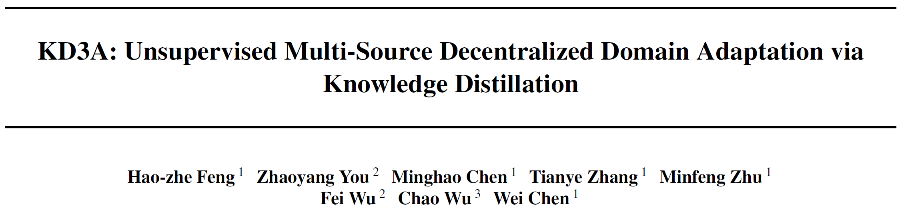
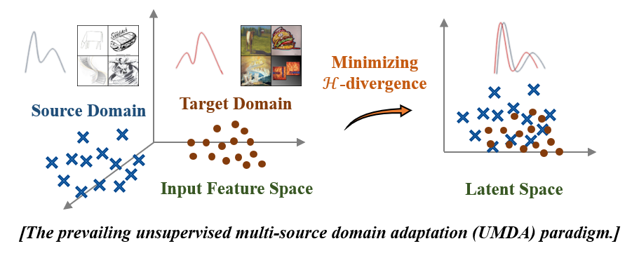
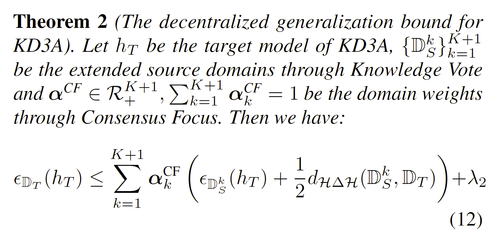
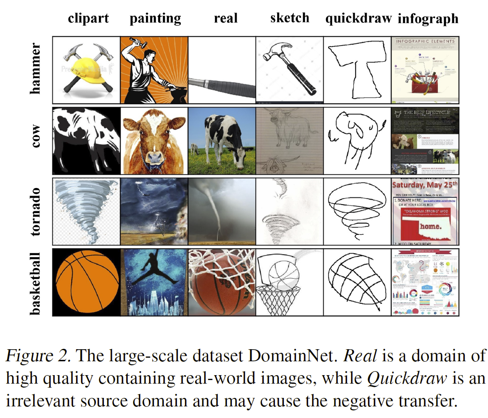
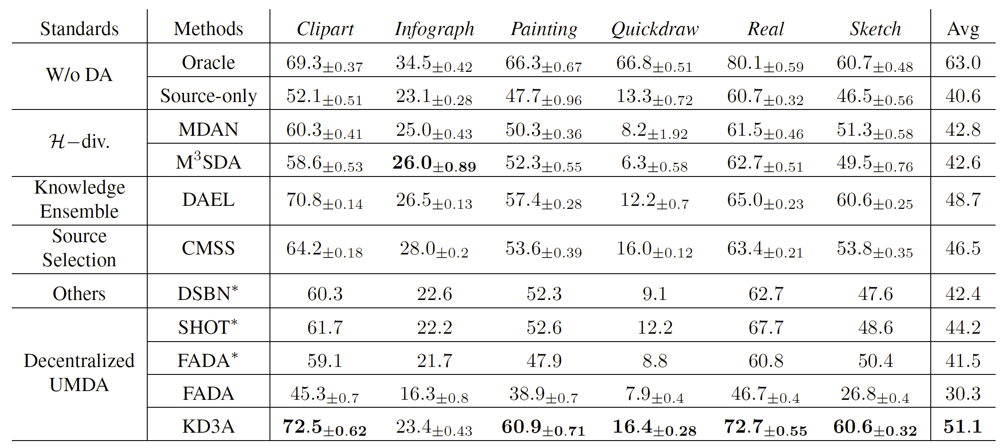

今天为大家介绍一篇已被**ICML 2021**接收的论文，论文作者来自**浙江大学CAD&CG国家重点实验室**，论文研究隐私保护政策下的无监督域适应问题，提出了一种**高迁移精度，低通信成本，并具有负迁移鲁棒性**的**去中心化**域适应范式。

论文链接：https://arxiv.org/abs/2011.09757

**TL; DR:**  传统的无监督多源域适应（Multi-source Unsupervised Domain Adaptation）方法假设所有源域数据都可以直接访问。然而，**隐私保护政策**要求所有数据和计算都必须在本地进行，这对域适应方法提出了三个挑战：首先，最小化域间距离需获取源域和目标域的数据并进行**成对计算**，而在隐私保护要求下，源域数据本地存储、不可访问。其次，**通信成本和隐私安全**限制了现有域适应方法的应用。最后，由于无法鉴别源域数据质量，更易出现不相关或恶意的源域，从而导致**负迁移**。为解决上述问题，我们提出一种满足隐私保护要求的**去中心化无监督域适应范式**，称为基于知识蒸馏的去中心化域适应（KD3A），通过对来自多个源域的模型进行知识蒸馏来构建可迁移的共识知识。大量实验表明，KD3A显著优于其他域适应方法。此外，与其他去中心化的域适应方法相比，KD3A 对**负迁移具有鲁棒性**，并可**将通信成本降低100倍**。  

## 问题背景与相关工作

成功的深度学习模型往往需要大规模数据集，并通过有监督学习进行训练。由于获取数据标注的成本高昂，往往采用与目标任务同构的多个数据集来训练模型。但是，不同数据源域存在域偏移（Domain Shift），简单地混合不同数据源域进行训练往往效果很差。无监督多源域适应（Unsupervised Multi-source Domain Adaptation，UMDA）构建具有迁移能力的特征，能够从多个源域迁移到某个无标注的目标域，从而解决域偏移问题。

如上图所示，现有的无监督多源域适应范式包含两个主要步骤：首先，结合来自源域与目标域的数据，构建源域-目标域数据对。然后，通过最小化域间分布距离（$\mathcal{H}$-散度）在潜变量空间（latent space）中建立可迁移特征。当所有源域数据都可以直接获取时，该域适应范式获得了很大成功。然而，在隐私保护政策下，很多敏感数据，例如来自不同公司的客户信息，或是来自不同医院的患者数据，是不可访问的。这种情况下，**源域的所有数据，以及对这些数据进行的计算，都必须保持本地化**，而仅有三部分信息是可用的：*K*个源域上训练数据集的大小$$\{N_S^k\}_{k=1}^K$$，在源域上本地训练的*K*个模型$$\{h_S^k\}_{k=1}^K$$，以及具有$$N_T$$个无标注数据的目标域$$\mathbb{D}_T:=\{\mathbf{X}_i^T\}_{i=1}^{N_T}$$。利用联邦学习，一个典型的分布式域适应训练范式如下图所示：首先，在各个源域本地训练模型。然后将模型参数（模型更新）发送到中央服务器，中央服务器采用联邦平均算法汇总本地模型，得到全局模型。最后，将全局模型迁移到目标域上。

但是，将现有的域适应算法用于隐私保护的去中心化场景存在三个挑战：首先，最小化域间分布距离（$\mathcal{H}$-散度）需要**收集源域和目标域的数据进行成对计算**，而源域上的数据不可访问。其次，**通信成本与隐私安全**也限制了模型的应用。例如，联邦对抗域迁移 (Federated Adversarial Domain Adaptation, Peng et al., 2020) 提出了去中心化的对抗训练方法。然而该方法需要每一个源域在每一个训练Batch后进行模型同步，这带来巨大的通信成本并导致隐私泄露。最后，由于原始数据不可访问，因此可能会**存在一些不良域或是恶意域，从而导致负迁移**（Negative Transfer）问题。例如，SHOT (Liang et al., 2020) 与Model Adaptation (Li et al., 2020) 提出无源（Source-free）域迁移来解决源域数据不可用问题，但是它们无法识别不良源域，容易受到负迁移的影响。

## 研究工作

**ICML 2021**的这项研究提出了一种基于知识蒸馏的去中心化域适应新范式，缩写为**KD3A**，以解决上文所总结的三个挑战。**KD3A**由三个串联使用的组件构成：首先是一种名为知识投票（***Knowledge Vote***）的多源模型知识蒸馏方法，用以获取高质量的域共识知识。然后，定义每一个源域所贡献共识知识的**质量**，并推导出一种**可以识别无关域与恶意域的新指标**，名为共识焦点（***Consensus Focus***），利用共识焦点对各个源域进行动态加权可以防止负迁移。最后，利用深度学习模型的**batch norm**层中所记录的特征滑动均值与方差，提出***BatchNorm MMD***距离，用于对域间距离进行分布式优化。整个域适应模型的训练过程如下图所示：首先，各源域本地训练模型，并将模型发送到中央服务器。然后，在多个源域模型上进行**知识投票**，构建一个额外的共识源域，包括共识知识$$\mathbf{p}_i$$以及支持$$\mathbf{p}_i$$的源域个数$$n_{\mathbf{p}_i}$$，记为$$\mathbb{D}_{S}^{K+1}:=$$$$\{\mathbf{X}_i^{T},\mathbf{p}_i,n_{\mathbf{p}_i}\}_{i=1}^{N_T}$$。随后通过**共识焦点**聚合 K+1 个源模型得到目标模型。最后，使用 ***BatchNorm MMD*** 来最小化域间分布距离（$\mathcal{H}$-散度），将特征适应于目标域。

## 泛化误差分析

记$$\mathcal{H}$$为模型空间，$$\{\epsilon_{\mathbb{D}_{S}^{k}}(h)\}_{k=1}^{K}$$和$$\epsilon_{\mathbb{D}_{T}}(h)$$分别为源域$$\{\mathbb{D}_{S}^{k}\}_{k=1}^{K}$$和目标域 $$\mathbb{D}_{T}$$上的任务风险误差，对于由多个源域模型集成而来的全局模型$$h_T\in \mathcal{H}$$，满足$$h_T=\sum_{k=1}^{K+1}\alpha_kh_S^k$$，有如下泛化误差界：

与之前的无监督多源域适应方法所提出的泛化界相比，**KD3A**引入了一个额外的共识源域$$\mathbb{D}_{S}^{K+1}$$。理论分析表明，当以下条件满足时，**KD3A**的泛化误差界比其他误差界更紧：

该引理指出，**KD3A**通过知识投票与共识焦点改进了泛化界：对于那些好的源域，**KD3A**用知识投票提供了更好的共识知识，使得共识源域$$\mathbb{D}_{S}^{K+1}$$上的任务风险更接近于目标域，即$$\epsilon_{\mathbb{D}_{S}^{K+1}}\rightarrow \epsilon_{\mathbb{D}_{T}}$$；对于质量较差的源域，**KD3A**通过共识聚焦过滤它们的影响，使得$$\epsilon_{\mathbb{D}_{S}^{K+1}}$$远离那些坏源域。

## 实验

在四个基准数据集上进行了实验：(1) **Amazon Review** (Ben-David et al., 2006)，这是一个情感分析数据集，包含四个源域。(2)**Digit-5** (Zhao et al., 2020)，这是一个数字分类数据集，包括五个源域。 (3) **Office-Caltech10** (Gong et al., 2012)，包含来自四个源域的十类图像。(4) **DomainNet** (Peng et al., 2019)，这是最近推出的具有 345 个类和 6 个域的大规模多源域适应基准数据集，如下图所示。鉴于篇幅所限，主要汇报**DomainNet**上的实验结果。

在**DomainNet**上进行域适应实验。总体而言，**KD3A** 显著优于所有基线域适应方法，并在剪贴画（ Clipart）和素描（Sketch）上达到了和全监督相同的性能。此外，对**KD3A**的三个模块进行了消融实验用以评估每个模块的贡献。结果表明，知识投票、共识焦点和**BatchNorm MMD**都能够提高性能，而大部分贡献来自知识投票，表明 **KD3A**也可以在那些无法使用 BatchNorm MMD 的任务上表现良好。

为验证在共识焦点的作用下，**KD3A** 对负迁移具有鲁棒性，在**DomainNet**数据集上人为构建不相关和恶意的源域并进行了模拟实验。其中，选取*Quickdraw*作为不相关源域，记为*IR-Qdr*，用注毒攻击（Poisoning Attack）构造恶意源域，在好的源域*Real*中选取$$m\%$$的数据打上错误标签，记为*MA-m*。如下图所示，共识焦点可以识别不相关的域并且在恶意域鉴别中为其分配了极低的权重，而其他策略无法识别恶意域。

为了评估通信效率，我们在不同的通信轮次(***r***)的设定下训练 KD3A，并汇报**DomainNet**上的域适应精度。 如下图所示，**KD3A** 能够在低通信成本(***r = 1)***下工作，与联邦对抗域适应(FADA)相比，减少了100倍通信量。 由于通信成本低，**KD3A** 对前沿的梯度泄漏攻击具有鲁棒性，这证明了高隐私安全性。

## 代码开源

**KD3A**实现了四个数据集上的无监督域适应方法，并模拟了无关域，恶意域，以及通信成本评估的场景。代码简洁，复用性强，已经被三个AI实验室分别复现出一致结果。开源地址为https://github.com/FengHZ/KD3A。

